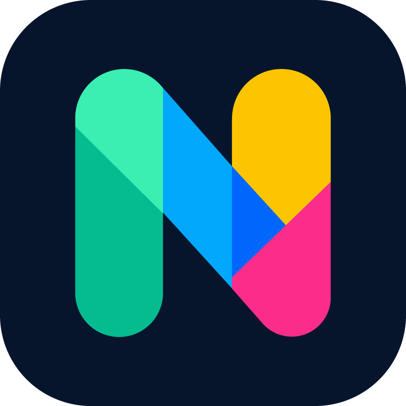
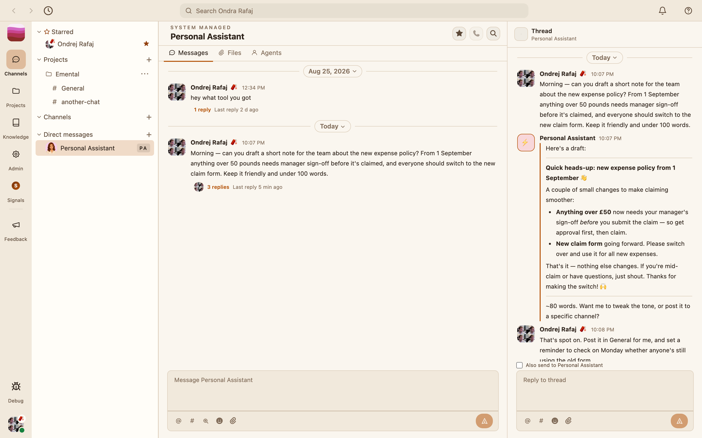
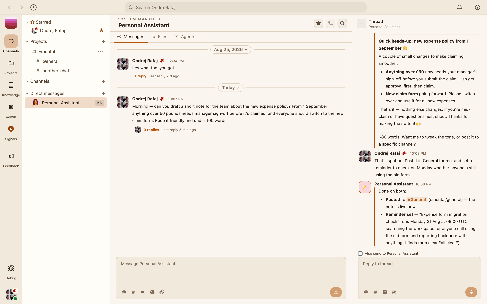
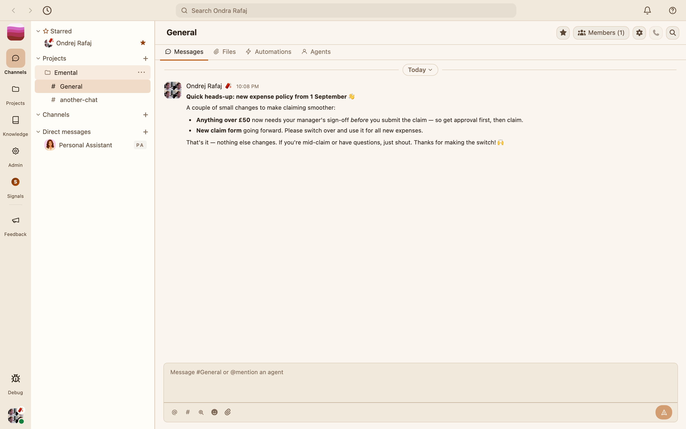

<p align="center">
  
</p>

<h1 align="center">Nessie</h1>

<p align="center">
  The European Slack alternative for an AI world.<br>
  Channels, threads and DMs your team already knows &mdash; with agents that do the work in them.
</p>

<p align="center">
  <a href="docs/standards/team-model.md">Team Model</a> &middot;
  <a href="docs/brief.md">Product Brief</a> &middot;
  <a href="docs/remote/brief.md">Remote Brief</a> &middot;
  <a href="docs/review-findings.md">Validated Findings</a>
</p>

---

## Screenshots

| Ask in a thread | It follows through | The team reads it |
|---|---|---|
| [](web/public/screenshots/nessie-assistant.png) | [](web/public/screenshots/nessie-actions.png) | [](web/public/screenshots/nessie-channel.png) |
| The assistant drafts the note in the reply thread where it was asked. | It posts to `#General` and schedules the Monday follow-up itself. | Channels, threads and DMs, exactly where the team already looks. |

These are the same images the public site (`web/`) shows at [nessie.works](https://nessie.works).

## What it is

Nessie is a multi-tenant, self-hosted agentic work platform: channels, threads
and DMs your team already knows, with agents that do the work in them.
Organisations host their own instance.

### How it is organised

Identity and the organisation structure come from **UnlikeOtherAI (UOA)**, the
SSO. It owns two levels and the people in them, and Nessie mirrors them one for
one — UOA stays the only authority over them:

```text
Organisation                 ← one UOA organisation
  └── Team              ← one UOA team. A user can be in many.
        ├── Project          ← Nessie's own. UOA has no such concept.
        │     └── Channel
        └── agents, knowledge, boards, …
```

A **team is the SSO's team** — the same thing under the product's own
word, not a container for one. A **project is a construct within Nessie**: a
body of work living inside exactly one team, so "which team does this
project belong to?" always has exactly one answer.

The model in full, including the vocabulary rules and the one place the schema
currently contradicts it, is
[docs/standards/team-model.md](docs/standards/team-model.md).

## Run locally

### Prerequisites

- `pnpm`
- PostgreSQL with `pgvector`

### API and admin UI

```bash
pnpm install
pnpm dev
```

That runs the API on **5454** and the admin UI on **5455**, both with hot
reload. Those ports are fixed — other tooling in the repo assumes them.

## Key features

- **Channels, threads and DMs** — the collaboration surface people already know,
  organised into teams and projects.
- **Agents that work in them** — they draft, follow through, and post where the
  team is already looking, rather than in a separate tool.
- **SSO-backed identity** — organisations, teams and membership come from
  UnlikeOtherAI, which stays their only authority.
- **RBAC and approval gates** — with an audit trail behind them.
- **A token-cost ledger** — so agent spend is attributable.
- **MCP connector management** — for the tools agents reach.
- **Triggers and scheduling**, video calling, and human work distribution.

## Architecture

```text
 [Admin web UI]  [iOS / iPad]  [macOS]      ← the admin UI is the primary surface
        |             |            |
        +-------------+------------+
                      |
                HTTP / WS / SSE
                      |
              [Nessie API :5454] ──── [UnlikeOtherAI SSO]
                      |                 identity, organisations,
                      |                 teams (teams), membership
                      +--> [Worker / orchestrator]
                      +--> [Executors]
                      +--> [MCP connectors]
                      +--> [Postgres]
```

UOA is the only authority over identity and the organisation structure. Nessie
keeps the binding keys — the external organisation id, the external team
id, the user's subject — and asks UOA for the rest. Some display data (profile
names, team names) is still mirrored locally and re-synced from UOA;
removing those mirrors is tracked in
[the unification plan](docs/plans/2026-09-02-uoa-as-a-service-unification.md).

## Repository structure

```text
api/           HTTP/WS API (port 5454)
admin/         Admin web UI — the primary surface (port 5455)
worker/        Agent orchestration and background runs
packages/      Shared libraries (schemas, db, runtime, team-admin, …)
executor/      Sandboxed tool execution
gateway/       Edge routing
web/           Public marketing site
mobile/        iOS / iPad client
desktop/       Desktop shell
cli/           Command-line tooling
macos/         Legacy macOS voice companion (separate from the above)
remote/        Go remote control-plane scaffold
docs/          Standards, plans, and product documentation
```

## Documentation

| Doc | Description |
|---|---|
| [Deployment](docs/deployment.md) | **Production deployment** (self-hosted, Hetzner + shared Caddy) |
| [Secret management](docs/secret-management-spec.md) | **A configured Infisical vault is required to save any secret** — scope, grants, and what is stored where |
| [Apple publishing & direct device delivery](docs/publishing-apple-testflight.md) | TestFlight releases and the default standalone phone/tablet delivery policy |
| [Running the native apps](docs/running-the-apps/overview.md#default-physical-device-delivery) | Direct installation policy and local development paths |
| [Product Brief](docs/brief.md) | Vision, modes, architecture, MVP direction |
| [Team Model](docs/standards/team-model.md) | Organisation, team, project — what each is and which the SSO owns |
| [Remote Brief](docs/remote/brief.md) | Remote control-plane scope |
| [Remote Tech Stack](docs/remote/techstack.md) | Remote service technology choices |
| [Remote SSO](docs/remote/sso.md) | Remote authentication notes |
| [Validated Findings](docs/review-findings.md) | cleaned review of the repo's real issues |
| [Licensing](docs/licensing.md) | FSL-1.1-ALv2 explained — what self-hosting, modifying and redistributing Nessie allows |

## License

Nessie is licensed under the [Functional Source License, Version 1.1, Apache
2.0 Future License](https://fsl.software/) (FSL-1.1-ALv2):

- **Free to self-host**, including for commercial organisations running it
  for their own internal use.
- **Free to inspect, modify, and fork** for internal use, non-commercial
  education/research, or while providing services to a licensee running
  Nessie.
- **Not free to turn into a competing commercial product or service** — you
  cannot take a current release and offer it (or something substantially
  similar) as a hosted alternative to Nessie.
- **Automatically becomes Apache License 2.0 two years after each release**,
  at which point that release is fully open source with no restrictions.

See [`LICENSE`](LICENSE) for the full legal text and
[`docs/licensing.md`](docs/licensing.md) for the plain-English explanation.
