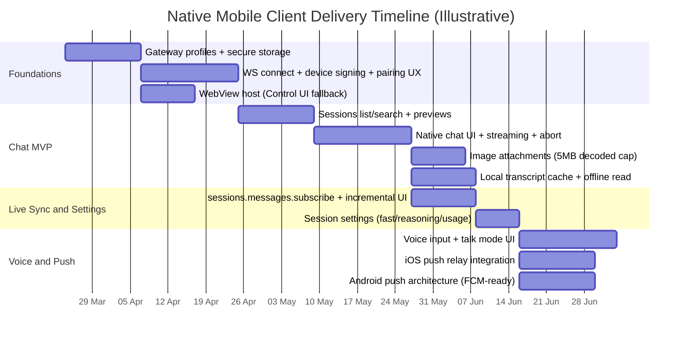

# OpenClaw Deep Research for Native iOS and Android Clients

> **Status**: superseded by [openclaw-reference.md](./openclaw-reference.md).

## Executive summary

OpenClaw is an MIT-licensed, self-hosted "Gateway" that sits between your existing chat surfaces (messaging apps, web UI, CLI) and one or more agent runtimes, owning session state, routing, delivery, pairing, and integrations. The core control-plane transport is a typed WebSocket (default port 18789) with a mandatory `connect` handshake, role declaration (`operator` vs `node`), scopes, and device identity + signature (challenge/nonce). After first approval ("device pairing"), the Gateway issues a per-device token (`hello-ok.auth.deviceToken`) that clients persist for subsequent connects, with explicit retry guidance and stable auth/detail error codes.

In practice, "chat is the UI": users interact from the channels they already use, while the Gateway manages multi-agent routing, tools/plugins, media handling, and automation primitives like cron/heartbeat. OpenClaw also exposes selected HTTP surfaces on the same multiplexed port, notably OpenAI-compatible `POST /v1/chat/completions` and OpenResponses-compatible `POST /v1/responses` (disabled by default), both supporting SSE streaming. A small authenticated webhook surface (e.g., `/hooks/wake`, `/hooks/agent`) exists when enabled.

For a modern native mobile experience, a hybrid strategy is the fastest path: implement **native chat** plus **5–10 high-value functions/settings** (suggested below), and host everything else in a WebView that loads the Gateway-served Control UI. To make migration from web → native incremental and low-risk, architect the app as a **feature-router**: each capability is addressable by a stable route, implemented either by a native module or a "web module" wrapper, switchable via feature flags and version gating.

Key technical constraints that shape the mobile plan:

- **Credential model is powerful, not least-privilege**: Gateway HTTP bearer auth is effectively "operator access" for that Gateway instance; treat any token/password that can access `/v1/*`, `/tools/invoke`, or `/api/channels/*` as a full-access secret.
- **Device pairing UX is central**: Setup codes now carry a short-lived `bootstrapToken` (not long-lived gateway credentials), following a security advisory that affected versions ≤ 2026.3.11 and was patched in 2026.3.12.
- **Chat history and session lists are performance-sensitive**: the project is actively adding richer dashboard chat tooling (search/export/pins) and has multiple issues around large histories/UI responsiveness—strong evidence that efficient paging/subscription and local caching matter for mobile.

## How OpenClaw works

OpenClaw's architecture is intentionally "single source of truth": one long-lived Gateway process owns sessions, routing, and channel connections; clients (web UI, CLI, companion apps) connect to the Gateway over the same WebSocket control plane; "nodes" (mobile/desktop) connect as peripherals with a declared capability surface invoked via `node.invoke`.

The Gateway WebSocket protocol has these defining characteristics:

- **Transport & frames**: WebSocket text frames carrying JSON; the **first frame must be a `connect` request**. Requests/responses follow `{type:"req", id, method, params}` → `{type:"res", id, ok, payload|error}`; server push uses `{type:"event", event, payload, seq?, stateVersion?}`.
- **Handshake hardening**: before `connect`, the server emits `event:"connect.challenge"` with `{ nonce, ts }`; clients must sign the challenge-bound payload and return matching `connect.params.device.nonce`. Device-auth migration codes (e.g., `DEVICE_AUTH_NONCE_REQUIRED`, `DEVICE_AUTH_SIGNATURE_INVALID`) are explicitly documented for client implementers.
- **Role separation**:
  - `operator`: control plane clients needing scopes like `operator.read`, `operator.write`, `operator.admin`, etc.
  - `node`: capability hosts (camera/screen/canvas/location/voice/device control) declaring `caps`, `commands`, and `permissions` in the `connect` payload.

Session state is conceptually "keyed chat threads": a main bucket, group buckets, cron buckets, hook buckets, and node buckets, with key formats explicitly described (e.g., `agent:<agentId>:<channel>:group:<id>`). This matters for mobile because "chat" in the Control UI / mobile app may represent multiple distinct session keys across channels and agents, and the client must be able to list, resolve, subscribe, and patch those sessions efficiently.

## Technical inventory

### Primary official sources and repositories

OpenClaw's primary documentation is hosted at docs.openclaw.ai, with deep reference content covering protocols, configuration, security, platforms, plugins, and APIs. Source code is published on GitHub, including the Gateway, Control UI, and mobile apps under `apps/ios` and `apps/android`. The MIT License in the root repository credits Peter Steinberger.

The project also documents and ships a plugin SDK ("plugin-sdk/*" subpaths) intended for external extensions (channels, providers, tools). A public skill registry, ClawHub, is documented as a discovery surface for skills with versioning and "usage signals".

Community surfaces referenced directly from the docs include a Discord server alongside the GitHub repository and releases pages.

### Protocols, APIs, endpoints, and transports

**WebSocket control plane (primary)**
The "Gateway protocol" is the unified control plane and node transport over WebSocket. It defines:

- `connect.challenge` event and `connect` request shape, including client metadata, role/scopes, and device identity (`id`, `publicKey`, `signature`, `signedAt`, `nonce`).
- Device token issuance in `hello-ok.auth.deviceToken` after pairing; token rotation/revocation methods are referenced.
- Role-based concepts (scopes for operators; caps/commands/permissions for nodes).

**Legacy transport (deprecated)**
A legacy "Bridge protocol" (TCP JSONL) is kept for historical reference; current builds no longer ship the TCP bridge listener and recommend using the unified Gateway WebSocket protocol for operator/node clients.

**HTTP APIs (same port as WS, feature-gated)**
OpenClaw documents multiple HTTP surfaces sharing the same multiplexed Gateway port:

- OpenAI-compatible `POST /v1/chat/completions` (disabled by default; supports SSE streaming).
- OpenResponses-compatible `POST /v1/responses` (disabled by default; supports SSE streaming with enumerated event types).
- A lower-level session transcript surface: `GET /sessions/{sessionKey}/history` with `limit`, `cursor`, `includeTools=1`, and `follow=1` (SSE stream of transcript updates).
- `/tools/invoke` and `/api/channels/*` are explicitly called out as HTTP endpoints requiring token/password auth (and treated as powerful access).

**Webhooks**
When enabled, the Gateway exposes webhooks on its HTTP server. Documented examples include:

- `POST /hooks/wake` with bearer auth (query-string tokens rejected), used to "nudge"/wake the agent.
- `POST /hooks/agent` with bearer auth, passing a JSON payload including `message` and optional `sessionKey` (enabling caller-controlled routing).

### Authentication flows and credential types

OpenClaw's security model has multiple layers:

- **Gateway shared auth (token/password)**: Both WS clients and HTTP endpoints use Gateway auth configuration. WS uses `connect.params.auth.token/password`; HTTP uses `Authorization: Bearer <token>` (token or password depending on mode).
- **Device pairing + per-device token**: New devices require pairing approval; after pairing, the Gateway issues a per-device token returned in `hello-ok` that clients persist.
- **Bootstrap setup codes (mobile-friendly)**: Setup codes (via `/pair` or `openclaw qr`) are base64-encoded JSON carrying a WS URL and a short-lived `bootstrapToken` used for initial pairing.
  - This replaced an earlier design that embedded long-lived shared credentials in setup payloads; a security advisory documents the impact and patch in 2026.3.12.
- **Provider auth (OAuth/API keys)**: Provider credentials (OAuth tokens, API keys, setup-tokens) are stored per agent under `~/.openclaw/agents/<agentId>/agent/auth-profiles.json`. OAuth uses PKCE and supports refresh/expiry handling.
- **Tailscale identity headers (optional trust shortcut)**: For Control UI/WebSocket, tokenless access via identity headers can be enabled (trusting the gateway host); HTTP APIs still require token/password.
  - Remote access is explicitly positioned as "preferred: VPN/Tailscale; fallback: SSH tunnel".

### Rate limits, CORS/origin policy, and security boundaries

OpenClaw's documented rate limiting and boundary controls include:

- **Config RPC throttling**: `config.apply`/`config.patch` are rate-limited to **3 requests per 60 seconds per `(ws deviceId + clientIP)`**, to avoid reload/reconnect loops; this rate limit is explicitly surfaced to clients.
- **HTTP auth failure rate limiting**: The OpenAI-compatible Chat Completions endpoint notes optional `gateway.auth.rateLimit` behaviour returning `429` + `Retry-After` when too many auth failures occur.
- **Origin allowlist for web UI**: For non-loopback deployments, `gateway.controlUi.allowedOrigins` must be set explicitly; otherwise startup is refused. Host-header origin fallback exists but is described as a dangerous downgrade.
- **"Bearer token = operator" boundary**: Documentation repeatedly emphasises that bearer auth for `/v1/*` endpoints is "full operator access," not a per-user scoped permission model.

### Existing mobile clients and third-party apps

There are official-in-repo native node apps:

- **iOS app**: repo README labels it "Super Alpha" and "internal-use only," connecting to a Gateway as `role: node`.
- **Android app**: docs state the Android node app "has not been publicly released yet" and is buildable from source under `apps/android`; the platform page also documents a foreground service that keeps the connection alive and enumerates chat/canvas/camera/voice capabilities via WS methods.

Separately, the public app ecosystems contain third-party apps using OpenClaw branding or claiming compatibility. For example, a Play Store listing named "OpenClaw" published by "Moltbook" exists under `com.openclaw.ai` with generic "AI coworker" marketing; this should be treated as unaffiliated unless proven otherwise. This external-brand collision is a concrete distribution risk for any official mobile client effort.

## Usage analysis and native scope selection

### How people use OpenClaw in practice

The dominant usage model is "message the assistant where you already are," with OpenClaw acting as the always-on bridge between messaging channels and agent runtimes. The project's own feature summaries emphasise multi-channel messaging, media in/out, multi-agent routing, and mobile nodes (voice/chat + device commands). In addition to conversational help, OpenClaw is explicitly positioned for "do things" workflows that combine chat with tools/plugins (automation, job search, Jira skill building, etc.), reinforced by its official Showcase.

Operationally, users run the Gateway on a "master" machine and connect from other devices via LAN discovery (Bonjour/mDNS/NSD) or via remote access (e.g., Tailscale/SSH tunnel). This pattern is documented for Android and nodes in general, including explicit "what runs where" separation (Gateway owns channels; nodes are peripherals).

The project is also investing heavily in **session UX** and **chat tooling** across web/CLI surfaces: recent releases explicitly add a modular dashboard with mobile-friendly navigation and richer chat tools like slash commands, search, export, and pinned messages. Combined with multiple performance/bug reports around large `chat.history` payloads and UI freezes, a rational inference is that users accumulate long-running sessions and need better paging, local caching, and targeted subscriptions—especially on mobile.

### Telemetry and "most used" signals

OpenClaw is self-hosted, so there is no single global analytics feed by default. However, the project does provide structured diagnostics suitable for local telemetry: a "Diagnostics + OpenTelemetry" pipeline can emit model usage and message-flow events (webhooks, queueing, session state) and export them via OTLP/HTTP when enabled. This enables a mobile client to offer **per-session usage/cost** views (where supported by providers) by querying gateway surfaces (e.g., session metadata and usage fields) rather than relying on external tracking.

### Top native features beyond chat

The requirement is: **native chat + 5–10 high-value functions/settings**, while everything else can remain in a WebView, with a migration-friendly architecture. The table below selects **nine** features that are (a) explicitly supported by current protocol/schema/docs, (b) high-frequency in the "daily driver" workflow, and (c) provide clear native value (latency, offline, device integration, notifications).

| Feature | Why it's "top" (value) | Native vs WebView | Effort | Primary dependencies (OpenClaw surfaces) |
|---|---|---:|---|---|
| Gateway connect & discovery | Fast setup; reduces friction vs manual URLs | Native | Medium | WS `connect` + discovery concepts (LAN/tailnet/SSH) |
| QR/setup code bootstrap | "Copy/paste" and camera scan are mobile-native | Native | Medium | Setup code carries `url` + `bootstrapToken` (`openclaw qr`, `/pair`) |
| Device pairing workflow | Required first-run; must be understandable on mobile | Native | Medium | Device pairing approvals; device token returned in `hello-ok` |
| Session list + search + previews | Navigation across "main", groups, jobs; reduces web dependency | Native | Medium | `sessions.list` params include `search`, `includeLastMessage`, `includeDerivedTitles`, filters |
| Live transcript subscription | Real-time updates without reload; avoids heavy polling | Native | Medium | `sessions.messages.subscribe/unsubscribe` + `session.message` semantics |
| Session settings (fast/reasoning/usage) | High leverage on cost/latency/UX | Native | Low–Medium | `sessions.patch` supports `fastMode`, `reasoningLevel`, `thinkingLevel`, `responseUsage` |
| Image attachments in chat | Core modern chat expectation | Native | Medium | `chat.send` attachments + image-only parsing & 5MB decode limit |
| Voice input + talk mode UI | Hands-free use is a main differentiator for mobile nodes | Native | High | Android node voice behaviour; "Talk" config exists; node caps/commands |
| Push notifications / reconnect wakes | Makes mobile reliable; enables "always available" feel | Native | High | iOS relay-backed push flow + `push.apns.register` publishing |

Everything not in this list—full config editing, plugin management, advanced ops dashboards, niche tools—can remain in the Control UI WebView initially.

## API mapping for chat and priority features

### Summary of interfaces

OpenClaw presents three main integration "planes" relevant to a mobile client:

- **WS control plane (typed RPC + events)** for real-time operator/node interactions (`connect`, chat send/history, sessions list/patch, node invoke).
- **HTTP "compatibility" plane** for OpenAI/OpenResponses clients (SSE streaming) and session transcript streaming (`follow=1`).
- **HTTP webhooks** for inbound triggers (wake/agent).

### Endpoint/method comparison table

| Surface | Method / Path | Purpose | Auth & where | Request schema (key fields) | Response / streaming | Notes (pagination, limits, errors) |
|---|---|---|---|---|---|---|
| WS | `connect` + `event:connect.challenge` | Handshake; declare role/scopes/caps; establish session | `connect.params.auth.token/password`; device signature required | `minProtocol/maxProtocol`, `client{ id,version,platform,mode }`, `role`, `scopes`, `caps/commands/permissions`, `device{ id,publicKey,signature,signedAt,nonce }` | `hello-ok` res; may include `auth.deviceToken` | Auth/detail codes include `DEVICE_AUTH_*`; guidance for `AUTH_TOKEN_MISMATCH` retries |
| WS | `chat.history` | Load recent messages for a session | Operator WS session; scope-gated by role | `{ sessionKey, limit? (≤1000) }` | Returns transcript payload (implementation-defined) | Not cursor-paged in schema shown; large histories are a known pain point |
| WS | `chat.send` | Send message; may trigger agent run; optional delivery | Operator WS session; idempotency required | `{ sessionKey, message, thinking?, deliver?, attachments?, timeoutMs?, idempotencyKey }` | Chat events: `{ runId, sessionKey, seq, state: delta|final|aborted|error, message?, usage? }` | Attachments are parsed to **images only**; base64 validated; default `maxBytes=5,000,000` decoded bytes; non-image attachments are dropped |
| WS | `chat.abort` | Abort in-flight run | Operator WS session | `{ sessionKey, runId? }` | No dedicated stream; termination reflected in chat events | Useful for "Stop generating" UX |
| WS | `sessions.list` | List sessions (with optional derived title / last-message preview / search) | Operator WS session | `{ limit?, activeMinutes?, includeDerivedTitles?, includeLastMessage?, label?, spawnedBy?, agentId?, search? }` | Returns rows (schema not shown here); used by UIs | Derived titles read 8KB transcript; last message preview reads 16KB—use `limit` carefully on large stores |
| WS | `sessions.preview` | Fetch previews for selected keys | Operator WS session | `{ keys[], limit?, maxChars? }` | Preview payload | Enables efficient session list rendering without full history |
| WS | `sessions.messages.subscribe` / `unsubscribe` | Subscribe to transcript updates for one session | Operator WS session | `{ key }` | Emits `session.message` events ("appended transcript messages + live usage metadata when available") | Prefer this over "reload `chat.history` on every event" for mobile efficiency |
| WS | `sessions.patch` | Update per-session settings | Operator WS session; admin gating may apply for some settings | `{ key, label?, thinkingLevel?, fastMode?, verboseLevel?, reasoningLevel?, responseUsage?, elevatedLevel?, execHost?, ... }` | Updated session state | Directly supports "fast mode" and "reasoning level" UX without parsing slash-command text |
| HTTP | `POST /v1/chat/completions` | OpenAI-compatible wrapper for agent runs | `Authorization: Bearer <token/password>` | Standard chat-completions body; select agent via `model:"openclaw:<agentId>"` or `x-openclaw-agent-id`; session via `x-openclaw-session-key` | Supports SSE when `stream:true`; ends with `[DONE]` | Treated as "full operator access"; keep private |
| HTTP | `POST /v1/responses` | OpenResponses-compatible wrapper; supports files/images | `Authorization: Bearer <token/password>` | OpenResponses items; `stream:true` enables SSE; various file/image guards and allowlists | SSE event types enumerated (`response.output_text.delta`, etc.) | Defaults: `maxBodyBytes=20MB`, `files.maxBytes=5MB`, `images.maxBytes=10MB`, SSRF guards + allowlists |
| HTTP | `GET /sessions/{sessionKey}/history` | Paged transcript access; optional SSE follow | (Auth not explicitly restated here; treat as operator surface consistent with gateway security posture) | Query: `limit`, `cursor`, `includeTools=1`, `follow=1` | `follow=1` upgrades to SSE transcript updates | Unknown sessions: `404` with `error.type="not_found"` |
| HTTP | `POST /hooks/wake` | Wake/nudge hook | `Authorization: Bearer …` | JSON payload `{}` (documented) | `200` on success | Tokens in query string are rejected |
| HTTP | `POST /hooks/agent` | Trigger agent run via webhook | `Authorization: Bearer …` | JSON `{ message, sessionKey? }` | JSON response ({ok, ...} documented) | Session routing via `sessionKey` is critical for conversational continuity |

## Native mobile client architecture, UX integration, roadmap, and risk mitigation

### Target architecture principles

A production-quality mobile client should treat the Gateway as the **source of truth** for sessions and routing, while the phone provides (a) a fast chat renderer, (b) session navigation & settings, and (c) device-integrated IO (camera, mic, notifications) with minimal setup friction. The design goal in OpenClaw's own "discovery & transports" guidance is to keep discovery/advertising in the Gateway and keep clients as consumers—aligning with a thin-client mobile approach.

#### Modular app structure for incremental web→native migration

Use a **Feature Router** abstraction:

- Each app "screen" is addressed by a stable route: `chat/<sessionKey>`, `sessions`, `sessionSettings/<key>`, `connect`, `web/<path>`, etc.
- For each route, choose an implementation:
  - **Native module** (SwiftUI / Compose) for prioritised features
  - **Web module** (WebView wrapper) that deep-links into the Gateway Control UI for everything else
- A local feature-flag service decides at runtime which implementation is active (e.g., based on Gateway version, client app version, A/B experiments, or user toggles).

This ensures that migrating a feature from web to native is primarily a routing/config change; the WebView route remains as a fallback.

### Proposed iOS and Android implementation architecture

#### Shared "Gateway Client Core" (recommended baseline)

Build (or generate) a shared protocol layer that can be reused across platforms:

- **Protocol models**: Auto-generate strongly typed models from OpenClaw's TypeBox/JSON-Schema source of truth (OpenClaw already treats TypeBox schemas as the protocol definition).
  - iOS: Swift package with generated models + WebSocket client.
  - Android: Kotlin module with generated `@Serializable` models (or codegen from JSON schema).
- **Connection engine**:
  - Implements `connect.challenge` wait, device signing, `connect` request, and `hello-ok` parsing.
  - Manages reconnection policy, one bounded retry for `AUTH_TOKEN_MISMATCH` using cached `deviceToken`, and surfaces "recommendedNextStep" guidance to UI.
- **RPC layer**: request id generation; idempotency key generation for side-effecting calls like `chat.send`.
- **Event bus**: typed dispatch for `chat` and `session.message`-style events; handshake→connected lifecycle.

This keeps platform UI clean: SwiftUI/Compose observe an app state store; features invoke typed RPC calls; the core handles retrying, backoff, and deduplication.

#### iOS app architecture (Swift/SwiftUI)

- **Presentation**: SwiftUI + a unidirectional data flow store (e.g., reducer-based) keyed around:
  - `ConnectionState` (discovered endpoints, selected gateway profile, auth mode, pairing status)
  - `SessionListState` (rows, search query, paging cursor if using HTTP history)
  - `ChatState` per session (local DB messages + "in-flight run" markers keyed by `runId`)
- **Data layer**:
  - `GatewayWebSocketClient` (core)
  - Optional `GatewayHttpClient` for `/v1/*` and `/sessions/{key}/history` SSE follow, especially for efficient paging/streaming on poor networks.
- **Storage**:
  - Keychain for gateway token/password/bootstrapToken/deviceToken.
  - Local DB (SQLite/CoreData) for transcript caching and offline read.
- **Background/push**:
  - Follow OpenClaw's relay-backed push design when distributing via Apple TestFlight/App Store: iOS app registers with a relay using App Attest + receipt, forwards an opaque handle via `push.apns.register`, and the gateway can send reconnect wakes and wake nudges without storing raw APNs tokens.
  - Use BGTaskScheduler for periodic refresh where feasible; treat silent pushes as best-effort due to platform throttling (explicitly acknowledged in node/location planning docs).

#### Android app architecture (Kotlin/Jetpack Compose)

- **Presentation**: Compose with a single source of truth (e.g., Store/ViewModel).
- **Background connection strategy**:
  - Mirror the documented Android node approach: keep the gateway connection alive via a **foreground service** with a persistent notification when "always-on" mode is enabled.
  - Use WorkManager for opportunistic sync when not in always-on mode.
- **Storage**:
  - Android Keystore-backed encrypted storage for credentials.
  - Room (SQLite) for cached transcripts and session metadata.
- **Push**:
  - The project explicitly discusses adding push wake support via FCM for Android; design your client so the push token registration path can be added without rewriting the connection layer.
  - Prefer data-only notifications for "reconnect" wakes and user-visible notifications for "new message," gated by user consent and platform rules.

### WebView hosting and bridging

Because the Control UI is served by the Gateway (Vite + Lit SPA) and speaks WebSocket directly, embedding it is straightforward technically but sensitive security-wise. A robust design:

- **Navigation constraints**: only allow the WebView to load content from the configured Gateway origin(s); deny external navigations or open them in the system browser.
- **Credential handling**:
  - Prefer not to persist long-lived tokens in WebView storage. Note the Control UI stores tokens in sessionStorage for the current tab session; treat this as a useful constraint but still assume WebView content has operator power if compromised.
  - If you need single sign-on into the WebView, inject a short-lived bootstrap flow (setup-code) rather than a long-lived shared token whenever possible.
- **Incremental migration**: implement deep linking so that when the user taps "Chat" inside the web UI, the app can intercept and route to native chat. Over time, route more paths to native modules.

### Seamless setup UX

A friction-minimised setup should be optimised for the "phone-first" reality while staying compatible with OpenClaw's security posture:

- **Setup entry points**:
  - Scan QR from `openclaw qr` (camera scanner + base64 decode).
  - Paste setup code from a channel-based pairing flow (e.g., Telegram `/pair` flow returns a copyable setup code).
  - Manual host/port with optional TLS fingerprint pinning support.
- **Pairing UX**:
  - After bootstrap connect, show the pending `requestId` and provide explicit approval instructions (CLI approval is canonical).
  - Once paired, persist the issued `deviceToken` for future connects.
- **Multi-gateway profiles**:
  - Support multiple gateways (home vs cloud) as first-class profiles; warn users that the Gateway host is the source of truth for sessions and auth state in remote mode.

### Implementation plan, effort, and testing

#### Roadmap (native-first, web fallback)

- **Milestone A (foundation)**: Gateway profiles, QR/setup-code bootstrap, device identity + signing, WS connection manager, secure credential store, and a basic WebView host to the Control UI (as the safety net).
- **Milestone B (chat MVP)**: Native session picker + list/search, native chat renderer, `chat.send` + streaming events, `chat.abort`, image attachments (image-only with 5MB decoded cap), and transcript caching.
- **Milestone C (live sync + settings)**: `sessions.messages.subscribe`, `sessions.preview`, and `sessions.patch` (fast/reasoning/usage) to reduce reliance on slash-command parsing and reduce reloads.
- **Milestone D (voice + notifications)**: Voice capture UI + talk mode UX + push plumbing (APNs relay path on iOS; pluggable FCM path on Android).

#### Mermaid timeline (illustrative)



#### Mermaid architecture diagram (hybrid, migration-friendly)

```mermaid
flowchart LR
  subgraph App[Mobile App]
    FR[Feature Router]
    NS[Native Screens\n(Chat, Sessions, Settings, Voice)]
    WV[WebView Host\n(Control UI fallback)]
    SS[Secure Storage\n(Keychain/Keystore)]
    DB[Local DB\n(offline cache)]
    GC[Gateway Client Core\n(WS + optional HTTP/SSE)]
  end

  subgraph Gateway[OpenClaw Gateway]
    WS[WS Control Plane\n(connect, chat.*, sessions.*, node.invoke)]
    HTTP[HTTP APIs\n/v1/*, /sessions/*, /tools/invoke]
    Hooks[Hooks\n/hooks/wake, /hooks/agent]
  end

  FR -->|route to native| NS
  FR -->|route to web| WV
  NS --> GC
  WV -->|loads| HTTP
  GC --> WS
  GC --> HTTP
  GC --> SS
  GC --> DB

  Hooks -->|wake triggers| Gateway
```

#### Testing strategy (high-level)

- **Contract tests against schema**: Use the TypeBox-derived schemas as the contract: generate fixtures for `connect`, `chat.send`, `sessions.patch` and verify encode/decode invariants for both iOS and Android models.
- **Integration tests with a real Gateway**: Stand up a local Gateway (loopback) in CI-like environments and run scripted sessions: security handshake, pairing, send/stream/abort, subscribe/unsubscribe, patch settings, and attachment upload.
- **Adversarial tests**:
  - Token drift and `AUTH_TOKEN_MISMATCH` retry behaviour (bounded retry, then require user action).
  - Oversized attachment rejection and non-image attachment drop behaviour (ensure UI makes this visible).
  - WebView origin enforcement and navigation denial (security regression suite).

### Risks and mitigations

**Security and credential leakage**
Risk: A mobile app necessarily handles powerful credentials (shared gateway token/password and/or per-device tokens), and the boundary is not per-user scoped.
Mitigations: store secrets only in Keychain/Keystore; require biometric unlock for "operator mode"; prefer bootstrap tokens via setup code; implement rapid token rotation/revocation UX; never log secrets; treat WebView as privileged content, lock it to allowed origins, and disable dangerous fallback settings (e.g., Host-header origin fallback).

**Pairing-code and onboarding safety**
Risk: Users may share setup codes via screenshots/chats; while bootstrap tokens are now short-lived, trust mistakes remain possible.
Mitigations: in-app copy about setup-code sensitivity; expiry countdown; auto-clear clipboard; encourage upgrading Gateway ≥ 2026.3.12 and rotating gateway credentials if earlier setup codes were shared.

**Media/file expectations mismatch**
Risk: WS chat attachments currently parse as images only; non-image files are dropped after MIME sniffing, and images have a 5,000,000 decoded-byte default limit.
Mitigations: enforce client-side validation and compression; show clear "images only" UI until document support exists; for documents, fall back to `/v1/responses` `input_file` when enabled (and clearly warn about operator-secret boundary).

**Background execution and push constraints (platform policy)**
Risk: Reliable "always available" background behaviour is hard—iOS silent pushes can be throttled; Android background work often requires a foreground service.
Mitigations: make "Always-on" an explicit opt-in; use established patterns (foreground service on Android; APNs relay-backed approach on iOS distributed builds); degrade gracefully to pull-on-open.

**App store brand confusion and impersonation**
Risk: Unofficial third-party "OpenClaw" apps exist in public stores; users may install the wrong app, harming trust and increasing phishing risk.
Mitigations: publish official package identifiers and signing info prominently in docs; add in-Gateway "Download mobile app" deep links that verify origin; implement in-app Gateway identity verification step before accepting pairing.

**Rate limits and scalability**
Risk: Aggressive mobile polling or misdesigned reconnect loops can trigger rate limits (e.g., config RPC throttles) and degrade the Gateway.
Mitigations: prefer subscription-based updates (`sessions.messages.subscribe` / SSE follow) and bounded refresh; implement exponential backoff and jitter; cap list/history loads; respect server policy intervals.

**Legal and channel policy exposure**
Risk: OpenClaw integrates with many third-party services with their own terms; a mobile client must avoid implying endorsement or bundling unauthorised access paths.
Mitigations: position the app as a client for a self-hosted Gateway; avoid embedding third-party service credentials in the mobile client; route such configuration to the Gateway/Control UI; provide clear disclaimers and per-channel guidance via links or WebView pages.
