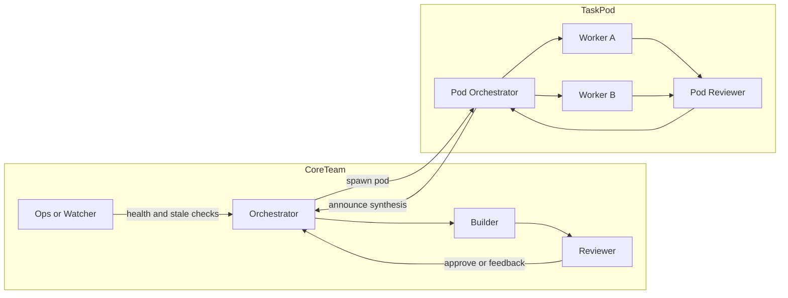
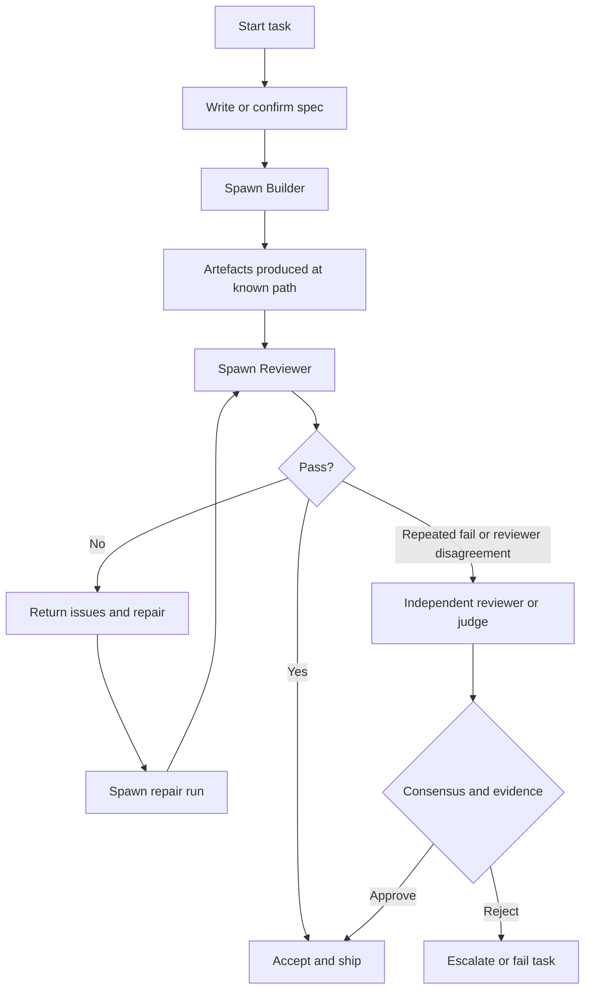

<!-- markdownlint-disable-next-line MD013 -->
# Structuring Agent Teams for Agentic Workflows with OpenClaw and Verifiable Multi-Agent Design

> Status: merged source-of-truth document combining two separate deep-research
> drafts. This version preserves the substance of both: OpenClaw runtime and
> workflow primitives, team topology patterns, verification mechanisms,
> determinism and auditability guidance, security and cost trade-offs, and the
> relevant research and industry references.

## Executive Summary

Agent teams become reliable when they are treated less like "multiple chats"
and more like a distributed system:

- explicit roles
- explicit state
- explicit artefacts
- explicit verification gates
- bounded authority

The most consistently effective pattern across both research and practical
deployments is a thin orchestrator that:

- decomposes work and assigns it
- enforces artefact and handoff contracts
- runs verification loops before outputs are accepted or shipped

OpenClaw maps well to that model. Its Gateway owns deterministic routing,
session state, retries, and tool policy. Its runtime serialises runs per
session key for correctness. It supports isolated sub-agents with depth limits,
tool restrictions, concurrency caps, timeouts, and a push-based announce
mechanism rather than poll loops. For more deterministic pipelines, Lobster and
Task Flow move orchestration into typed, resumable workflow runtimes with
approval checkpoints and durable state.

The research picture points in the same direction:

- redundancy helps most when it is structured
- self-consistency and majority vote are cheap and often strong defaults
- debate can help, but it is not magic and often needs explicit correction bias
- self-verification only becomes trustworthy when anchored to external truth,
  such as tests, schema validation, retrieval, static analysis, or other
  reproducible tool outputs

The practical recommendation is therefore:

1. Use a 3 to 4 role core team by default:
   - Orchestrator
   - Builder
   - Reviewer
   - Ops or Watcher
2. Spawn specialised sub-teams only when needed, rather than keeping every
   role always active.
3. Make verification a hard state transition, not a vague instruction.
4. Separate concerns:
   - prompts define role and local decision contracts
   - deterministic orchestration defines flow, retries, approvals, and budgets
   - tool schemas, sandboxing, and policy define hard capability boundaries
5. Measure the team with evals, regression suites, and operational metrics.

## Scope, Terminology, and Assumptions

This document assumes:

- the deployment environment may be local, remote, or containerised
- model providers may vary by role
- higher-capability models are reserved for orchestration and review
- cheaper or faster models can be used for mechanical worker roles
- the current date context of the source research was 6 April 2026

Terminology:

- Team: a set of roles with distinct responsibilities, policies, and
  verification duties
- Spawn: creating an isolated execution context to complete a bounded task and
  return a structured result
- Verifiable: outputs are accepted only after passing explicit checks such as
  tests, review, retrieval, consistency selection, or approval gates
- Determinism: operational determinism at the workflow level, not bit-identical
  model output

## OpenClaw Architecture and Team Primitives

### Gateway as the deterministic control plane

OpenClaw is built around a long-lived Gateway process that owns:

- routing
- session management
- delivery
- tool execution
- operator and node connectivity
- webhooks
- cron jobs
- control UI
- selected HTTP APIs

This matters because it means the most safety-critical and repeatability-
critical parts of the system live outside the model prompt.

Key control-plane properties:

- deterministic routing through explicit bindings, with specific match rules and
  fallback behaviour
- delivery retries and ordering policies handled by the runtime, not the model
- queueing by session key so only one active run mutates the same session at a
  time
- lane-aware concurrency, allowing safe parallelism across different sessions

This is a distributed-systems style design choice: correctness first, then
parallelism.

### Agent loop and runtime behaviour

OpenClaw embeds the Pi runtime directly into the Gateway. The execution path is
an agent loop:

1. intake
2. context assembly
3. model inference
4. tool execution
5. streaming replies
6. persistence

Runs are serialised per session key. This reduces race conditions and preserves
session consistency.

At session bootstrap, OpenClaw injects workspace files such as:

- `AGENTS.md`
- `SOUL.md`
- `TOOLS.md`

Large files are trimmed to control prompt size. This implies a best practice:

- long-lived role and policy should live in versioned workspace files
- per-task detail should be passed via prompts or artefacts, not buried in
  global persona text

### Multi-agent routing as a static team boundary

OpenClaw supports multiple top-level agents, each with its own:

- workspace
- state directory
- session store
- persona and operating instructions
- tool and sandbox policy

This is best treated as the "static team structure" layer:

- support bot
- ops bot
- research bot
- private assistant

Each can have its own trust boundary and own inbox or channel binding.

OpenClaw explicitly advises against sharing state directories across agents.

### Session visibility and communication boundaries

OpenClaw exposes session tools such as:

- `sessions_list`
- `sessions_history`
- `sessions_send`
- `sessions_spawn`

Visibility scope is configurable:

- `self`
- `tree`
- `agent`
- `all`

Defaulting to `tree` means a session can usually inspect itself plus its own
spawned descendants, but not arbitrary other sessions. Sandboxed sessions are
effectively clamped to `tree`.

This is important for team design:

- local verification is safer by default
- broad cross-session inspection is powerful but should be explicit

### Sub-agents as dynamic team spawning

Sub-agents are first-class in OpenClaw. They are background runs created from
an existing run, each with its own session key, lifecycle, and result path.

Important mechanics:

- spawning is non-blocking
- a spawn returns quickly with accepted status and a child session key
- completion is push-based via announce
- OpenClaw explicitly discourages polling loops for completion

Operationally significant spawn parameters include:

- `task`
- `label`
- `agentId`
- `model`
- `thinking`
- `runTimeoutSeconds`
- `thread`
- `mode`
- `cleanup`
- `sandbox`

Other key controls:

- `maxSpawnDepth`
- `maxChildrenPerAgent`
- `maxConcurrent`
- archive and cleanup policy
- stop and cascade-stop semantics

OpenClaw documents a maximum nesting depth of 5, but recommends staying around
depth 2. The common useful shape is:

- main session
- depth-1 orchestrator sub-agent
- depth-2 leaf workers

Sub-agent context injection is deliberately limited. Workers receive the most
important operating files, but not the full persona or identity context of the
parent. That pushes good designs toward:

- task prompts with clear contracts
- shared artefacts
- reproducible file-based handoffs

### Announce semantics and bounded recall

Announce is the structured return path from a sub-agent back to its parent or
requester. OpenClaw documents that announce:

- runs inside the sub-agent session
- can be suppressed
- includes status from runtime state, not from model self-report
- can include token and cost statistics
- can include transcript pointers

OpenClaw also documents `sessions_history` as a bounded and safety-filtered
recall surface, not just raw transcript dumping. This is the right model for
orchestration: children should return structured artefacts and bounded recalls,
not force the parent to ingest full raw transcripts.

### Deterministic workflow engines: Lobster and Task Flow

OpenClaw provides two key workflow primitives above ordinary chat turns.

#### Lobster

Lobster is a typed workflow shell intended to move orchestration out of
repeated LLM tool calls and into a deterministic runtime. It provides:

- typed steps
- approval checkpoints
- resumable execution via tokens
- explicit pause and resume
- auditability of side effects

This is the right primitive for:

- email triage
- outbound posting
- approval-gated updates to external systems
- repeatable operations that should be resumable after interruption

#### Task Flow

Task Flow adds durable, multi-step orchestration with:

- durable state
- revisions
- managed versus mirrored modes
- explicit cancellation semantics
- restart survivability

If Lobster is a deterministic pipeline shell, Task Flow is the durable state
machine for longer-lived orchestration.

### Hooks, memory, and workspace home

OpenClaw’s hooks system allows scripts to attach to lifecycle events and
message pipeline events. Bundled hooks include memory-writing behaviour.

The workspace is treated as the agent’s long-term home. In practice, that means
memory and operating context should be durable, auditable, and ideally kept in
private version control when appropriate.

### Tool policy, sandboxing, and hard boundaries

OpenClaw supports:

- per-agent tool allow and deny policy
- sandbox policies
- sub-agent-specific tool restrictions
- delegate and audit patterns

Tool filtering has defined precedence rules and deny wins.

This is essential. Prompt instructions are soft. Gateway-enforced policy is
hard.

### Loop detection, approvals, and formal security modelling

OpenClaw exposes several guardrails that should be treated as part of workflow
verification:

- tool-loop detection to dampen or block repeated no-progress cycles
- exec approvals with allowlists, interlocks, and locally enforced execution
  context
- per-agent sandboxing and tool restrictions
- formal TLA+ and TLC-based bounded security models for certain platform
  properties

These are not optional extras. They are part of making an agent team
operationally trustworthy.

## Research and Industry Evidence on Coordination and Verification

### Coordination patterns from LLM-agent systems

Several influential systems converge on the same broad lesson: coordination is
not a single prompt; it is a protocol.

#### AutoGen

AutoGen models applications as multi-agent conversations with interaction
patterns defined in code or natural language. The practical implication is that
"who speaks when and with what authority" must be specified.

#### CAMEL

CAMEL explores role-playing communicative agents with strong role conditioning.
The implication is that roles help, but only when the protocol constrains
turn-taking and objectives.

#### ChatDev

ChatDev structures software work as a chat chain across design, coding, and
testing phases, with communicative dehallucination. The key lesson is that
phase boundaries should become verification gates.

#### MetaGPT

MetaGPT encodes SOPs into prompt sequences and uses an assembly-line workflow
of roles. The practical lesson is that verifiable pipelines look like:

- role
- artefact
- review
- next role

These systems reinforce the same architectural stance as OpenClaw’s runtime and
team playbooks:

- explicit roles
- explicit artefacts
- explicit review gates

### Self-verification and iterative improvement

Three families are especially relevant:

#### Reflexion

Reflexion shows that agents can improve via linguistic feedback stored as
episodic memory rather than weight updates. Operationally, this means:

- failures should produce structured lessons
- those lessons should persist into later runs

#### Self-Refine

Self-Refine demonstrates iterative generate, critique, and refine loops using
the same model. The lesson is that one-shot outputs are usually the wrong
default for non-trivial tasks.

#### Chain-of-Verification

CoVe reduces hallucination by:

1. drafting
2. generating verification questions
3. answering those questions independently
4. revising the draft

The lesson is simple and strong:

- verifier passes should be structurally separate from generator passes

### Consensus, voting, and disagreement

#### Self-consistency

Self-consistency improves reasoning by sampling multiple reasoning paths and
selecting the most consistent result. It is a strong low-cost default when
external truth checks are not available.

#### Debate

Multi-agent debate can improve reasoning and factuality, but it is a protocol,
not a guarantee. It needs:

- controlled turn structure
- clear stopping rules
- explicit judging criteria

#### Debate or Vote

The NeurIPS 2025 spotlight work on debate versus vote suggests that majority
voting alone may account for much of the apparent benefit often attributed to
debate. Debate should therefore be treated as optional overhead unless it
proves its value empirically for a specific workload.

### Distributed systems and fault tolerance analogies

Classical consensus systems are not direct blueprints for LLM teams, but they
provide useful metaphors:

- Paxos and Raft reinforce the "single leader for state progression" pattern
- PBFT is a useful analogy for high-risk actions requiring multiple independent
  approvals or verifications

In practical agent-team terms:

- redundancy catches model errors
- deterministic guardrails catch system errors

Use:

- voting or resampling for model uncertainty
- timeouts, queueing, idempotency, loop detection, and approvals for system
  safety

## Team Design Patterns

### Core design principles

1. One role owns decomposition and state progression.
2. Everything important becomes an artefact.
3. Review is an explicit state.
4. Spawn defaults to isolation.
5. Spawned work must have an output path.
6. Cost and safety budgets are configured in the runtime, not negotiated in the
   middle of a task.

### Pattern catalogue

<!-- markdownlint-disable MD013 MD060 -->
| Pattern | Team shape | Verification mechanism | Strengths | Common failure modes | Recommended use cases |
|---|---|---|---|---|---|
| Orchestrator, Builder, Reviewer | 3 roles, sometimes plus Ops | Cross-role review and optional tests | Clear accountability and scalable default | Reviewer bottleneck, weak specs | Most production workflows |
| Spec, Feasibility Review, Build, Review | 4 roles | Feasibility check plus review and tests | Prevents building the wrong thing | Early-phase latency | Features and larger deliverables |
| Parallel research and merge | Orchestrator plus N researchers | Independent runs then synthesis | Breadth and perspective diversity | Duplicate work and weak merge quality | Investigations and design exploration |
| Committee vote | N peers plus aggregator | Majority or consistency selection | Cheap robustness | Correlated errors | Low or medium stakes reasoning |
| Debate plus judge | N debaters plus judge | Judge or rubric-based adjudication | Surfaces hidden assumptions | High cost and latency | When explanation of disagreement matters |
| Guard plus executor | Guard agent plus tool-capable worker | Guard checks policy and tool usage | Strong safety boundary | Excessive strictness | Tool-heavy or high-risk actions |
| Ops watcher plus circuit breakers | Watcher plus all roles | Timeouts, loop detection, stale-task alerts | Cost and failure containment | Alert fatigue | Long-running or parallel systems |
<!-- markdownlint-enable MD013 MD060 -->

### Task pod pattern

A robust task pod is an ephemeral sub-team created for one bounded task:

- a pod orchestrator at depth 1
- one or more workers at depth 2
- a reviewer, either as a dedicated run or a dedicated role

This aligns with OpenClaw’s nesting and announce semantics and avoids blocking
the main session while preserving auditability.

### Disagreement escalation protocol

Use a predictable ladder:

1. reviewer rejects with explicit issues
2. builder gets one repair iteration
3. if still unresolved, spawn an independent second reviewer with fresh context
4. if reviewers disagree, adjudicate using tests, evidence, and spec alignment
5. if still blocked, escalate to a human with a concise decision packet

This keeps debate bounded and evidence-based.

### Team topology diagram



## Prompt Design and Deterministic Orchestration

### What belongs where

<!-- markdownlint-disable MD013 MD060 -->
| Concern | Prompts | Deterministic loops | Runtime and system orchestration |
|---|---|---|---|
| Role identity and behavioural constraints | Yes | No | Store stable policy in `AGENTS.md` and stable voice in `SOUL.md` |
| Deliverable format and artefact path | Yes | Validate path and schema | Enforce shared conventions |
| Verification instructions | Yes | Run checks and retries | Enforce review gate and stop conditions |
| Tool invocation rules | Lightly | Yes | Prefer tool schemas, allowlists, and sandboxing |
| Cost and latency budgets | No | Yes | Yes |
<!-- markdownlint-enable MD013 MD060 -->

### Prompt layering in OpenClaw

OpenClaw’s workspace model gives a practical prompt hierarchy:

- `AGENTS.md` for mission, rules, and operating constraints
- `SOUL.md` for tone and persona
- `TOOLS.md` for usage guidance, not capability authority

Tool schemas count toward context window budget. That makes per-role tool
minimisation a performance and cost concern as well as a safety concern.

### Example prompts

#### Orchestrator spawn prompt

```text
## Task: Implement feature X
Task ID: FEAT-123
Role: Builder
Priority: High

Inputs:
- Spec: /shared/specs/FEAT-123-spec.md
- Constraints: Do not change public API signatures.
- Environment notes: /shared/specs/env.md

Deliverables:
1) Code changes with exact file paths
2) Tests for new behaviour
3) A short handoff note

Output path:
/shared/artifacts/FEAT-123-feature-x/

Handoff must include:
- summary of what changed
- exact file paths
- how to verify
- known limitations
```

#### Reviewer prompt

```text
You are the Reviewer.

Inputs:
- Spec: /shared/specs/FEAT-123-spec.md
- Artefacts: /shared/artifacts/FEAT-123-feature-x/

Do:
- verify spec compliance
- identify edge cases and security issues
- return pass or fail with numbered issues
- give concrete fixes and minimal reproductions

Do not:
- implement changes unless explicitly asked
```

### Deterministic verification loop

OpenClaw discourages polling for sub-agent completion. The intended model is
event-driven completion handling.

```pseudo
function run_task_with_verification(task):
  create_task_record(task.id, state="Inbox")
  spec = ensure_spec(task)
  set_state(task.id, "Assigned")

  builder = sessions_spawn(build_prompt(task, spec))
  set_state(task.id, "In Progress")

  builder_result = wait_for_completion(builder.runId)
  assert_exists(task.output_path)
  assert_handoff_present(task.id)

  review = sessions_spawn(review_prompt(task, spec))
  set_state(task.id, "Review")
  review_result = wait_for_completion(review.runId)

  if review_result.verdict == "PASS":
    set_state(task.id, "Done")
    return ship(builder_result)

  if review_result.verdict == "FAIL":
    repair = sessions_spawn(repair_prompt(task, review_result))
    wait_for_completion(repair.runId)
    goto review

  if disagreement or repeated_failures:
    adjudicate_or_escalate(task)
```

### Verification flowchart



## Dynamic Spawning, Lifecycle, Parallelism, and Communication

### Spawning strategies

Useful spawning strategies include:

- static trios such as researcher, builder, reviewer
- uncertainty-driven verifier spawning
- failure-driven debugger spawning
- budgeted swarm patterns
- workflow-engine-first orchestration for highly repeatable processes

### Lifecycle management in OpenClaw

Sub-agent lifecycle controls include:

- `runTimeoutSeconds`
- archive and cleanup behaviour
- `maxConcurrent`
- `maxChildrenPerAgent`
- cascade stop semantics

For longer workflows, Task Flow adds durable revision tracking and managed
progress across restarts.

### Communication protocols and artefact flow

The preferred communication stack is:

- shared files for durable, auditable artefacts
- structured handoff notes
- comments or ledger entries for blockers and progress
- `sessions_send` only for urgent, synchronous intervention

Bounded transcript recall via `sessions_history` is useful for debugging and
context, but should not replace file-based handoff.

### MCP and external tool integration

OpenClaw participates in the Model Context Protocol ecosystem. MCP is useful as
the standard tool and data integration boundary between agent runtimes and
external capabilities. The orchestration lesson is that tool integration should
be schema-driven and capability-scoped, not improvised through free-form
prompts.

## Determinism, Idempotency, Reproducibility, and Audit Trails

### What belongs in loop logic

The clean split is:

- prompts define local decision-making and output contracts
- runtime logic defines retries, backoff, idempotency, checkpointing,
  side-effect gating, and concurrency

Lobster is the clearest OpenClaw-native example of this split. The agent
requests one typed workflow call; the runtime owns the multi-step control flow.

### Idempotency patterns

OpenClaw operationally demonstrates three useful idempotency patterns:

1. per-request delivery retries with idempotency protection
2. serialised execution per session key
3. explicit approval checkpoints before high-risk side effects

These should be standard for production-grade agent teams.

### Checkpoints and audit trails

OpenClaw provides:

- session transcripts
- task ledgers
- workflow state
- durable task flow revisions
- audit-oriented announce payloads

This is the right operational posture. Agent systems need replayable artefacts,
not just chat history.

### Guarding against tool thrashing

Loop detection is a runtime guardrail that should complement prompt-level
instructions such as "stop when stuck." Prompt guidance alone is insufficient
to control cost and failure loops.

## Metrics, Tests, and Evaluation

### Correctness metrics

For tasks with deterministic truth:

- unit test pass rate
- integration test pass rate
- regression rate
- spec compliance rate
- patch correctness

For factual and research tasks:

- supported claim rate
- citation and attribution quality
- draft-to-verified error reduction
- hallucination divergence checks when no external validator exists

### Efficiency and latency metrics

Track:

- LLM call count per role
- wall-clock latency per stage
- token spend per stage
- tool-call count and tool error rate
- queue wait time
- announce turnaround time

OpenClaw exposes useful runtime signals for this, including token and runtime
stats in announce payloads.

### Robustness metrics

Track:

- reviewer rejection rate
- disagreement rate
- repair depth
- stale-task rate
- timeout rate
- loop-detection warnings and blocks
- protocol violations such as missing artefacts or missing handoff notes

### Test harnesses

Two complementary surfaces matter:

1. system tests for orchestration logic
2. behavioural evals for agent roles

System tests should inject:

- tool failure
- delayed completion
- partial output
- restart during orchestration
- announce loss

Role evals should use:

- datasets
- graders
- prompt version comparisons
- model version comparisons

OpenAI’s eval guidance and OpenClaw’s own layered testing posture both point to
the same conclusion: reliability is an engineering surface, not a vibe.

## Security, Compliance, Cost, and Latency Trade-offs

### Security posture

Agent teams expand the attack surface because they multiply:

- tool calls
- prompt ingestion points
- external integrations
- side-effect opportunities

Relevant frameworks:

- OWASP LLM Top 10
- MITRE ATLAS
- NIST AI RMF and Generative AI profile
- UK government code of practice for cyber security of AI systems

Relevant OpenClaw controls:

- per-agent sandboxing
- per-agent tool policy
- sub-agent tool restrictions
- exec approvals
- ATLAS-aligned threat modelling
- formal verification models for selected properties

### Cost and latency trade-offs

Redundancy buys reliability, but also consumes time and tokens.

Main cost drivers:

- each sub-agent has its own context and token burn
- review loops add latency
- tool-rich roles inflate context through tool schemas
- unconstrained parallelism expands spend quickly

Primary controls:

- cheaper models for workers where appropriate
- stronger models only for orchestration and review
- `maxConcurrent`
- `maxChildrenPerAgent`
- `runTimeoutSeconds`
- loop detection and circuit breakers
- prompt and context minimisation

## Implementation Checklist

### Team and artefacts

- roles are defined and non-overlapping
- shared artefact directory structure exists
- task IDs are stable
- review is mandatory for non-trivial work

### OpenClaw configuration

- sub-agent defaults are configured
- spawn depth is explicit
- visibility scope is explicit
- sandbox and tool policy is explicit
- loop detection is enabled where needed
- exec approvals are configured for destructive actions

### Verification

- builder handoffs always include how to verify
- review rejection and escalation rules are documented and bounded

### Measurement

- per-run stats are captured
- rejection and repair rates are tracked
- regression harnesses exist

## Migration Plan

Use a phased migration:

1. Make the single agent act like a team without spawning.
2. Split builder and reviewer as explicit passes.
3. Introduce a real restricted reviewer role.
4. Adopt `sessions_spawn` for self-contained tasks.
5. Add parallelism selectively.
6. Introduce nested task pods only when needed.
7. Harden with sandboxing, approvals, and threat-model-driven tests.
8. Institutionalise evals and regression flywheels.

This sequence matters. Behavioural structure should come before concurrency.

## Ecosystem and Operational Signals

The source drafts also captured broader ecosystem facts worth preserving:

- OpenClaw positioned itself as a self-hosted automation control plane plus
  agent runtime rather than "just a chatbot"
- the project had very large public adoption signals in early 2026
- security incidents around malicious marketplace add-ons and exposed
  installations were already material enough to drive public concern
- OpenClaw’s own VISION document explicitly resisted turning the core into an
  all-in agent framework, reinforcing the idea that orchestration opinions
  should sit above the Gateway substrate rather than inside it

These points matter because they support a conservative design stance:

- treat OpenClaw as a stable control plane and runtime substrate
- keep team orchestration explicit and testable at the application layer

## Primary Sources and Reference Index

<!-- markdownlint-disable MD034 -->
OpenClaw official:

- https://github.com/openclaw/openclaw
- https://docs.openclaw.ai/concepts/multi-agent
- https://docs.openclaw.ai/tools/subagents
- https://docs.openclaw.ai/tools/lobster
- https://docs.openclaw.ai/automation/taskflow
- https://docs.openclaw.ai/concepts/queue
- https://docs.openclaw.ai/concepts/retry
- https://docs.openclaw.ai/tools/loop-detection
- https://docs.openclaw.ai/tools/multi-agent-sandbox-tools
- https://docs.openclaw.ai/security/THREAT-MODEL-ATLAS

Multi-agent research:

- https://arxiv.org/abs/2210.03629
- https://arxiv.org/abs/2203.11171
- https://arxiv.org/abs/2303.11366
- https://arxiv.org/abs/2305.10601
- https://arxiv.org/abs/2212.08073
- https://arxiv.org/abs/2308.08155

Related agent systems and workflows:

- https://docs.langchain.com/oss/python/langgraph/persistence
- https://docs.crewai.com/en/learn/hierarchical-process

Consensus and distributed systems:

- https://lamport.azurewebsites.net/pubs/paxos-simple.pdf
- https://raft.github.io/raft.pdf
- https://css.csail.mit.edu/6.824/2014/papers/castro-practicalbft.pdf

Security and governance:

- https://owasp.org/www-project-top-10-for-large-language-model-applications/
- https://nvlpubs.nist.gov/nistpubs/ai/nist.ai.100-1.pdf
- https://atlas.mitre.org/
- https://atlas.mitre.org/pdf-files/SAFEAI_Full_Report.pdf

MCP:

- https://www.anthropic.com/news/model-context-protocol
- https://modelcontextprotocol.io/specification/2025-11-25

OpenAI prompting and eval guidance:

- https://developers.openai.com/api/docs/guides/prompt-engineering/
- https://developers.openai.com/api/docs/guides/prompt-guidance/
- https://developers.openai.com/cookbook/articles/openai-harmony/
<!-- markdownlint-enable MD034 -->
