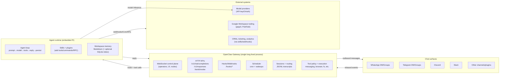

# OpenClaw Deep Research Report

## Executive summary

OpenClaw is a self-hosted, open-source "personal AI assistant" that centres on a long‑lived Gateway process acting as a control plane and multi-channel messaging hub, plus an embedded agent runtime (Pi) that executes an "agent loop" (context assembly → model inference → tool execution → reply streaming → persistence). It is designed to let you run an always-on assistant on infrastructure you control and interact with it from the chat surfaces you already use (for example WhatsApp and Telegram), while extending its capabilities via skills, plugins, webhooks, cron jobs, nodes (paired devices), and HTTP/WS APIs.

This report's key operational takeaway is that OpenClaw is powerful precisely because it can be wired into real messaging surfaces and real tools (filesystem, browser automation, external CLIs, API credentials). That same power creates serious security and compliance risk if you run it like a typical "chatbot." The official security guidance explicitly frames OpenClaw as requiring a trusted host/config boundary and warns against using one Gateway for multiple mutually untrusted operators; it recommends tightening access and tool policy first and widening later.

From a business-operations perspective, OpenClaw is best treated as an "automation control plane + agent runtime" that you can deploy in layers:

- Start with "messaging-only" (read/respond) workflows in one or two channels with strict allowlists and strong Gateway authentication, and adopt deterministic/approval-gated patterns (for example via Lobster) for side effects (sending email, posting content).
- Expand into inbox and calendar automation using Google Workspace tooling (commonly via `gogcli` + Gmail Pub/Sub hooks), but segment accounts and scope permissions (dedicated bot accounts, least privilege) and operationalise backups (workspace in private git; credentials excluded).
- For multi-function "business assistant" usage (support/marketing/sales), run multiple agents with distinct workspaces and security profiles (tool allow/deny + sandbox at "non-main" or "all"), and split trust boundaries across separate Gateways or OS users when needed.

Adoption is unusually large for a new OSS project: as of 23 February 2026, the OpenClaw organisation's repository listing shows ~219k stars and ~42k forks on the main repo, with ~3.8k issues and ~4.2k pull requests visible in the repo navigation.

However, the ecosystem has also attracted active security threats (malicious skills, secret leakage patterns, exposed instances). Multiple reputable security writeups and mainstream outlets reported malicious add-ons in the skills marketplace and organisational bans driven by cybersecurity concerns in February 2026.

## What OpenClaw is and how it works

OpenClaw is a self-hosted assistant framework built around a "Gateway architecture": one always-on Gateway process owns chat channel connections and exposes a multiplexed control plane (WebSocket + HTTP APIs + Control UI + hooks). Control-plane clients (CLI, browser UI, macOS app, automations) connect to the Gateway over WebSocket; nodes (paired devices, including mobile) also connect over WebSocket with explicit role/capability declarations.

Under the hood, OpenClaw's agent execution path is an "agent loop": a single run per session takes inbound events, assembles prompt/context, calls the model, executes tool calls, streams partial replies, and persists session state. The official "Agent Loop" documentation describes the key stages (RPC entry, queues/lanes, embedded Pi runtime invocation, event streaming, timeouts).

OpenClaw's agent runtime is implemented by embedding the Pi SDK (from `pi-coding-agent` and related packages) directly into the Gateway rather than running Pi as a subprocess. The project's own Pi integration write-up lists the Pi packages used and the design goals (custom tool injection, system prompt customisation, session persistence, auth profile rotation, failover, tool streaming, and more).

### Core architecture diagram



## Features and capabilities analysis

OpenClaw's capabilities are best understood as a layered stack: messaging surfaces and session routing at the edge; tool execution, automation, and APIs in the middle; and extensibility through skills/plugins plus device nodes.

### Messaging, replying, and cross-channel actions

OpenClaw ships a cross-channel `message` tool that supports sending messages and performing channel actions across multiple chat providers. The tools documentation lists core actions such as `send` (text + optional media), `react`, `edit`, `delete`, pinning, search, thread operations, polls (provider-dependent), and moderation-style actions (kick/ban/timeout) where supported. It also notes safety constraints: when a message tool call is bound to an active chat session, sends are constrained to that session's target to reduce cross-context leaks.

Access controls for inbound messaging are central. The configuration reference defines per-channel DM policies (`pairing`, `allowlist`, `open`, `disabled`) and group policies (`allowlist`, `open`, `disabled`), with fail-closed defaults and pairing limits (expiry, cap on pending requests). This is the backbone for running OpenClaw safely in business contexts (support inboxes, shared groups, etc.).

### Automation, scheduling, and deterministic workflows

OpenClaw includes a built-in scheduler ("Cron jobs") that persists jobs, wakes the agent at the right time, and can optionally deliver output back to a chat. This is a first-class mechanism for recurring business tasks (daily support rollups, morning KPI digests, scheduled social posts, compliance checks).

For workflows that require side effects with explicit approvals, OpenClaw provides "Lobster," a typed workflow runtime designed to run multi-step pipelines deterministically with approval checkpoints and resumable state. The Lobster docs include an "Email triage" example showing how an approval gate can pause and resume sending replies safely.

### Integrations via skills, plugins, and external CLIs

OpenClaw's extensibility model separates "skills" (instructional/tooling bundles) from "plugins" (code modules that register tools, commands, Gateway RPC methods, HTTP handlers, background services, and skills). Skills load from bundled, managed (`~/.openclaw/skills`), and workspace (`<workspace>/skills`) locations with precedence rules; gating depends on environment/config and required binaries.

For discovery and distribution, OpenClaw provides ClawHub, a public registry with versioned skill bundles, browsing/search, and community feedback signals such as stars/downloads.

Plugins are the primary path for optional capabilities (for example Microsoft Teams and decentralised messaging integrations). The plugins documentation describes the CLI install flow and enumerates official plugins (as of early 2026, this includes items such as Microsoft Teams, Matrix, Nostr, Zalo, and Voice Call).

### UI, CLI, APIs, and operational tooling

OpenClaw provides multiple operator surfaces:

- A browser "Dashboard / Control UI" served by the Gateway (default `/`), used for chat, config editing (including schema-driven forms), logs tailing, and operational actions. Documentation emphasises that this is an admin surface and should not be exposed publicly.
- A terminal UI (`openclaw tui`) that connects to the Gateway, with troubleshooting guidance around delivery settings and connectivity.
- A "WebChat" concept for native clients that talk directly to the Gateway WebSocket and preserve deterministic reply routing.

On the API layer, OpenClaw exposes:

- A WebSocket "Gateway protocol" that defines the control plane and node transport, including handshake and scopes.
- An always-enabled (but auth/policy-gated) HTTP endpoint `POST /tools/invoke` for invoking a single tool with the same policy chain as agents, plus a default HTTP deny list for dangerous operations.
- Opt-in OpenAI-compatible chat completions (`POST /v1/chat/completions`) and an OpenResponses-compatible endpoint (`POST /v1/responses`), both executed via the normal Gateway agent run codepath so routing and permissions match standard operation.

### Capability map into business-operational primitives

| Capability area | Documented OpenClaw primitive | Typical real-world pattern | Specified vs unspecified |
|---|---|---|---|
| Messaging + replying | `message` tool; per-channel policies; session routing | Run allowlisted DMs; mention-gated groups; `message.send/edit/react` for actions | Core actions specified. |
| Email handling | Gmail Pub/Sub hooks; `gogcli`-based workflows; Lobster "email triage" pattern | Use `gog` CLI for Gmail search/send and Pub/Sub watch; approval-gate sends | Gmail path specified; generic IMAP/SMTP not described as a built-in channel. |
| Social media posting | Skills/plugins + browser automation; cron scheduling | Post via dedicated APIs (third-party skills) or browser tool; schedule via cron | Core "social" not built-in; depends on skills/plugins and external APIs. |
| Automation + scheduling | Cron scheduler; hooks/webhooks; Lobster workflows | Daily/weekly digests, inbound webhook triggers, approval-based pipelines | Specified. |
| Integrations + APIs | Skills, plugins; Gateway WS protocol; HTTP endpoints | Integrate with SaaS via skills or inbound hooks; expose OpenAI-compatible endpoint internally | Specified. |
| Multi-user / business workflows | Multi-agent routing; per-agent tools/sandbox profiles; multi-instance isolation | Separate agents per function; separate Gateways for trust boundaries | Core mechanisms specified; "multi-tenant" use explicitly discouraged in one-Gateway mixed-trust setups. |
| UI/CLI | Control UI/dashboard; TUI; logs/doctor/security audit | Ops runbooks and CI checks around config/auth/tools | Specified. |

## Configuration and deployment playbook

This section is organised as "capability-by-capability" setup guidance, with explicit config snippets and operational checks. OpenClaw configuration is stored in `~/.openclaw/openclaw.json` (JSON5 format; comments/trailing commas allowed), and defaults are intended to be safe when omitted—though business deployments should assume "safe defaults" are not sufficient without explicit hardening.

### Installation and first run

OpenClaw's documented fast path is CLI-first:

1. Install (for example via the official install script).
2. Run onboarding (`openclaw onboard --install-daemon`) to configure auth, Gateway settings, and optional channels.
3. Verify the Gateway status and open the Control UI (`openclaw dashboard`).

Example operator commands:

```bash
# Install (macOS/Linux)
curl -fsSL https://openclaw.ai/install.sh | bash

# Onboard + install as a daemon/service
openclaw onboard --install-daemon

# Verify the gateway and open the UI
openclaw gateway status
openclaw dashboard
```

The docs specify Node.js 22+ as a prerequisite.

### Hosting, profiles, scaling, and backups

**Single host model, multi-instance isolation.** OpenClaw is designed as "one Gateway per host" for normal operations, but it supports running multiple Gateways on one machine by using unique ports and isolated state directories (`OPENCLAW_STATE_DIR`) and config paths (`OPENCLAW_CONFIG_PATH`). Convenience flags such as `--profile <name>` are documented.

```bash
# Example: run a second isolated gateway instance
OPENCLAW_CONFIG_PATH=~/.openclaw/acme-support.json \
OPENCLAW_STATE_DIR=~/.openclaw-acme-support \
openclaw gateway --port 19001
```

**VPS and managed deployment patterns.** There are official "production VPS guide" style docs (for example GCP via Docker), plus platform guides (for example Render) and marketplace-style deployment documentation (for example DigitalOcean's OpenClaw marketplace page). These emphasise durable state, baked-in binaries for skills, and safe restart behaviour.

**Backups.** The official FAQ recommends putting your agent workspace into a private git repository for backup and restoring the assistant's "mind" (memory and bootstrap files), while explicitly warning not to commit `~/.openclaw` because it contains credentials, sessions, and tokens. For full restores, back up workspace and state separately.

### Authentication, permissions, and network exposure

**Gateway auth.** Gateway auth is enforced at the WebSocket handshake (token/password), and documentation explicitly recommends keeping token auth even on loopback so local clients must authenticate. Remote access patterns include SSH tunnelling and Tailscale Serve/Funnel (with notes on identity headers and when tokenless access is acceptable). Reverse proxy deployments should configure `gateway.trustedProxies` to prevent authentication bypass by spoofed forwarding headers.

A hardened baseline config example is provided in the security documentation; it starts with loopback binding and token auth, then denies high-risk tool groups by default.

**Device pairing and nodes.** OpenClaw supports pairing devices/nodes and documenting node permission requirements (especially on macOS, where system permissions such as screen recording and accessibility require approval). The onboarding wizard and remote access docs highlight permission prompts and workflows.

### Messaging channels setup

OpenClaw supports a set of "core" channels plus additional plugin channels. The official channels overview lists major providers and identifies which are plugin-only.

**WhatsApp.** The WhatsApp channel runs through WhatsApp Web (Baileys) and is linked via QR login (`openclaw channels login --channel whatsapp`). The docs include a "Quick setup" config that illustrates DM and group policies and allowlists. They also note there is no built-in Twilio WhatsApp channel in the built-in registry.

```bash
openclaw channels login --channel whatsapp
openclaw gateway
```

**Telegram.** Telegram is implemented via grammY; docs emphasise allowlists as numeric user IDs and provide tooling to resolve legacy usernames (doctor fix). The channel supports both long-poll and webhook modes, mention gating, and per-group/per-topic overrides.

**Microsoft Teams (plugin).** The Teams integration is plugin-only and requires Azure Bot setup plus webhook exposure (`/api/messages`), with optional Microsoft Graph permissions for media, attachments, and history. It also documents known limitations such as webhook timeouts and markdown rendering constraints.

### Email capability setup: Gmail and beyond

OpenClaw's email story is best understood as two layers: (1) using a Google Workspace CLI and (2) using push-based inbound eventing via Pub/Sub mapped into OpenClaw hooks.

**Google Workspace via `gogcli`.** The `gogcli` repository describes itself as a script-friendly CLI covering Gmail, Calendar, Drive, and more, with Gmail support including search, send, labels, and Pub/Sub watch. It supports multiple accounts and least-privilege auth.

**Gmail Pub/Sub → OpenClaw hooks.** The Gmail Pub/Sub automation page lists prerequisites (`gcloud`, `gogcli`, hooks enabled, Tailscale) and provides example hook config enabling a `gmail` preset mapping and delivery templates. It also documents an operational footgun: if configured, the Gateway auto-starts `gog gmail watch serve` on boot; running a separate watcher in parallel can cause port bind conflicts.

```json5
{
  hooks: {
    enabled: true,
    token: "OPENCLAW_HOOK_TOKEN",
    path: "/hooks",
    presets: ["gmail"],
    mappings: [
      {
        match: { path: "gmail" },
        action: "agent",
        wakeMode: "now",
        name: "Gmail",
        sessionKey: "hook:gmail:{{messages[0].id}}",
        messageTemplate:
          "New email from {{messages[0].from}}\nSubject: {{messages[0].subject}}\n{{messages[0].snippet}}\n{{messages[0].body}}",
        deliver: true
      }
    ]
  }
}
```

**Unspecified: built-in IMAP/SMTP.** In the official channel list and configuration reference surfaced in the cited sources, IMAP/SMTP does not appear as a first-class built-in email channel. Where businesses need non-Gmail email integration, the documented strategy is to build or install a skill/plugin that calls an API/CLI, or to use browser automation as a fallback for providers without good APIs. Therefore, "SMTP/IMAP setup" is *unspecified as a native OpenClaw capability* in the primary OpenClaw docs cited here; it should be implemented via a custom skill (for example running an IMAP polling script and sending outbound via SMTP) and then wired into cron/hooks.

### Automation: cron, hooks, and web-triggered workflows

OpenClaw cron is explicitly documented as the built-in scheduler and a recommended mechanism for "run this every morning" style tasks.

OpenClaw hooks (webhooks) are configured under `hooks` with a shared secret token, payload size limits, session key restrictions, and mappings that can route inbound events to agent runs with delivery back to a chat.

For deterministic multi-step operations with approvals, Lobster provides `run` and `resume` operations and a JSON envelope with `needs_approval` status, which is a strong fit for business workflows where you must log and confirm side effects (sending emails, posting content, editing external systems).

### APIs, integrations, and "headless" orchestration

OpenClaw's documented integrations include:

- `POST /tools/invoke` for single-tool execution, gated by Gateway auth and tool policy, and with an additional HTTP deny list (for example `sessions_spawn`, `sessions_send`, `gateway`, and `whatsapp_login`). This is a practical "integration API" for external systems (ticketing, monitoring) that want deterministic calls without prompting the LLM.
- Opt-in OpenAI-compatible and OpenResponses-compatible endpoints suitable for integrating OpenClaw as an internal "agent execution backend," selecting the target agent via the request `model` field or an `x-openclaw-agent-id` header.
- A WebSocket Gateway protocol with handshake challenges, role/scope declarations, and optional TLS pinning.

## Real-world use cases and business workflows

OpenClaw's official showcase page and community writeups point to a pattern: users build specialised agents and workflows that live "under one Gateway," often controlled from messaging apps, and use skills/webhooks/nodes for side effects.

### Customer support operations

A pragmatic OpenClaw support stack looks like:

1. **Ingress**: messages arrive from a support channel (for example a Slack channel or Teams bot endpoint) into the Gateway; strict allowlists and mention gating prevent uncontrolled prompts.
2. **Triage + drafting**: the agent summarises context, proposes a response, and optionally tags the conversation with internal metadata in the workspace. Lobster is a strong fit to make "triage → draft → approve → send" deterministic, with an audited resume token.
3. **External system updates**: use a skill to create/update tickets (or call `/tools/invoke` to run a deterministic tool wrapper); avoid letting the model freely run arbitrary scripts in production.
4. **Escalation**: route "high-risk" or "needs human" messages to a human operator, and keep "send" actions behind explicit approvals.

### Marketing and social media management

OpenClaw can support marketing workflows in two main ways:

- **API-based posting/scheduling via skills**: third parties have published "social media automation" skills (for example a Genviral "partner API" skill described as automating posting and analytics across multiple platforms). These are not core OpenClaw features; they depend on external services, credentials, and platform terms.
- **Browser automation**: OpenClaw's browser tool can interact with JS-heavy sites, but the docs recommend manual login in the host browser profile and warn against giving credentials to the model. This approach is brittle (anti-bot, UI changes) but can work when APIs are unavailable.

A marketing automation pattern that stays closer to "business-safe" is: research and draft creation + human approval → scheduled posting via cron → performance metrics pulled from approved APIs into a spreadsheet (for example using Google Sheets via `gog`).

### Sales outreach and pipeline hygiene

OpenClaw's strongest fit is **assistive** sales operations rather than autonomous outreach:

- Use web search tools (`web_search` via Brave or Perplexity) to create context briefs, then draft messages for a human to send.
- Use scheduled digests for pipeline hygiene ("review top leads daily at 09:00") and build "CRM update" tooling as deterministic scripts invoked through Lobster with approvals.

### Inbox and calendar management

OpenClaw's homepage positions "clears your inbox, sends emails, manages your calendar" as core outcomes, but the concrete operational mechanism in documented setups is typically a Google tooling layer (gogcli, OAuth, Pub/Sub hooks).

The combination of Gmail Pub/Sub push events → webhook mapping → Lobster triage workflows is the most "production-shaped" pattern surfaced in primary docs.

### Multi-agent "departmental assistant" model

OpenClaw supports multi-agent routing and per-agent security profiles (sandbox and tool restrictions), enabling a single Gateway to host separate agents for separate business functions. The "Multi-Agent Sandbox & Tools" and sandboxing documentation explicitly frame this as a way to run "personal assistant with full access" alongside restricted/public-facing agents.

A practical pattern is:

- **Support agent**: messaging-only tool profile, no filesystem/runtime tools, strict channel allowlists.
- **Ops agent**: cron + hooks enabled, limited filesystem scope (workspace-only) and approvals for exec.
- **Marketing agent**: browser tool enabled only in a sandbox; API-based posting only via vetted integrations.

## Security, privacy, and legal/compliance considerations

### Security posture and threat model

OpenClaw is "high-privilege by design": it can be wired into messaging platforms, local tools, web automation, and credentials. The official security doc states there is no "perfectly secure" setup and recommends deliberate control over who can talk to the bot, where it can act, and what it can touch. It also explicitly warns that the host/config boundary is trusted and that running one Gateway for multiple mutually untrusted operators is not recommended; mixed-trust teams should split trust boundaries (separate Gateways or at least separate OS users/hosts).

### Current ecosystem security events (January–February 2026)

A business deployment in February 2026 must account for an active threat environment around OpenClaw skills and exposed instances:

- Multiple reports described malicious "skills" distributed via the skills marketplace, including campaigns that used social engineering to induce users/agents to execute commands that install infostealers.
- Snyk reported a different class of risk: skills that are "functional" but insecure, instructing agents to mishandle secrets (keys/PII) by passing them through model context or logs.
- Mainstream coverage in mid-February 2026 described internal bans at companies (including Meta) driven by concerns about unpredictability, privacy breach potential, and manipulation risk when used on company systems.
- Security press reported infostealer malware extracting OpenClaw configuration and secrets from infected machines, motivating strong host hardening and secret management.

### Practical hardening checklist for business use

The following items are all supported by documented mechanisms:

**Network and auth**

- Keep the Gateway bound to loopback unless you have a controlled tunnel; prefer Tailscale Serve or SSH tunnels.
- Require token/password auth, and configure `gateway.trustedProxies` correctly if you are behind a reverse proxy to prevent spoofed "local" connections.
- Treat the Control UI as an admin surface and avoid public exposure.

**Tool policy and sandboxing**

- Start with `tools.profile: "messaging"` or similarly restricted policies and explicitly allow only what you need.
- Use Docker sandboxing for non-main sessions or all sessions to constrain filesystem and runtime actions; understand that "workspace is the default cwd" but not a hard sandbox without sandboxing.
- Run `openclaw security audit` regularly and treat "break glass" flags as temporary.

**Skills supply chain**

- Treat skills as executable operational artefacts: pin versions where possible, review before installing, and assume marketplaces can be attacked. The combination of marketplace malware reports and "leaky skill" patterns makes "install-first, review-later" incompatible with business security.

**Data and secrets**

- Know where data lives: workspace files are in the agent workspace; sessions are stored as JSONL under `~/.openclaw/agents/<agentId>/sessions/`; memory search indexes may be stored as per-agent SQLite.
- Prefer environment variable substitution for secrets (and avoid committing secrets to config); the config reference documents `${VAR_NAME}` substitution and failure behaviour when vars are missing.
- Encrypt data at rest on hosts that store sensitive transcripts and tokens.

### Legal/compliance framing for UK/EU organisations

If you deploy OpenClaw in a business context, you should assume you are processing personal data (message content, identifiers, potentially attachments and inbox data). Under UK GDPR/EU GDPR principles, you need to ensure lawfulness, fairness, transparency, purpose limitation, data minimisation, storage limitation, integrity/confidentiality, and accountability.

A business-safe OpenClaw deployment should therefore include:

- A documented purpose for each connected channel/account and a retention strategy for transcripts/logs (including deletion).
- Strong access controls and auditability (who can message the bot; who can approve side effects; who can change configuration). OpenClaw's policy model (DM/group allowlists, tool allow/deny, sandboxing) is directly relevant to "integrity and confidentiality" obligations.
- Vendor/processor due diligence where you use third-party services for posting, analytics, or model providers.

### OAuth, token safety, and PKCE

OpenClaw supports OAuth-based "subscription auth" for certain providers and documents PKCE usage and token storage behaviour (a "token sink" approach to reduce refresh token invalidation conflicts).

## Adoption, limitations, troubleshooting, and alternatives

### Community adoption evidence and typical user personas

**Repository-scale signals.** As of 23 February 2026, the OpenClaw organisation repository listing shows the main repo at ~219k stars and ~42k forks, with thousands of issues and pull requests; the organisation page also lists thousands of followers and active sponsorship.

**Ecosystem examples and community artefacts.**

- Official Showcase entries include multi-agent "Dream Team" style writeups, and a variety of task-automation demos across devices and channels.
- Community "awesome lists" and use-case repositories exist with large star counts, indicating rapid community aggregation of skills and patterns.
- Tutorials from infrastructure providers (for example DigitalOcean) now cover deploying OpenClaw and integrating Google services via OAuth and `gogcli`, which reflects a shift from "toy demo" to operational walkthroughs.
- Social chatter includes guidance that OpenClaw can be asked to create skills/workflows (tweets/posts), but contemporary security warnings in the same channels illustrate the "power vs risk" tradeoff.

Typical personas, based on these artefacts, are: (1) developers and DevOps operators running OpenClaw on dedicated machines/VPS and integrating it into daily workflows; (2) "power users" building multi-agent orchestration; (3) small teams experimenting with internal automation; (4) security researchers and SREs analysing exposed instances and supply chain risk.

### Limitations and common problems

**Security and trust boundary limits.** The most important "limitation" is effectively architectural: OpenClaw assumes a trusted host/config boundary, and it is not designed to safely multiplex mutually untrusted operators in one Gateway. For business usage, this forces you toward separate Gateways/OS users for mixed-trust teams or external-facing bots.

**Channel-specific constraints.** Some integrations have known limitations; for example Microsoft Teams formatting limitations and webhook timeout behaviour are explicitly documented.

**Operational footguns.** The docs and troubleshooting guides repeatedly point to classes of issues:

- Control UI connection problems owing to auth mode/token mismatch or using insecure HTTP contexts where device identity is required.
- Environment variables not loading in daemon/service contexts if not placed where launchd/systemd will read them.
- Parallel Gmail watchers causing port conflicts when the Gateway auto-starts `gog gmail watch serve`.

### Best practices for running a business on OpenClaw

A defensible business operating posture (grounded in the documented capabilities and current threat landscape) is:

1. **Treat OpenClaw as privileged infrastructure**: dedicate hosts, lock down access, encrypt storage, and limit what the agent can reach (sandbox + tool policy).
2. **Separate concerns**: use multiple agents for different departments and, where trust boundaries differ, multiple Gateways or OS users.
3. **Default to deterministic pipelines for side effects**: Lobster-style approval gates and resumable workflows reduce "agent drift" and create audit points.
4. **Make the workspace your source of truth and backup unit**: keep it versioned (private) and restoreable; never commit credentials.
5. **Assume marketplace compromise is normal**: review skills, pin versions, and monitor for secret leakage patterns.

### Alternatives and comparisons

OpenClaw sits in a different category than most "automation tools": it is a self-hosted, agentic control plane tied directly to messaging surfaces and device capabilities. For comparison, consider:

- **Zapier**: a SaaS automation platform emphasising large integration breadth (thousands of apps) and managed operation, suitable for business-critical workflows where you prefer vendor-managed security and uptime over local-first control.
- **n8n**: workflow automation that can be self-hosted or cloud-hosted, often used by technical teams for multi-step integrations; typically more deterministic than an LLM agent loop and easier to govern, but less "chat-native" and less device-integrated out of the box.
- **Make**: a no-code/low-code automation platform positioning itself around orchestrated AI workflows and enterprise governance features, usually preferable if you want centralised RBAC and managed controls without running privileged agents on endpoints.
- **LangChain (LangGraph)**: a developer framework for implementing agent/workflow patterns as code with explicit persistence/streaming/debugging features—appropriate when you want to build a bespoke agent service rather than adopt a prebuilt "messaging gateway + skills" ecosystem.

In practice:

- If your priority is **governed business automation** with predictable execution and centralised access control, Zapier/Make/n8n often fit better.
- If your priority is **local-first assistants** that live in messaging, can act through device nodes, and can be extended rapidly via skills/plugins, OpenClaw is unusually capable—but requires a security posture closer to running production DevOps tooling than deploying a chatbot.
