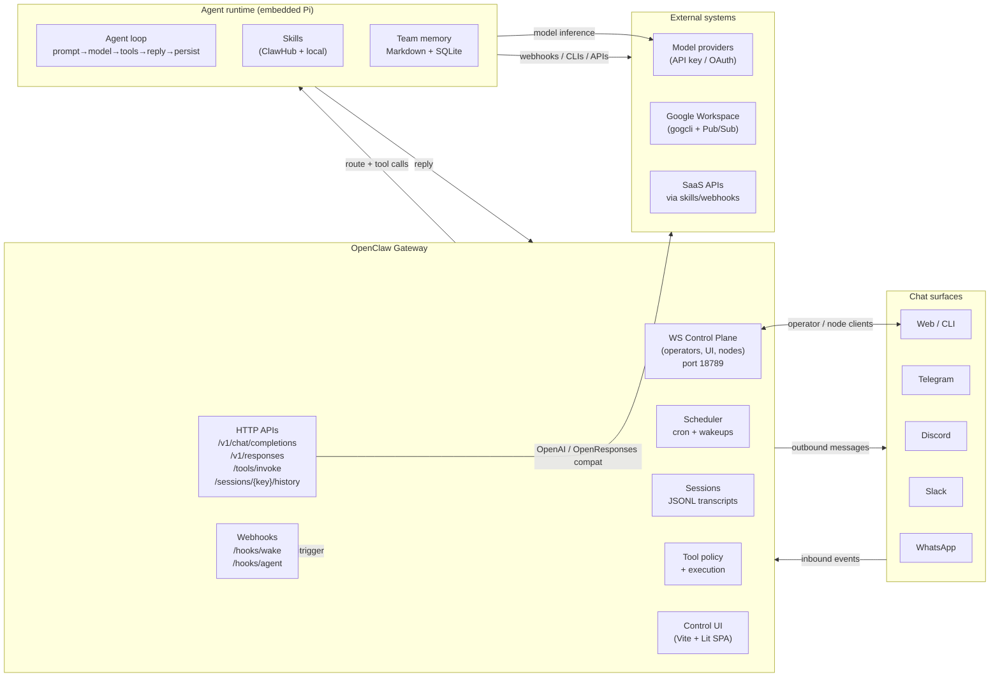
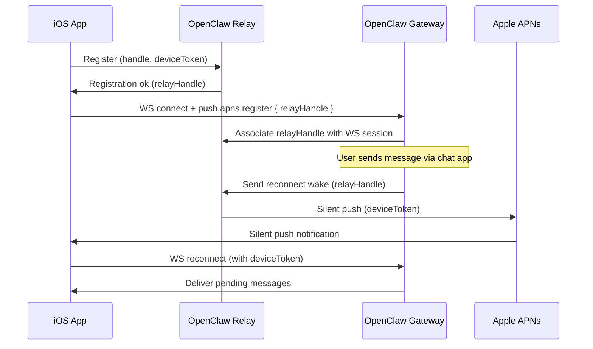

# OpenClaw Full Reference

> **Status**: Canonical document merging and replacing `openclaw-deep-research.md` and `openclaw-deep-research-report.md`. Supersedes both source docs.
>
> **Verification note**: Protocol details (WS frame schemas, `chat.send` event states, `sessions.list` row shapes, HTTP endpoint field names) are sourced from OpenClaw documentation at docs.openclaw.ai. They should be verified against live Gateway source (`packages/gateway/src/protocol/` TypeBox schemas) and a running instance before use in production. Items pending live verification are marked `[VERIFY LIVE]`.

---

## Part 1 — What OpenClaw Is

OpenClaw is an MIT-licensed, self-hosted "Gateway" that sits between your existing chat surfaces and one or more agent runtimes, owning session state, routing, delivery, pairing, and integrations. One always-on Gateway process owns all channel connections and exposes a multiplexed control plane (WebSocket + HTTP + Control UI + hooks). "Chat is the UI" — users interact from channels they already use while the Gateway manages multi-agent routing, tools/plugins, media, and automation primitives.

The Gateway embeds the **Pi SDK** agent runtime directly rather than running it as a subprocess. The agent loop per session is: inbound event → context assembly → model inference → tool execution → reply streaming → persistence.

Adoption as of February 2026: ~219k stars, ~42k forks on the main repo. Active security threats exist (malicious skills in the marketplace, infostealer campaigns targeting exposed instances).

### Architecture diagram



### Core protocol characteristics

- **Transport**: WebSocket text frames carrying JSON. First frame **must** be a `connect` request.
- **Frames**: `{type:"req", id, method, params}` → `{type:"res", id, ok, payload|error}`. Server push: `{type:"event", event, payload, seq?, stateVersion?}`.
- **Handshake**: Server emits `event:"connect.challenge"` with `{ nonce, ts }` before `connect`. Clients sign the challenge-bound payload and return `connect.params.device.nonce`.
- **Roles**:
  - `operator`: control plane clients (CLI, web UI, mobile companion). Declares scopes (`operator.read`, `operator.write`, `operator.admin`).
  - `node`: capability hosts (mobile/desktop). Declares `caps`, `commands`, `permissions` in `connect` payload.
- **Session keys**: `agent:<agentId>:<channel>:group:<id>`, `agent:<agentId>:cron:<id>`, `agent:<agentId>:hook:<id>`, `agent:<agentId>:node:<id>`, etc.

---

## Part 2 — Protocol Reference

### WebSocket control plane

The Gateway protocol is the primary control plane and node transport over WebSocket (default port 18789).

#### Handshake: `connect.challenge` + `connect`

**Server → Client** (server sends this first, before any client request):

```json
{
  "type": "event",
  "event": "connect.challenge",
  "payload": {
    "nonce": "abc123...",
    "ts": 1743000000000
  }
}
```

**Client → Server** (`connect` is always the first client request):

```json
{
  "type": "req",
  "id": 1,
  "method": "connect",
  "params": {
    "minProtocol": 1,
    "maxProtocol": 1,
    "client": {
      "id": "com.example.myapp",
      "version": "1.0.0",
      "platform": "darwin",
      "mode": "app"
    },
    "role": "operator",
    "scopes": ["operator.read", "operator.write"],
    "auth": {
      "token": "<gateway-token>"
    },
    "device": {
      "id": "device-uuid-xxxx",
      "publicKey": "-----BEGIN PUBLIC KEY-----\n...\n-----END PUBLIC KEY-----\n",
      "signature": "base64-encoded-signature",
      "signedAt": "2026-04-04T12:00:00Z",
      "nonce": "abc123..."  // must match challenge nonce
    }
  }
}
```

**Server → Client** (`hello-ok` response):

```json
{
  "type": "res",
  "id": 1,
  "ok": true,
  "payload": {
    "auth": {
      "deviceToken": "dev_xxxx...",  // persist this for reconnect
      "expiresAt": null  // or timestamp if token expires
    },
    "recommendedNextStep": "approve device on the gateway host",
    "detail": {
      "code": "DEVICE_AUTH_PENDING_APPROVAL",
      "message": "Waiting for device approval"
    }
  }
}
```

> `[VERIFY LIVE]` The full shape of `hello-ok.auth` (especially `expiresAt` and `deviceToken` lifecycle fields) should be confirmed against the live Gateway TypeBox schema.

#### Auth error codes and retry guidance

| Code | Meaning | Client action |
|---|---|---|
| `DEVICE_AUTH_NONCE_REQUIRED` | Device challenge nonce missing or mismatched | Re-do handshake with correct nonce from `connect.challenge` |
| `DEVICE_AUTH_SIGNATURE_INVALID` | Device signature does not verify | Regenerate key pair and re-pair |
| `AUTH_TOKEN_MISMATCH` | Token rejected | Bounded retry: re-fetch token, retry once; if still fails, surface error to user |
| `DEVICE_AUTH_PENDING_APPROVAL` | Device needs operator approval on host | Show `recommendedNextStep` guidance to user |
| `AUTH_DETAIL_PROVIDED` | More info in `detail` field | Read `detail.message` for guidance |

#### RPC methods (operator role)

##### `chat.history` — Load session transcript

```json
{
  "type": "req",
  "id": 2,
  "method": "chat.history",
  "params": {
    "sessionKey": "agent:main:telegram:dm:12345",
    "limit": 100  // ≤1000; large histories are a known performance concern
  }
}
```

> `[VERIFY LIVE]` Confirm: does `chat.history` return a cursor for pagination, or does it return all messages up to `limit` in one shot? The cited docs show no cursor field in the request schema — verify this against live source.

##### `chat.send` — Send message and trigger agent run

```json
{
  "type": "req",
  "id": 3,
  "method": "chat.send",
  "params": {
    "sessionKey": "agent:main:telegram:dm:12345",
    "message": {
      "role": "user",
      "content": "What are my top 3 tasks today?"
    },
    "thinking": true,         // optional: request thinking/reasoning output
    "deliver": true,          // optional: deliver reply to chat channel
    "attachments": [           // optional; parsed as IMAGES only
      {
        "type": "image",
        "mimeType": "image/png",
        "data": "base64-encoded..."
      }
    ],
    "timeoutMs": 60000,        // optional: abort if no response within ms
    "idempotencyKey": "uuid-xxxx"  // required for deduplication
  }
}
```

**Streaming response events** (server pushes multiple `event` frames):

```json
// First event: run started
{
  "type": "event",
  "event": "chat",
  "payload": {
    "runId": "run-xxxx",
    "sessionKey": "agent:main:telegram:dm:12345",
    "seq": 1,
    "state": "running"
  }
}

// Subsequent events: content deltas
{
  "type": "event",
  "event": "chat",
  "payload": {
    "runId": "run-xxxx",
    "sessionKey": "agent:main:telegram:dm:12345",
    "seq": 2,
    "state": "delta",
    "message": {
      "role": "assistant",
      "content": "Here are your top 3 tasks..."
    }
  }
}

// Final event: run complete
{
  "type": "event",
  "event": "chat",
  "payload": {
    "runId": "run-xxxx",
    "sessionKey": "agent:main:telegram:dm:12345",
    "seq": 5,
    "state": "final",
    "message": { "role": "assistant", "content": "..." },
    "usage": {
      "inputTokens": 1200,
      "outputTokens": 340,
      "totalTokens": 1540,
      "cost": 0.0042
    }
  }
}
```

**`chat.send` event `state` values** `[VERIFY LIVE]`:

| State | Meaning |
|---|---|
| `running` | Run started, model is processing |
| `delta` | Partial content update (streaming) |
| `final` | Run completed successfully |
| `aborted` | Run stopped via `chat.abort` |
| `error` | Run failed with error |

> `[VERIFY LIVE]` Confirm the exact enum values for `state` and whether there are intermediate states (e.g., `thinking`, `tool_use`). Also verify the `usage` object shape.

##### `chat.abort` — Stop an in-flight run

```json
{
  "type": "req",
  "id": 4,
  "method": "chat.abort",
  "params": {
    "sessionKey": "agent:main:telegram:dm:12345",
    "runId": "run-xxxx"  // optional; aborts all if omitted
  }
}
```

##### `sessions.list` — List sessions

```json
{
  "type": "req",
  "id": 5,
  "method": "sessions.list",
  "params": {
    "limit": 50,
    "activeMinutes": 1440,          // optional: only sessions active in last N minutes
    "includeDerivedTitles": true,    // reads 8KB transcript per session — expensive at scale
    "includeLastMessage": true,     // reads 16KB transcript per session — very expensive
    "label": "support",              // optional: filter by label
    "spawnedBy": "hook:gmail",       // optional: filter by spawn origin
    "agentId": "main",               // optional: filter by agent
    "search": "quarterly report"     // optional: full-text search
  }
}
```

**Response row schema** `[VERIFY LIVE]`:

```json
{
  "key": "agent:main:telegram:dm:12345",
  "agentId": "main",
  "channel": "telegram",
  "label": "support",
  "spawnedBy": "telegram:dm",
  "createdAt": "2026-04-01T09:00:00Z",
  "updatedAt": "2026-04-04T14:22:00Z",
  "title": "Customer support thread with @alice",   // if includeDerivedTitles
  "lastMessage": "Here's the quarterly report...",   // if includeLastMessage
  "messageCount": 47,
  "isActive": true
}
```

> `[VERIFY LIVE]` The `sessions.list` response row schema should be confirmed from live Gateway source. The schema above is inferred from documented behaviour, not from a schema export.

##### `sessions.preview` — Fetch lightweight previews for selected keys

```json
{
  "type": "req",
  "id": 6,
  "method": "sessions.preview",
  "params": {
    "keys": ["agent:main:telegram:dm:12345", "agent:main:telegram:group:789"],
    "limit": 5,
    "maxChars": 500  // truncate preview to N chars per session
  }
}
```

##### `sessions.messages.subscribe` / `sessions.messages.unsubscribe`

```json
{
  "type": "req",
  "id": 7,
  "method": "sessions.messages.subscribe",
  "params": {
    "key": "agent:main:telegram:dm:12345"
  }
}
```

Server emits `session.message` events for appended transcript messages and live usage metadata. Prefer this over polling `chat.history` on every event — it avoids re-reading transcript JSONL on each update.

##### `sessions.patch` — Update per-session settings

```json
{
  "type": "req",
  "id": 8,
  "method": "sessions.patch",
  "params": {
    "key": "agent:main:telegram:dm:12345",
    "label": "high-priority-support",
    "fastMode": true,         // skip reasoning for faster response
    "thinkingLevel": "low",   // "off" | "low" | "medium" | "high"
    "reasoningLevel": "off",   // "off" | "low" | "medium" | "high"
    "verboseLevel": "normal", // "quiet" | "normal" | "verbose"
    "responseUsage": true,     // include usage/cost in response events
    "elevatedLevel": "default" // elevated privilege for session
  }
}
```

> `[VERIFY LIVE]` Confirm the exact enum string values for `thinkingLevel`, `reasoningLevel`, `verboseLevel`, and `elevatedLevel`.

##### `sessions.spawn` `[VERIFY LIVE]` — Create a new session

```json
{
  "type": "req",
  "id": 9,
  "method": "sessions.spawn",
  "params": {
    "agentId": "support-bot",
    "channel": "telegram",
    "label": "new-thread",
    "parentKey": "agent:main:telegram:dm:12345"
  }
}
```

##### Node role: `node.invoke` `[VERIFY LIVE]`

Nodes declare capabilities in `connect` payload. The Gateway invokes them via:

```json
{
  "type": "req",
  "id": 10,
  "method": "node.invoke",
  "params": {
    "nodeId": "my-macbook",
    "command": "screenshot",
    "args": {}
  }
}
```

### HTTP APIs (same multiplexed port as WS)

#### `POST /v1/chat/completions` — OpenAI-compatible

Requires `Authorization: Bearer <token>` (treated as full operator access).

```bash
curl -X POST https://localhost:18789/v1/chat/completions \
  -H "Authorization: Bearer $GATEWAY_TOKEN" \
  -H "Content-Type: application/json" \
  -d '{
    "model": "openclaw:main",
    "messages": [{"role": "user", "content": "Hello"}],
    "stream": true
  }'
```

Select agent via `model: "openclaw:<agentId>"` or header `x-openclaw-agent-id`. Route to existing session via header `x-openclaw-session-key`.

SSE streaming when `"stream": true`; terminates with `[DONE]`.

#### `POST /v1/responses` — OpenResponses-compatible

Similar auth. Supports `input_file` items and image inputs.

Defaults: `maxBodyBytes=20MB`, `files.maxBytes=5MB`, `images.maxBytes=10MB`. SSRF guards + allowlists apply.

SSE event types include `response.output_text.delta`, `response.output_text.done`, `response.complete`.

#### `GET /sessions/{sessionKey}/history`

Query params: `limit` (default 100, max?), `cursor` (pagination cursor), `includeTools=1`, `follow=1` (SSE stream of transcript updates as they happen).

```bash
# First page
curl "https://localhost:18789/sessions/agent:main:telegram:dm:12345/history?limit=50" \
  -H "Authorization: Bearer $GATEWAY_TOKEN"

# Next page with cursor
curl "https://localhost:18789/sessions/agent:main:telegram:dm:12345/history?limit=50&cursor=eyJsYXN0IjoxfQ==" \
  -H "Authorization: Bearer $GATEWAY_TOKEN"

# SSE follow mode (real-time transcript updates)
curl "https://localhost:18789/sessions/agent:main:telegram:dm:12345/history?follow=1" \
  -H "Authorization: Bearer $GATEWAY_TOKEN" \
  -N
```

> `[VERIFY LIVE]` Confirm: (1) cursor encoding format, (2) whether `limit` has a server-side cap, (3) exact SSE event names in `follow=1` mode, (4) what happens on unknown session (docs say `404` with `error.type="not_found"`).

#### `POST /tools/invoke`

Invoke a single tool with Gateway auth. Gated by tool policy + HTTP deny list.

```bash
curl -X POST https://localhost:18789/tools/invoke \
  -H "Authorization: Bearer $GATEWAY_TOKEN" \
  -H "Content-Type: application/json" \
  -d '{
    "name": "message",
    "params": {
      "action": "send",
      "channel": "telegram",
      "target": "12345",
      "message": "Hello from the API"
    }
  }'
```

**Default HTTP deny list** `[VERIFY LIVE]` — operations that are blocked over HTTP regardless of tool policy:

| Blocked operation | Why blocked |
|---|---|
| `sessions_spawn` | Prevent arbitrary session creation via HTTP |
| `sessions_send` | Force chat through WS control plane |
| `gateway` | Prevent gateway config changes via HTTP |
| `whatsapp_login` | Prevent WhatsApp re-authentication via HTTP |

> `[VERIFY LIVE]` Confirm the exact deny list from the source (`packages/gateway/src/http/denyList.ts` or equivalent).

#### `POST /hooks/wake` — Wake the agent

```bash
curl -X POST https://localhost:18789/hooks/wake \
  -H "Authorization: Bearer $HOOK_TOKEN" \
  -H "Content-Type: application/json" \
  -d '{}'
```

Tokens in query strings are rejected.

#### `POST /hooks/agent` — Trigger agent run via webhook

```bash
curl -X POST https://localhost:18789/hooks/agent \
  -H "Authorization: Bearer $HOOK_TOKEN" \
  -H "Content-Type: application/json" \
  -d '{
    "message": "Process this: the user submitted a support ticket #4521",
    "sessionKey": "agent:main:hook:support-ticket-4521"
  }'
```

Omitting `sessionKey` creates a new hook-scoped session. Including it routes to a specific existing session for conversational continuity.

### Rate limits

| Operation | Limit | Window | Response |
|---|---|---|---|
| `config.apply` / `config.patch` RPC | 3 req | 60s per `(ws deviceId + clientIP)` | Error with retry guidance |
| HTTP auth failures (if `gateway.auth.rateLimit` enabled) | TBD | TBD | `429` + `Retry-After` |

---

## Part 3 — Live Gateway Walkthrough

### Start a local Gateway

```bash
# Install (macOS/Linux)
curl -fsSL https://openclaw.ai/install.sh | bash

# Verify prerequisites
node --version  # must be 22+

# Onboard and install as background service
openclaw onboard --install-daemon

# Start gateway manually (foreground, for testing)
openclaw gateway --port 18789 --verbose

# Check status
openclaw gateway status

# Open the Control UI
openclaw dashboard
```

**Startup flags** `[VERIFY LIVE from `openclaw gateway --help`]`:

| Flag | Purpose |
|---|---|
| `--port` | Override default port (default: 18789) |
| `--verbose` | Enable debug logging |
| `--profile <name>` | Use named config profile |
| `--config <path>` | Use specific config file |
| `--state-dir <path>` | Use specific state directory |

### Connect as operator via wscat

```bash
# Install wscat
npm install -g wscat

# Connect to local gateway (auth token from openclaw onboard output)
wscat -c "ws://localhost:18789" \
  --auth "Bearer <your-gateway-token>"

# Or with a specific protocol version
wscat -c "ws://localhost:18789?protocol=1"
```

**Annotated handshake**:

```
# Server sends challenge first (server->client)
<- { "type": "event", "event": "connect.challenge", "payload": { "nonce": "x", "ts": 1743000000000 } }

# Client responds with connect request
-> {
    "type": "req",
    "id": 1,
    "method": "connect",
    "params": {
      "minProtocol": 1,
      "maxProtocol": 1,
      "client": { "id": "my-wscat", "version": "1.0.0", "platform": "cli", "mode": "cli" },
      "role": "operator",
      "scopes": ["operator.read", "operator.write"],
      "auth": { "token": "<token>" },
      "device": { "id": "cli-device", "nonce": "x" }
    }
  }

# Server responds
<- {
    "type": "res",
    "id": 1,
    "ok": true,
    "payload": { "auth": { "deviceToken": "dev_xxxx" }, "recommendedNextStep": "..." }
  }
```

### Send a message and receive streaming events

```
# After handshake, send a chat message
-> {
    "type": "req",
    "id": 2,
    "method": "chat.send",
    "params": {
      "sessionKey": "agent:main:tui:local",
      "message": { "role": "user", "content": "Hello, who are you?" },
      "idempotencyKey": "req-$(uuidgen)"
    }
  }

# Server streams back events
<- { "type": "event", "event": "chat", "payload": { "runId": "run-001", "sessionKey": "agent:main:tui:local", "seq": 1, "state": "running" } }
<- { "type": "event", "event": "chat", "payload": { "runId": "run-001", "sessionKey": "agent:main:tui:local", "seq": 2, "state": "delta", "message": { "role": "assistant", "content": "I'm" } } }
<- { "type": "event", "event": "chat", "payload": { "runId": "run-001", "sessionKey": "agent:main:tui:local", "seq": 3, "state": "delta", "message": { "role": "assistant", "content": "OpenClaw," } } }
<- { "type": "event", "event": "chat", "payload": { "runId": "run-001", "sessionKey": "agent:main:tui:local", "seq": 4, "state": "final", "message": { "role": "assistant", "content": "..." }, "usage": { "totalTokens": 120 } } }
```

### List sessions

```
-> { "type": "req", "id": 3, "method": "sessions.list", "params": { "limit": 10, "includeLastMessage": false } }
<- { "type": "res", "id": 3, "ok": true, "payload": { "sessions": [ ... ] } }
```

### Trigger agent via webhook (curl)

```bash
# Set up hook token in config first (~/.openclaw/openclaw.json):
# { "hooks": { "enabled": true, "token": "my-hook-secret" } }

# Then trigger:
curl -X POST http://localhost:18789/hooks/agent \
  -H "Authorization: Bearer my-hook-secret" \
  -H "Content-Type: application/json" \
  -d '{
    "message": "Remind me to review the quarterly report at 3pm",
    "sessionKey": "agent:main:hook:quarterly-reminder"
  }'
# Response: { "ok": true, "runId": "run-xxx", "sessionKey": "agent:main:hook:quarterly-reminder" }
```

### Inject tool call directly (HTTP)

```bash
curl -X POST http://localhost:18789/tools/invoke \
  -H "Authorization: Bearer $GATEWAY_TOKEN" \
  -H "Content-Type: application/json" \
  -d '{
    "name": "message",
    "params": {
      "action": "send",
      "channel": "telegram",
      "target": "12345",
      "message": "Direct tool call from curl"
    }
  }'
```

---

## Part 4 — Business Deployment

### Hosting patterns

**Local / on-machine**: Gateway runs on a dedicated Mac/PC. Clients connect via loopback or LAN. Simple, low-latency for local use.

**VPS / cloud**: Run via Docker on a VPS (GCP, DigitalOcean, etc.). Official guides exist for GCP and DigitalOcean marketplace. Key considerations:
- Bind to private network or behind VPN
- Use Tailscale Serve or SSH tunnel for remote access (preferred over exposing the port publicly)
- Persist state across restarts (bind-mount or named volume for `~/.openclaw`)
- Bake skill dependencies (CLIs, binaries) into the container image

**Multi-instance isolation**:

```bash
# Run a second isolated gateway for a different trust domain
OPENCLAW_CONFIG_PATH=~/.openclaw/acme-support.json \
OPENCLAW_STATE_DIR=~/.openclaw-acme-support \
openclaw gateway --port 19001
```

Each instance has independent auth, sessions, channels, and tools. This is the recommended approach for separating mixed-trust environments (e.g., personal vs work, different departments).

### Backups

- **Team** (the agent's "memory"): put in a private git repo. Never commit `~/.openclaw` (contains credentials and sessions).
- **State**: back up `~/.openclaw/agents/<agentId>/sessions/` (JSONL transcripts) and `~/.openclaw/agents/<agentId>/memory/` separately from team.
- **Config**: back up `~/.openclaw/openclaw.json` with secrets excluded (use environment variable substitution for sensitive values: `"token": "${GATEWAY_TOKEN}"`).

### Messaging channels

**WhatsApp**: QR login via `openclaw channels login --channel whatsapp`. Runs through WhatsApp Web (Baileys). No built-in Twilio channel.

**Telegram**: grammY-based. Allowlists use numeric user IDs (not usernames, which can change). `openclaw doctor fix` resolves legacy usernames.

**Microsoft Teams** (plugin): requires Azure Bot setup + webhook at `/api/messages`. Known limitations: webhook timeout constraints, markdown rendering.

**Others** (Discord, Slack, Matrix, Nostr, Zalo, Voice Call): plugin-only.

### Email: Gmail via gogcli + Pub/Sub

This is the documented email path, not IMAP/SMTP (which is not a built-in OpenClaw capability):

```
Gmail → Pub/Sub push → OpenClaw /hooks/agent webhook → agent processes → response delivered
```

Prerequisites: `gcloud` configured, `gogcli` installed, OpenClaw hooks enabled, Tailscale for push connectivity.

**Operational footgun**: If configured, the Gateway auto-starts `gog gmail watch serve` on boot. Running a separate watcher in parallel causes port bind conflicts.

**IMAP/SMTP** (unspecified): Not documented as a built-in OpenClaw channel. Implement via a custom skill that polls IMAP and calls `POST /hooks/agent`, or uses an SMTP CLI for outbound.

### Automation: cron, hooks, Lobster

**Cron**: Configure under `cron` in `openclaw.json`. Jobs wake the agent at schedule time and optionally deliver output to a chat.

**Hooks**: Map inbound HTTP POSTs to agent runs with `deliver: true` to send responses back to chat.

**Lobster**: Typed workflow runtime with approval gates. Use for operations that need a human-in-the-loop before side effects (sending emails, posting content, updating external systems). Example:

```json
// Lobster workflow envelope
{
  "lobster": {
    "workflowId": "email-triage",
    "runId": "lob-run-xxxx",
    "status": "needs_approval",
    "step": 2,
    "approvalToken": "resume-xxxx",
    "message": "Send this reply to the customer?"
  }
}
```

Resume with `openclaw lobster resume <approval-token>` or via WS RPC.

### Deployment checklist

- [ ] Gateway bound to loopback (or behind VPN/Tailscale)
- [ ] Token/password auth required (even on loopback)
- [ ] `gateway.trustedProxies` set if behind reverse proxy
- [ ] Tool policy set to `messaging` or equivalent restrictive profile initially
- [ ] Channel DM/group policies set to `allowlist` or `pairing` (not `open`)
- [ ] Webhook tokens strong and unique
- [ ] Team backed up to private git
- [ ] `~/.openclaw` excluded from git
- [ ] Skills reviewed before installing; versions pinned
- [ ] `openclaw security audit` run and findings addressed
- [ ] Separate Gateway instance or OS user for different trust domains

---

## Part 5 — Mobile Client Architecture

### Feature Router architecture

Implement as a **feature-router** app: each screen has a stable route, each route has an implementation (native or WebView). A feature-flag service decides which implementation is active.

```
App
├── /connect              → Native: gateway discovery + QR scan + pairing
├── /sessions              → Native: session list + search + previews
├── /chat/:sessionKey      → Native: chat UI + streaming + attachments
├── /settings/:key         → Native: session settings (fast/reasoning/usage)
├── /settings/connection   → Native: gateway profiles + auth management
├── /settings/notifications→ Native: push + notification preferences
├── /voice                 → Native: voice input + talk mode
└── /web/*                 → WebView: loads Gateway Control UI
```

### Build vs Buy decision tree

```
Is the feature in the top-9 native list?
├── YES → Implement native
│         ├── High effort (voice, push) → Milestone D
│         └── Medium/Low effort → Milestones A–C
└── NO → Route to WebView initially
          └── Promote to native when:
              ├── Usage frequency > X sessions/day?
              ├── Latency sensitivity > threshold?
              ├── Offline access needed?
              └── Device integration required (camera, mic, notifications)?
```

**WebView → Native migration checklist**:

1. Route: add new route entry in the Feature Router
2. Flag: add feature flag `NATIVE_<FEATURE> = false` (default WebView)
3. Implement: build native SwiftUI/Compose module
4. Test: verify against real Gateway (WS + HTTP)
5. Gate: roll out to internal users first, monitor error rates
6. Remove flag: set `NATIVE_<FEATURE> = true`, remove WebView route
7. Cleanup: delete WebView wrapper code

**Top-9 native features** (effort-ranked):

| Feature | Effort | Milestone |
|---|---|---|
| Gateway connect + discovery | Medium | A |
| QR/setup code bootstrap | Medium | A |
| Device pairing workflow | Medium | A |
| Session list + search + previews | Medium | B |
| Live transcript subscription | Medium | C |
| Session settings (fast/reasoning/usage) | Low–Medium | C |
| Image attachments | Medium | B |
| Voice input + talk mode | High | D |
| Push notifications + reconnect wakes | High | D |

### Push strategy (detailed)

**What the relay is**: OpenClaw's relay-backed push avoids storing raw APNs/FCM tokens on the Gateway. Instead:

1. The Gateway registers with an OpenClaw-operated relay (or self-hosted relay) using an opaque handle.
2. When the Gateway needs to wake a client, it sends a message to the relay.
3. The relay delivers a silent push to the device.
4. The device reconnects to the Gateway over WebSocket.

**iOS APNs relay flow**:



**Android FCM** `[PLANNED]`: The Gateway documents FCM push wake support. Design the client so the registration path can be added without rewriting the connection layer. Use WorkManager for opportunistic sync when not in always-on mode.

**Android foreground service**: When "always-on" is enabled, run a foreground service with a persistent notification to keep the WebSocket connection alive. Gracefully degrade to "pull on open" when the service is killed by the user or system.

**iOS background**: Silent pushes are throttled by Apple. Do not rely on them as the primary delivery mechanism. BGTaskScheduler can handle periodic refresh; treat push as best-effort.

### WebView bridging

- Lock WebView to Gateway origin(s) only; deny external navigations.
- Do not persist long-lived tokens in WebView storage.
- Inject short-lived bootstrap tokens rather than shared gateway credentials for WebView SSO.
- Intercept deep links from WebView to route back to native screens.

---

## Part 6 — Security, Compliance & Hardening

### Threat model

OpenClaw is high-privilege by design. Treat the host/config boundary as trusted. The Gateway token/password is **operator access** — it can read/write sessions, invoke tools, and modify channel state. Bearer auth for `/v1/*` and `/tools/invoke` is not a per-user scoped permission model.

**Known risks**:

- Malicious skills in the ClawHub marketplace (social-engineering infostealers, leaky skills that expose secrets via logs/context).
- Exposed Gateway instances (infostealer campaigns targeting `~/.openclaw` on compromised machines).
- Bootstrap token misuse (fixed in 2026.3.12 — tokens are now short-lived).
- Mixed-trust users on one Gateway (not supported; split into separate Gateways or OS users).

### Hardening checklist

**Network**
- [ ] Gateway bound to loopback; remote access via Tailscale Serve or SSH tunnel
- [ ] `gateway.trustedProxies` set correctly if behind reverse proxy
- [ ] `gateway.controlUi.allowedOrigins` set explicitly for non-loopback deployments
- [ ] Host-header origin fallback disabled

**Auth**
- [ ] Token/password auth required (even on loopback)
- [ ] Device pairing tokens short-lived; rotated after use
- [ ] Gateway credentials rotated after any suspected compromise
- [ ] `AUTH_TOKEN_MISMATCH` retry bounded to 1 retry, then user action required

**Tool policy**
- [ ] Start with `tools.profile: "messaging"` or equivalent restrictive profile
- [ ] Explicitly allow only required tools and channels
- [ ] Docker sandboxing enabled for `non-main` or `all` sessions
- [ ] `openclaw security audit` run regularly

**Skills supply chain**
- [ ] Review skills before installing; do not install untrusted marketplace skills blindly
- [ ] Pin skill versions in production
- [ ] Monitor for skills that log or exfiltrate context
- [ ] Treat ClawHub as an untrusted registry; prefer local skills

**Secrets**
- [ ] Use environment variable substitution (`${VAR}`) in config; never hardcode tokens
- [ ] Encrypt storage at rest on hosts with sensitive transcripts
- [ ] Never log gateway tokens, device tokens, or bootstrap tokens
- [ ] Clear bootstrap tokens from clipboard after use

### Legal / compliance (UK/EU GDPR)

**When is a DPIA required?**
A Data Protection Impact Assessment is likely required when OpenClaw processes special category data (health, location, communications content), involves systematic monitoring of individuals, or processes at scale. Deployments that read Gmail inboxes, Slack messages, or health-related chat content in a business context are strong candidates.

**OpenClaw data flows**:

```
Ingress: chat message → Gateway → session JSONL → agent team file
         ↓
External tools: agent calls Gmail API → reads email content → team file
                agent calls web search → results → team file
                agent calls CRM API → data → team file
         ↓
Persistence: session transcripts → ~/.openclaw/agents/<id>/sessions/
             agent memory → ~/.openclaw/agents/<id>/memory/
             skill indexes → ~/.openclaw/agents/<id>/memory/search.db
```

**Retention policy template**:

| Data type | Retention | Basis |
|---|---|---|
| Session transcripts | Delete after N days / on user request | Operational need vs privacy |
| Agent team files | User-controlled; git-backed | User ownership |
| Credentials / tokens | Rotated regularly; deleted on revocation | Security |
| Hook delivery logs | N days max; review for PII | Operational debugging |
| Skills | Version-pinned; old versions deleted | Supply chain hygiene |

**Processor checklist for skills/plugins**:
- [ ] Skills are reviewed code; no opaque marketplace installs in production
- [ ] Skills do not log or exfiltrate context, messages, or credentials
- [ ] Skills are scoped to their declared purpose (no unexpected filesystem or network access)
- [ ] Plugin HTTP handlers reviewed for SSRF and data exfiltration risk

---

## Part 7 — Alternatives Comparison

### Agent orchestration

| | OpenClaw | LangGraph | crewAI | AutoGen |
|---|---|---|---|---|
| **Deployment** | Self-hosted Gateway | Library (you host) | SaaS or self-hosted | Library (Microsoft) |
| **Messaging-native** | Yes (channels built-in) | No (build your own) | Partial | No |
| **Mobile / voice** | Via nodes (Android/iOS) | No native client | No | No |
| **Tool ecosystem** | Skills + plugins + WS tools | LangChain tools | Built-in + LangChain | Built-in + custom |
| **Session persistence** | JSONL transcripts + team | Custom | Custom | Custom |
| **Multi-agent routing** | Built-in | Build your own | Built-in | Build your own |
| **Learning curve** | Medium | High | Low–Medium | Medium–High |
| **Security model** | Tool policy + sandboxing | Custom | Custom | Custom |

**When to choose OpenClaw**: You want a messaging-first assistant that lives in your existing chat apps and can be extended via skills. You control the host.

**When to choose LangGraph**: You are building a bespoke agent service with explicit graph-based orchestration, need full control over every step, and will host it yourself.

**When to choose crewAI**: You want a fast onboarding to multi-agent pipelines with less infrastructure work than LangGraph, and don't need OpenClaw's messaging integration.

### Workflow automation

| | OpenClaw | n8n | Temporal | Zapier | Make |
|---|---|---|---|---|---|
| **Agentic (LLM-driven)** | Yes | Partial (LLM nodes) | No (deterministic) | No | No |
| **Self-hosted** | Yes | Yes | Yes | No | No |
| **Messaging channels** | Built-in | Via integrations | No | Via integrations | Via integrations |
| **Cron / scheduling** | Built-in | Built-in | Built-in | Built-in | Built-in |
| **Approval gates** | Via Lobster | Via manual approval nodes | Via signals | Via approval steps | Via approval steps |
| **Learning curve** | Medium | Low–Medium | High | Low | Low |
| **Governance / RBAC** | Per-agent sandbox | Built-in (teams/roles) | Built-in (namespaces) | Built-in (enterprise) | Built-in |
| **Connector count** | Skills/plugins | 400+ | Via SDK | 6000+ | 1300+ |

**When to choose OpenClaw**: You want an AI-native automation plane tied to messaging, with LLM-driven decision-making and the ability to extend via code (skills/plugins).

**When to choose n8n/Temporal/Zapier/Make**: You need governed, deterministic workflows with a large connector ecosystem and enterprise RBAC. These are better for business-critical automation where predictability > adaptability.

### macOS menu bar app vs OpenClaw node

| | Helper Agent (this project) | OpenClaw node app |
|---|---|---|
| **Voice layer** | OpenAI Realtime API (native audio WS) | Not native; relies on channel integration |
| **Input injection** | macOS accessibility + input injection | Not documented |
| **Orchestration backend** | MiniMax (via `max` CLI) | OpenClaw Gateway + any model provider |
| **Tool layer** | File, bash, search, find | Tool policy + skills/plugins |
| **Session model** | Ephemeral (in-memory + markdown) | Persistent JSONL transcripts |
| **Messaging channels** | None (voice + keyboard only) | WhatsApp, Telegram, Discord, Slack, etc. |
| **Multi-device** | Single machine | Multi-device via Gateway |
| **Setup complexity** | Low (single app) | Medium–High (Gateway + channels + skills) |

---

## Part 8 — Gap Analysis: Helper Agent vs OpenClaw

See `docs/openclaw-gap-analysis.md` for the full analysis.

**Summary**:

| Dimension | Helper Agent | OpenClaw |
|---|---|---|
| Voice | OpenAI Realtime API (primary, native) | Via messaging channels (not native voice) |
| macOS integration | Input injection + accessibility (native) | Node app with permissions |
| Orchestration | MiniMax via `max` CLI (sub-agents) | Multi-agent routing + Pi runtime |
| Tool layer | File, bash, search, find | Skills, plugins, 20+ built-in tools |
| Messaging channels | None | WhatsApp, Telegram, Discord, Slack, Teams, etc. |
| Session persistence | File-based team | JSONL transcripts + SQLite indexes |
| WebSocket protocol | Custom (OpenAI Realtime) | Gateway WS protocol (connect, chat.*, sessions.*) |
| Cron / scheduling | None | Built-in cron + Lobster workflows |
| HTTP API surface | Minimal (index.ts entry point) | OpenAI-compatible, OpenResponses, /tools/invoke |
| Self-hosted | Yes | Yes |
| License | MIT | MIT |

**Integration paths**:

1. **Helper Agent as OpenClaw operator client**: Connect Helper Agent's Orchestrator to OpenClaw's Gateway WS control plane. Helper sends/receives messages via OpenClaw's messaging channels. Helper's tool layer stays; OpenClaw provides the channel layer.

2. **Helper Agent as OpenClaw node**: Register Helper as a node on the OpenClaw Gateway with voice + input injection capabilities. Gateway can invoke `node.invoke` to trigger Helper's capabilities.

3. **Hybrid**: Helper Agent owns the voice/UI layer; OpenClaw owns messaging + automation. They communicate via WS or HTTP.

---

## Part 9 — Testing Playground

See `testing/openclaw/` for runnable infrastructure.

### What's in the testing playground

- `docker-compose.yml` — spin up a local Gateway with persistent state
- `wscat-connect.sh` — annotated WebSocket connection script
- `http-examples.sh` — curl commands for every HTTP endpoint
- `mock-gateway-server.ts` — minimal mock WS server for contract testing without a real Gateway

### Quick start

```bash
cd testing/openclaw

# Spin up a local Gateway
docker compose up -d

# Wait for it to start
sleep 3

# Connect via wscat
./wscat-connect.sh ws://localhost:18789

# Or run HTTP examples
./http-examples.sh

# For contract testing (no real Gateway needed)
npx ts-node mock-gateway-server.ts
```

---

## Open Items (Pending Live Verification)

The following items should be verified against a live OpenClaw Gateway instance and the TypeBox source schemas before use in production:

- [ ] `connect.params` full field set (especially optional fields like `locale`, `timezone`)
- [ ] `hello-ok.auth` lifecycle fields (`expiresAt`, token rotation methods)
- [ ] `chat.send` event `state` enum values (complete list including intermediate states)
- [ ] `chat.send` `usage` object shape and which fields are populated
- [ ] `sessions.list` response row schema (confirmed from schema export)
- [ ] `sessions.spawn` method existence and exact params
- [ ] `node.invoke` method and `nodeId` / `command` / `args` semantics
- [ ] HTTP `/tools/invoke` exact deny list
- [ ] `GET /sessions/{key}/history` cursor encoding, SSE event names in `follow=1`, unknown session behaviour
- [ ] `thinkingLevel`, `reasoningLevel`, `verboseLevel`, `elevatedLevel` enum values for `sessions.patch`
- [ ] `gateway.auth.rateLimit` threshold values
- [ ] `openclaw gateway --help` flag descriptions
- [ ] TypeBox schemas exported from `packages/gateway/src/protocol/` for code generation
