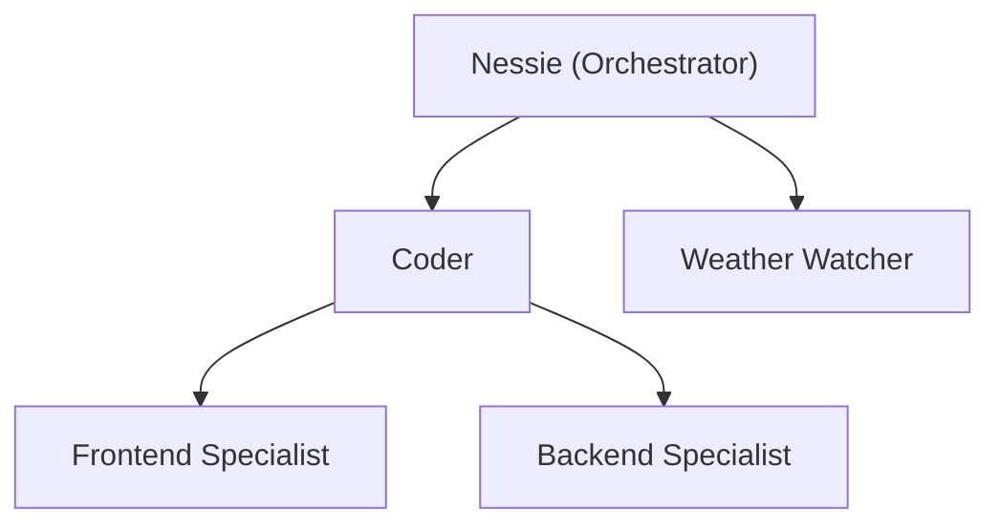

# Mermaid Charts, Agent Hierarchy Navigation & Multi-Session

**Date:** 2026-04-06
**Status:** Design

---

## Overview

Three interconnected features:

1. **Mermaid chart rendering** — a backend tool that converts Mermaid syntax to PNG images, displayed inline in chat. Clicking opens in the default image viewer.
2. **Agent hierarchy in the sidebar** — agents with sub-agents are navigable via a slide-right drill-down (like UINavigationController). The chat is context-aware: creating an agent while viewing a sub-agent nests it there.
3. **Multi-session support** — "New session" button, unnamed sessions that auto-title from the first message, sidebar split into Sessions and Agents sections.

---

## 1. Mermaid Chart Tool

### What it does

A new tool (`MermaidTool`) that the orchestrator and sub-agents can call. It takes Mermaid graph syntax, renders it to a PNG, and returns the file path. The frontend displays the image inline in the chat bubble.

### Backend — `src/tools/MermaidTool.ts`

```
Input:  { syntax: string, title?: string }
Output: { imagePath: string, width: number, height: number }
```

**Rendering approach:** Use `@mermaid-js/mermaid-cli` (`mmdc`) which runs Mermaid in a headless Chromium via Puppeteer. It produces a PNG from the syntax.

```
pnpm add @mermaid-js/mermaid-cli
```

The tool:
1. Writes the Mermaid syntax to a temp `.mmd` file
2. Calls `mmdc -i input.mmd -o output.png -b transparent`
3. Returns `{ imagePath: "/tmp/nessie-charts/<uuid>.png", width, height }`
4. The image path is stored in the message content as a structured block

### Message format

When the Mermaid tool is called, the assistant message contains a structured image reference:

```json
{
  "type": "chart",
  "syntax": "graph TD\n  A[Orchestrator] --> B[Coder]\n  A --> C[Weather]",
  "imagePath": "/tmp/nessie-charts/abc123.png",
  "title": "Agent Structure"
}
```

The frontend parses this from the message content and renders it as an inline image.

### Frontend — ChatView rendering

In `ChatView.swift`, when a message contains a `[chart:...]` block:

1. Parse the image path from the structured content
2. Load the image from disk via `NSImage(contentsOfFile:)`
3. Display it inline in the message bubble, max width constrained to chat column
4. On click: `NSWorkspace.shared.open(URL(fileURLWithPath: imagePath))` — opens in Preview.app or whatever the default image viewer is

### Agent structure chart generation

Whenever an agent is created or the user asks to see the agent structure, the orchestrator automatically generates a Mermaid chart showing the full hierarchy:



This is triggered by:
- Any `ensureAgent()` call (auto-generate after creation)
- Explicit user request ("show me the agent structure", "show agent tree")

---

## 2. Agent Hierarchy & Sidebar Navigation

### Data model changes

#### Backend — `ManagedAgent` gets a `parentId`

```typescript
// src/agent/types.ts
export type ManagedAgent = {
  id: string
  name: string
  type: 'orchestrator' | 'coder' | 'weather' | 'custom'
  responsibility: string
  trigger: 'main' | 'on-demand' | 'hourly'
  tools: string[]
  parentId?: string        // NEW — null means top-level (under root)
  intervalMinutes?: number
  lastRunAt?: number
  nextRunAt?: number
}
```

#### Frontend — `Agent` model gets `parentId` and computed children

```swift
// Models.swift
struct Agent: Identifiable, Hashable {
  let id: String
  let name: String
  let type: String
  let responsibility: String
  let trigger: String
  let intervalMinutes: Int?
  let parentId: String?     // NEW
}
```

#### `AppState` additions

```swift
// New published state
@Published var agentNavigationStack: [String] = ["main"]  // stack of agent IDs being drilled into

// Computed: agents visible at the current navigation depth
var currentAgentChildren: [Agent] {
  let currentParentId = agentNavigationStack.last ?? "main"
  return agents.filter { $0.parentId == currentParentId }
}

// The agent at the top of the navigation stack
var currentParentAgent: Agent? {
  guard let id = agentNavigationStack.last else { return nil }
  return agents.first { $0.id == id }
}

// Can we go back?
var canNavigateBack: Bool {
  agentNavigationStack.count > 1
}
```

### Sidebar UI — slide navigation

The AGENTS section of `SessionsSidebar.swift` becomes a navigation stack.

#### Layout

```
┌─────────────────┐
│ SESSIONS        │
│  + New session   │
│  Today           │
│    Session A     │
│    Session B     │
│  Yesterday       │
│    Session C     │
│                  │
│ ─────────────── │
│                  │
│ AGENTS           │
│ < Back           │  ← only shown when depth > 0
│ [Current: Coder] │  ← breadcrumb showing where you are
│                  │
│  Frontend Spec.  │  ← children of current agent
│  Backend Spec.   │
│  Test Runner     │
│                  │
└─────────────────┘
```

When at root (`agentNavigationStack == ["main"]`):

```
│ AGENTS           │
│ [Nessie]         │  ← root orchestrator, non-clickable or shows info
│  > Coder       2 │  ← ">" indicates has children, "2" = child count
│  > Weather       │
│    Research      │  ← no ">" means leaf agent
```

#### Slide animation

The transition uses SwiftUI's built-in transition system:

```swift
// In SessionsSidebar agents section:
VStack {
  if canNavigateBack {
    backButton
  }
  
  ForEach(currentAgentChildren) { agent in
    agentRow(agent, hasChildren: agentHasChildren(agent))
  }
}
.transition(.move(edge: .trailing))
.animation(.easeInOut(duration: 0.25), value: agentNavigationStack)
```

#### Interactions

| Action | Result |
|--------|--------|
| Tap agent with children | Push agent ID onto `agentNavigationStack`, slide right to show its children |
| Tap agent without children | Select it, show its chat thread |
| Tap "< Back" | Pop last ID from stack, slide left |
| Tap breadcrumb | Pop stack to that level |

#### Functions on `AppState`

```swift
func drillIntoAgent(_ agent: Agent) {
  agentNavigationStack.append(agent.id)
}

func navigateAgentBack() {
  guard agentNavigationStack.count > 1 else { return }
  agentNavigationStack.removeLast()
}

func agentHasChildren(_ agent: Agent) -> Bool {
  agents.contains { $0.parentId == agent.id }
}
```

### Chat context awareness

When the user is viewing a particular level in the agent hierarchy (e.g., drilled into "Coder"), the chat knows to scope new agent creation to that parent.

#### How it works

1. `AppState` exposes `currentAgentContext: String` — the ID of the agent the user is currently "inside" in the sidebar.
2. When sending a message, this context is passed to the backend:
   ```
   POST /chat { "message": "create a frontend agent", "threadId": "main", "agentContext": "coder" }
   ```
3. The orchestrator's `handleAgentManagement` uses `agentContext` to set `parentId` on the new agent.
4. After creation, the backend broadcasts an `agent.created` event with the full agent list.
5. The frontend receives the event, updates `agents`, and the sidebar automatically shows the new agent under the current parent.

#### Backend changes — `handleAgentManagement`

Currently hardcodes agent creation for "coder" and "weather" keywords. This needs to become flexible:

```typescript
// New: the orchestrator asks the LLM to determine agent properties
// when it detects a creation intent but the agent type isn't hardcoded
async handleAgentManagement(content: string, agentContext?: string): Promise<string | null> {
  const lower = content.toLowerCase()
  const wantsCreate = /\b(create|build|add|make|setup|set up)\b/.test(lower) 
    && lower.includes('agent')

  if (!wantsCreate) return null

  // Use LLM to extract agent name, responsibility, tools from the user's request
  const agentSpec = await this.extractAgentSpec(content)
  
  const newAgent: ManagedAgent = {
    id: slugify(agentSpec.name),
    name: agentSpec.name,
    type: 'custom',
    responsibility: agentSpec.responsibility,
    trigger: 'on-demand',
    tools: agentSpec.tools,
    parentId: agentContext ?? 'main',  // <-- uses the sidebar context
  }

  const result = this.ensureAgent(newAgent)
  
  // Auto-generate Mermaid chart of updated structure
  await this.generateAgentStructureChart()
  
  return result
}
```

### Real-time sidebar updates

When an agent is created/removed on the backend:

1. Backend broadcasts `{ type: "agent.created", agent: ManagedAgent }` or `{ type: "agent.removed", agentId: string }`
2. Frontend's `handleEvent` processes these:
   ```swift
   case .agentCreated(let agent):
     if !agents.contains(where: { $0.id == agent.id }) {
       agents.append(agent.toAppAgent())
     }
   case .agentRemoved(let agentId):
     agents.removeAll { $0.id == agentId }
   ```
3. SwiftUI reactivity handles the rest — the sidebar re-renders with the new agent in the correct position.

---

## 3. Multi-Session Support

### Current state

Sessions are derived from message `threadId` groupings. There's no explicit session creation — a session appears when a message with a new `threadId` is sent. The sidebar always shows whatever sessions exist.

### Target state

- Explicit "New session" button creates an empty, unnamed session
- The session gets auto-named from the first user message
- Sessions persist independently of agents (a session is a conversation, not an agent thread)
- Each session has its own `threadId` (UUID-based)

### Session lifecycle

```
1. User clicks "+ New session"
   → Frontend creates Session(id: UUID, name: "New conversation", threadId: UUID, ...)
   → Backend: POST /sessions { threadId: UUID }
   → Session appears in sidebar, selected, chat area is empty

2. User types first message
   → Message sent with the session's threadId
   → Backend processes, generates a session title from the message content
   → Backend broadcasts: { type: "session.updated", session: { id, name: "Research on X", ... } }
   → Sidebar updates the session name in place

3. Subsequent messages
   → All use the same threadId
   → Session updatedAt and preview refresh on each message

4. User can switch sessions
   → Click a session in sidebar
   → Chat loads messages filtered by that threadId
```

### Backend changes

#### New endpoints

```
POST /sessions              → create a new session (returns { id, threadId })
PATCH /sessions/:id         → update session (name, etc.)
DELETE /sessions/:id        → delete session and its messages
GET /sessions               → list all sessions
```

#### Session storage — SQLite

New table:

```sql
CREATE TABLE sessions (
  id TEXT PRIMARY KEY,
  thread_id TEXT UNIQUE NOT NULL,
  name TEXT NOT NULL DEFAULT '',
  created_at INTEGER NOT NULL,
  updated_at INTEGER NOT NULL,
  agent_context TEXT DEFAULT 'main'
);
```

#### Auto-naming

When the first user message arrives for a session with an empty/default name:

1. The orchestrator calls the LLM with a short prompt: "Summarize this conversation start in 3-5 words as a title: {message}"
2. Updates the session name
3. Broadcasts `session.updated` event

### Frontend changes

#### "New session" button

In `SessionsSidebar.swift`, add a button at the top of the SESSIONS section:

```swift
Button(action: { appState.createNewSession() }) {
  HStack {
    Image(systemName: "plus.circle.fill")
    Text("New session")
  }
}
```

#### `AppState.createNewSession()`

```swift
func createNewSession() {
  let id = UUID().uuidString
  let threadId = UUID().uuidString
  let session = Session(
    id: id,
    name: "New conversation",
    threadId: threadId,
    createdAt: Date(),
    updatedAt: Date(),
    messageCount: 0,
    preview: "",
    agentId: "main"
  )
  sessions.insert(session, at: 0)
  selectedSession = session
  streamingContent = ""
  
  // Tell backend about the new session
  Task {
    try? await client.createSession(threadId: threadId)
  }
}
```

#### Session name auto-update

When the backend broadcasts `session.updated`:

```swift
case .sessionUpdated(let sessionId, let newName):
  if let idx = sessions.firstIndex(where: { $0.id == sessionId }) {
    // Rebuild session with new name
    let old = sessions[idx]
    sessions[idx] = Session(
      id: old.id, name: newName, threadId: old.threadId,
      createdAt: old.createdAt, updatedAt: Date(),
      messageCount: old.messageCount, preview: old.preview,
      agentId: old.agentId
    )
  }
```

### Sidebar layout — final structure

```
┌──────────────────────┐
│ SESSIONS             │
│ [+ New session]      │
│                      │
│ Today                │
│   Research on APIs   │  ← auto-named from first message
│   Quick question     │
│                      │
│ Yesterday            │
│   Agent setup        │
│                      │
│ ──────────────────── │
│                      │
│ AGENTS               │
│  > Nessie          3 │  ← root, 3 children
│    > Coder         2 │
│      Research        │
│    Weather           │
│                      │
│ ──────────────────── │
│ [status bar]         │
└──────────────────────┘
```

When drilled into "Coder":

```
┌──────────────────────┐
│ SESSIONS             │
│ [+ New session]      │
│ ...                  │
│ ──────────────────── │
│ AGENTS               │
│ < Back to Nessie     │
│ [Coder]              │
│   Frontend Spec.     │
│   Backend Spec.      │
│                      │
│ ──────────────────── │
│ [status bar]         │
└──────────────────────┘
```

---

## 4. WebSocket Events — New Event Types

```typescript
// New events to add to the broadcast system

// Agent lifecycle
{ type: 'agent.created', agent: ManagedAgent }
{ type: 'agent.removed', agentId: string }
{ type: 'agent.updated', agent: ManagedAgent }

// Session lifecycle
{ type: 'session.created', session: { id, threadId, name, createdAt } }
{ type: 'session.updated', sessionId: string, name: string }
{ type: 'session.removed', sessionId: string }

// Chart generated (for inline display)
{ type: 'chart.generated', threadId: string, imagePath: string, title: string }
```

Frontend `ServerEvent` enum additions:

```swift
case agentCreated(RemoteAgent)
case agentRemoved(String)
case sessionCreated(RemoteSession)
case sessionUpdated(String, String)  // id, new name
case sessionRemoved(String)
case chartGenerated(String, String, String)  // threadId, imagePath, title
```

---

## 5. File Changes Summary

### New files

| File | Purpose |
|------|---------|
| `src/tools/MermaidTool.ts` | Mermaid-to-PNG rendering tool |
| `src/sessions/session-store.ts` | Session CRUD (SQLite persistence) |

### Modified files

| File | Changes |
|------|---------|
| `src/agent/types.ts` | Add `parentId` to `ManagedAgent`, add `'custom'` type |
| `src/agent/Orchestrator.ts` | Flexible agent creation with `parentId` and `agentContext`, auto Mermaid chart generation, `extractAgentSpec()` via LLM |
| `src/index.ts` | New `/sessions` REST endpoints, new WS event types, pass `agentContext` to orchestrator |
| `src/db/database.ts` | Add `sessions` table, session CRUD functions |
| `src/tools/index.ts` | Register `MermaidTool` |
| `src/mcp/server.ts` | Expose `create_agent`, `list_agents`, `generate_chart` MCP tools |
| `macos/Nessie/Models.swift` | Add `parentId` to `Agent`, add `RemoteSession` |
| `macos/Nessie/App.swift` | Add `agentNavigationStack`, `currentAgentChildren`, `createNewSession()`, `drillIntoAgent()`, `navigateAgentBack()`, new event handlers |
| `macos/Nessie/SessionsSidebar.swift` | Split into Sessions + Agents with drill-down navigation, "New session" button, slide transitions, back button |
| `macos/Nessie/ChatView.swift` | Inline chart image rendering, click-to-open |
| `macos/Nessie/NessieClient.swift` | `createSession()`, `updateSession()` REST calls, new event parsing |

### Dependencies

```
pnpm add @mermaid-js/mermaid-cli
```

---

## 6. Implementation Order

1. **Backend: `parentId` on `ManagedAgent`** — data model change, update `ensureAgent`, update serialization
2. **Backend: Session store** — `sessions` table, CRUD, REST endpoints
3. **Backend: Flexible agent creation** — LLM-based `extractAgentSpec`, `agentContext` parameter
4. **Backend: Mermaid tool** — `MermaidTool`, register in tool list, auto-generate on agent creation
5. **Backend: New WS events** — `agent.created`, `session.created`, `session.updated`
6. **Frontend: Multi-session** — "New session" button, session CRUD, auto-naming
7. **Frontend: Agent drill-down** — navigation stack, slide animation, back button, breadcrumb
8. **Frontend: Chat context** — pass `agentContext` with messages, scope creation
9. **Frontend: Inline charts** — parse chart blocks, render images, click-to-open
10. **Integration: End-to-end** — create agent via chat, see it appear in sidebar, see structure chart
