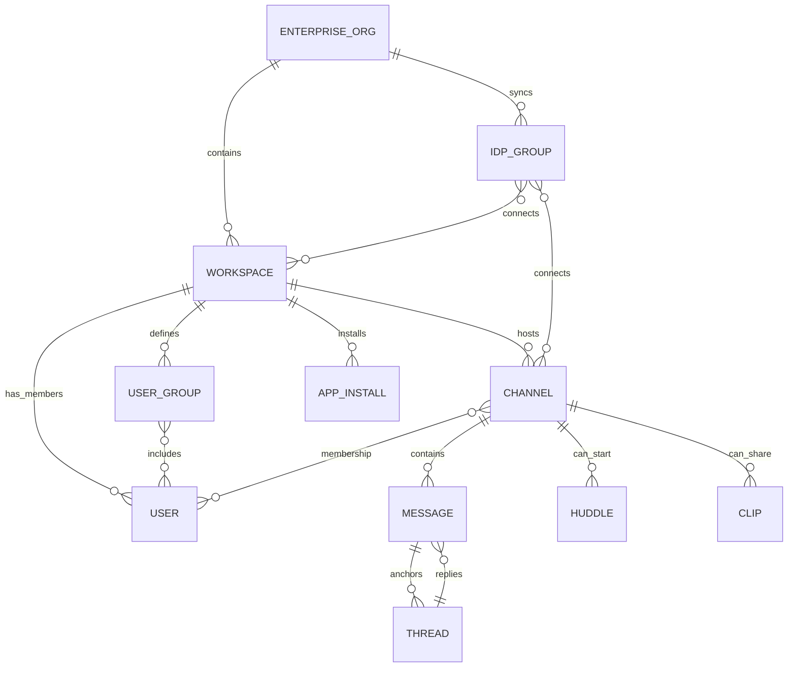
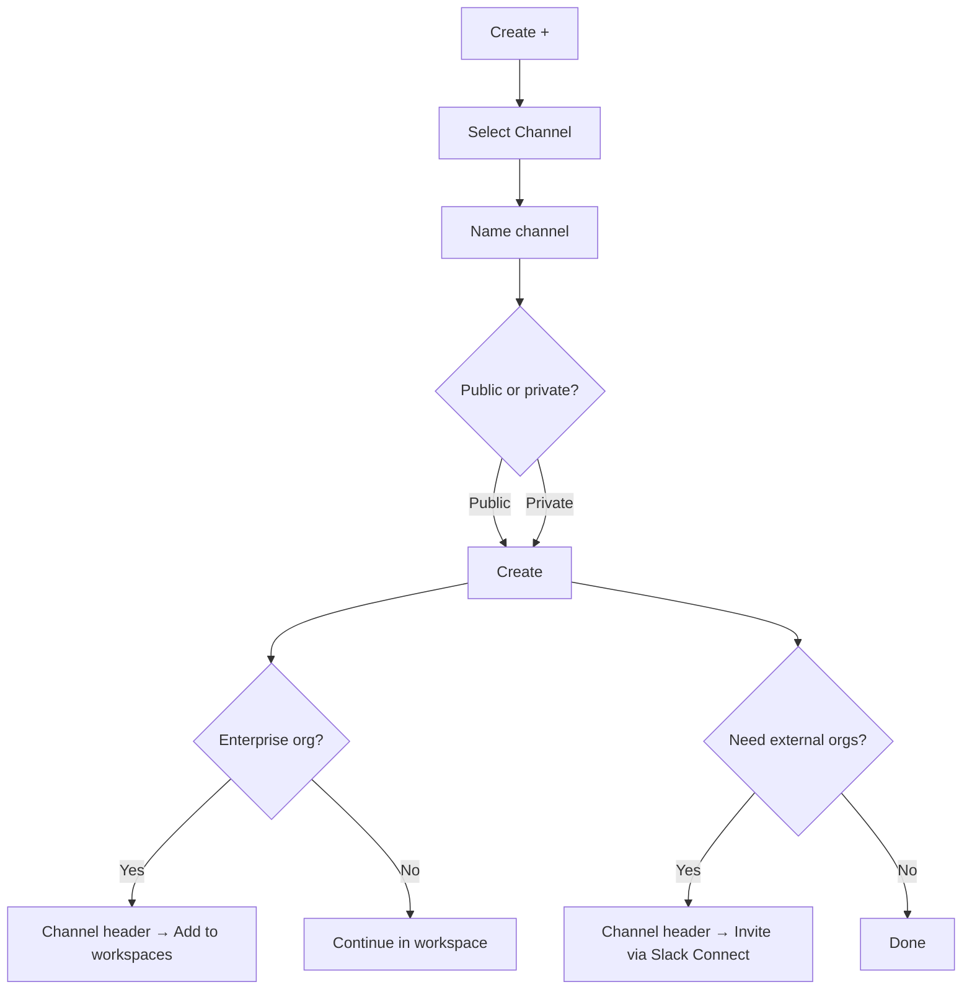

# Deep research on the Slack interface and interaction model

## Executive summary

Slack’s interface is built around a small set of durable objects—**workspaces, channels, direct messages, messages, and apps**—and a layered administrative model that becomes significantly richer on **Enterprise** subscriptions (multiple workspaces under a single enterprise organisation, plus additional org-wide roles and policies). This multi-layer structure is the foundation for “seamlessness”: users can largely behave the same way (read, write, search, react, thread, huddle) regardless of whether they are working in a single workspace, across many workspaces, or with external organisations via Slack Connect. citeturn24view3turn24view2turn23view0turn31view1

From a UI perspective, recent iterations of Slack’s navigation increasingly **separate “modes of work”** (Home for the live channel list; DMs for conversational chat; Activity for an inbox-like feed; Later for personal triage; Files/Tools/Directories for retrieval and orchestration). Slack formalised this navigation model in its redesigned interface rollout (initially announced in 2023) and later consolidated desktop tabs beginning September 2025 (e.g., Files and Tools tabs, and a Directories page for People/Channels/External connections). citeturn16view1turn35view2turn14view3turn35view0

Organisationally, Slack offers multiple mechanisms for grouping people and governing access:

- **Workspaces** as primary membership containers; **Enterprise organisations** as containers for multiple workspaces. citeturn31view1turn22view2  
- **Role-based administration** at workspace level (primary owner/owner/admin) and additional **org-level roles** plus system roles on Enterprise. citeturn14view0turn14view1  
- **User groups** (mentionable + can auto-join default channels) and **IDP group sync** (SCIM/IDP integrations) for large-scale membership automation. citeturn20view0turn22view0turn21view2  
- **Guest account types** (single-channel and multi-channel) for internal-limited access; **Slack Connect** for external organisations in shared channels/DMs. citeturn21view0turn32view0turn23view0

Access and lifecycle management spans end-user clients (desktop, browser, mobile), plus identity/admin rails (SAML SSO, SCIM provisioning, OAuth app installs, enterprise admin policies). The result is a product where the core interaction grammar remains consistent, while governance and automation scale “above” it for admins. citeturn28view2turn21view3turn21view2turn18view3turn14view0

## Conceptual model and entity relationships

Slack’s interface is easiest to reason about as a **graph of membership and conversations**:

- A **workspace** is a membership and content boundary for most objects (members, channels, installed apps, files). citeturn31view1turn24view3  
- An **Enterprise organisation** links two or more workspaces; some channels can be shared across workspaces in the same enterprise org (multi-workspace/shared channels in the enterprise sense). citeturn31view1turn22view3  
- **Slack Connect** creates “shared” channels/DMs across organisations (external companies) while preserving per-organisation control over policies like retention and message moderation. citeturn23view0turn23view3  
- **User groups** and **IDP groups** act as higher-level membership abstractions: user groups are native Slack groupings (often mentionable and channel-default driven), while IDP groups are synchronised from an identity provider and can be connected to workspaces/channels in an Enterprise org. citeturn20view0turn22view0turn21view2  

A practical relationship diagram (focusing on the objects you asked about) looks like this:



This diagram aligns with Slack’s own distinctions between: (a) enterprise organisations vs workspaces as containers, (b) shared/multi-workspace channels inside an enterprise org, and (c) Slack Connect “external organisations” as a different sharing plane than enterprise multi-workspace. citeturn31view1turn22view3turn23view0turn24view0

## Organising people and permissions

### Workspaces, enterprise organisations, and “who governs what”

Slack defines a **workspace** as the typical scope for channels, members, and app installations, while Enterprise subscriptions introduce an **enterprise organisation** as a network of multiple workspaces. The developer documentation is explicit that each workspace retains its own IDs, directories, and installations, while enterprise introduces cross-workspace sharing and organisation-level user identity concepts. citeturn31view1turn22view3

Slack’s own Enterprise Grid materials describe this as “unlimited workspaces connected within the container of an organisation,” with workspaces often mapping to business units/departments and shared channels bridging across them. citeturn31view0turn22view3

### Roles and account types

Slack’s role model splits into:

- **Administrative roles** (workspace primary owner, workspace owners, workspace admins; and on Enterprise: org primary owner, org owners, org admins). citeturn14view0turn22view2  
- **Non-admin roles/account types** (full members; multi-channel guests; single-channel guests; invited members; channel managers; and “system roles” on Business+/Enterprise for finer delegated administration). citeturn14view0turn21view0turn5search6  

The “permissions by role” matrix shows Slack’s governance intent: everyday collaboration actions are broadly available, while sensitive administration is progressively restricted (and often further restrictable by owners/admins). Examples include restricting channel creation, editing/deleting messages, converting channels, retention changes, and guest invites. citeturn14view1turn25view0turn26view3turn21view1  

Channel managers are a notable UI/governance hybrid: they are assigned at channel-creation time by default and can adjust administrative settings for assigned channels, while owners/org owners can centralise or override permissions at workspace/org level. citeturn5search6turn25view1turn14view0  

### User groups vs IDP groups

Slack offers **native user groups** primarily as a “mention and bulk membership” device:

- Mentioning a group handle (e.g., `@designers`) notifies everyone in the group. citeturn20view0turn35view0  
- User groups can be configured with up to **100 default channels** that members are automatically added to, and can be added to channels similarly to adding individuals. citeturn20view0turn9search6  
- Workspace-level vs org-level user groups differ: org-level groups can be used for permissions/membership across workspaces, but Slack notes constraints (e.g., org-level user groups created in Slack can’t be managed via SCIM and can’t be @mentioned). citeturn20view0turn19view1turn21view2  

For Enterprise scale, Slack also supports **IDP group sync**: IDP groups can be connected to workspaces and channels so membership is automatically added/removed; channels must be accessible from a required workspace to be connected. citeturn22view0turn19view3  

This yields a two-layer grouping strategy in practice:

- **User groups** = collaboration semantics (mention, default channels, shared sidebar section patterns). citeturn20view0turn17view0  
- **IDP groups** = identity governance semantics (automated provisioning, required membership, offboarding consistency). citeturn22view0turn21view2  

### Comparison table for “grouping people” constructs

| Construct | Primary purpose | Scope/boundary | Who manages it | Key UI affordances | Notable constraints |
|---|---|---|---|---|---|
| Workspace | Membership + content container | Single workspace | Workspace owners/admins (policies); members (collaboration) | Workspace switcher, channel/DM list, admin menus citeturn14view2turn36view3 | App installs and directories are workspace-scoped even in enterprise citeturn31view1 |
| Enterprise organisation | Multi-workspace container | 2+ workspaces networked | Org primary owner/owners/admins | Org settings, multi-workspace channels, org-wide policies citeturn14view0turn22view2turn22view3 | Org-level policies can override workspace settings (e.g., retention, permissions) citeturn25view3turn5search9 |
| Workspace roles | Administrative control | Workspace | Primary owner/owners assign owners/admins citeturn14view0 | Role-dependent access to Admin/Tools & settings citeturn14view1 | Some actions restricted by subscription/owner policies citeturn14view1turn25view0 |
| Org roles | Org-wide administration | Enterprise org | Org primary owner/owners/admins citeturn14view0 | Organisation settings, org dashboards, system roles citeturn14view0 | Org owners may not have certain defaults unless granted (system roles/tools) citeturn14view0 |
| Channel managers | Delegated per-channel governance | Channel(s) assigned | Creator by default; configurable by owners/admins citeturn5search6turn14view0 | Channel header → Settings; “channel manager” permissions citeturn25view1turn15view1 | Only covers assigned channels; org/workspace can override permissions citeturn5search9turn14view1 |
| User groups (workspace-level) | Mention + bulk channel membership | Workspace | Owners/admins by default; can be delegated citeturn20view0turn19view1 | Directories → User groups; @handle mention citeturn19view2turn20view0 | Guests + Slack Connect externals can’t join (and can’t mention) org’s user groups citeturn20view0 |
| User groups (org-level) | Permissions/membership across workspaces | Enterprise org | Managed in admin dashboard citeturn19view1turn20view0 | Org settings → People/Groups citeturn19view1 | Not @mentionable; not combinable with IDP groups; not SCIM-managed citeturn20view0turn19view1 |
| IDP groups (synced) | Automated membership governance | Enterprise org | Org owners/admins + identity provider citeturn22view0 | Org settings → IDP Groups (connect channels/workspaces) citeturn22view0 | Requires IDP support or SCIM API; membership changes occur in IDP citeturn22view0turn21view2 |
| Guests (single/multi-channel) | Limited access for “internal-like” outsiders | Workspace (or org workspace) | Owners/admins invite/manage citeturn21view0turn21view1 | Guest icons; channel-limited access; expiration UI citeturn21view0turn9search3 | Single-channel guest ratio per paid member; multi-channel guests billed like members citeturn21view0turn32view0 |

## Access methods and identity lifecycle

### Client surfaces: desktop, web, mobile

Slack’s primary access methods are:

- **Desktop app** (macOS/Windows/Linux),  
- **Web/browser access** (Slack in a supported browser),  
- **Mobile apps**. citeturn28view0turn28view2turn24view0  

Slack maintains an explicit **support lifecycle** for app versions, browsers, and operating systems, and updates system requirements on a regular cadence (notably described as twice per year). citeturn28view0turn28view1  

From a UI standpoint, Slack documents both parity and differences:

- Huddles are available on desktop and mobile apps and also supported browsers (with specific browser coverage noted for huddles). citeturn24view0  
- Some organisational controls and UI affordances are desktop-first (e.g., creating custom Activity views; certain sorting/filtering in Unread messages; inviting guests isn’t available from mobile per Slack’s invitation doc). citeturn34view2turn17view3turn21view1  
- Slack’s September 2025 desktop tab consolidation explicitly states mobile navigation remains as-is (i.e., similar changes were “not right now”). citeturn35view2  

### Authentication and sign-in patterns

Slack supports password-free email sign-in (via emailed confirmation code), and also sign-in via entity["company","Apple","consumer technology company"] and entity["company","Google","technology company"] accounts in supported contexts. Slack notes that if SSO is required for a workspace or org, users must authenticate with the organisation’s SSO provider during sign-in. citeturn28view2  

On the security side:

- SSO is presented as an “extra layer of security” that owners (workspace/org) can enable and configure, with different settings depending on subscription. citeturn22view1turn21view3  
- SAML SSO setup flows are described in a stepwise UI path (Admin → Workspace settings → Security → SSO & authentication, etc.), including toggles for whether SSO is required/optional and whether users can edit profile fields after enabling SSO. citeturn21view3turn22view1  
- Enterprise org launch guidance treats configuring SSO as required on Enterprise subscriptions and cautions about matching email addresses between Slack accounts and the identity provider to avoid lockout during migrations. citeturn31view3  

### Provisioning and lifecycle: SCIM and group sync

Slack supports provisioning via the SCIM standard:

- Provisioning can create/deactivate members, create/deactivate multi-channel guests (Enterprise only), sync profile fields, create/delete user groups, and manage user-group membership. citeturn21view2turn20view0  
- Slack positions SCIM provisioning as requiring a connector app with a supported IDP, while also pointing developers/admins to the SCIM API for custom scripting. citeturn21view2turn22view0  

In Enterprise, Slack also supports connecting IDP groups to workspaces/channels so that members are auto-added/removed; it explicitly notes that if an IDP does not support group syncing, the SCIM API can be used manually, with the important caveat that individual membership changes still live in the IDP. citeturn22view0turn21view2  

### OAuth and app access

OAuth in Slack is primarily an **app installation and authorisation mechanism**, not a user login mechanism. The developer documentation describes the core OAuth flow as requesting scopes, waiting for user approval, and exchanging an authorisation code for an access token, using the `/oauth/v2/authorize` and `oauth.v2.access` endpoints and configured HTTPS redirect URLs. citeturn18view3turn30view2  

For apps distributed beyond a single workspace:

- Single-workspace “one-click install” yields one access token for that workspace, but distributing to other workspaces requires handling OAuth to obtain tokens per workspace/user context. citeturn30view2turn18view3  

### Comparison table for access methods

| Access method | Typical use | Navigation/UI characteristics | Auth patterns commonly encountered | Admin controls most relevant |
|---|---|---|---|---|
| Desktop app | Primary power-user surface; multi-windowing; admin tasks | Sidebar tabs (Home/DMs/Activity/Files etc), Directories, keyboard-heavy workflows citeturn35view0turn14view2turn36view0 | Email code sign-in; SSO-required flows; switching multiple workspaces citeturn28view2turn36view3 | Desktop app configuration enforcement for enterprise rollouts; retention, roles, SSO settings citeturn28view3turn25view3turn22view1 |
| Browser/web | Lightweight/managed devices; quick access | Similar IA to desktop; search preference overrides exist for browser keyboard shortcuts citeturn27view1 | Email code, SSO; often used as intermediate step even when launching desktop sign-in citeturn28view2turn21view3 | SSO enforcement; access policies; browser support lifecycle citeturn28view1turn22view1 |
| Mobile apps | On-the-go triage and response | Mobile-specific navigation; Activity available but certain customisation desktop-first citeturn34view2turn35view2 | Sign-in options guided in-app; SSO if required citeturn28view2 | Mobile notification scheduling and overrides; some invite/admin limits (e.g., guest invitations not possible from mobile) citeturn33view3turn21view1 |
| Guest accounts | Limited internal access for outsiders | Appears as normal user in UI but restricted to assigned channels; indicator icons; expiration controls citeturn21view0turn9search3 | Invited like members from invitations UI (desktop); can be time-limited citeturn21view0turn21view1 | Guest invitation permissions; expiration; channel access controls citeturn21view0turn9search1 |
| Slack Connect (external organisations) | Cross-company channels/DMs | “External” directories; Slack Connect sections; invitation/approval flows; workspace-owned channels citeturn23view0turn16view3turn23view2 | Invitation/acceptance required for external DMs; channel invitations may require approvals citeturn32view2turn23view2 | Approval settings; per-org connection settings; retention split by sender org citeturn23view2turn23view3 |
| Apps/bots (OAuth installations) | Automation, integrations, workflows | App Home, shortcuts, bot messages; Tools tab/Directories surfaces citeturn30view3turn18view2turn35view0 | OAuth v2 scopes + token exchange; per-workspace installs citeturn18view3turn30view2 | App approval/permissions; enterprise app governance; bot/user tokens and surfaces citeturn8search10turn30view2turn30view0 |

## Creation and onboarding flows

Slack’s “creation” UX tends to converge on two consistent UI patterns:

1. A **global Create (+) affordance** in the sidebar/top UI that leads to creation of messages, channels, huddles, canvases/lists, workflows, etc. citeturn35view0turn25view0  
2. **Contextual creation** anchored where the artefact will live (e.g., add tabs/folders in a channel header; pin from message actions; invite externals from a channel header). citeturn15view1turn23view1turn25view1  

### Workspace creation

Creating a standalone workspace is a web-driven onboarding flow, while creating a workspace inside an Enterprise organisation is an admin flow from organisation settings:

- Enterprise flow: Organisation name → Tools & settings → Organisation settings → Organisation → Workspaces → Create a workspace; includes naming/domain, description, and workspace access preferences. citeturn22view2turn19view3  

Enterprise guidance also highlights that the org primary owner is auto-assigned to new workspaces created in the Enterprise org. citeturn22view2turn14view0  

### Channel creation and privacy conversion

Slack’s channel creation steps are explicit:

- Create → Channel → choose blank channel or template (paid) → name → public/private → Create. Slack notes that by default members can create channels and multi-channel guests can create private channels, though owners can change permissions. citeturn25view0turn14view1  

Conversion between public/private is handled in the channel header settings and is governed by role and policies; converting to private posts an in-channel notification message. citeturn25view1turn14view1  

### Multi-workspace channels (Enterprise)

A multi-workspace channel is created by adding an existing channel (except `#general`) to additional workspaces, from the channel header (“Workspaces with access to this channel” → Edit). Slack positions this as a way for departments in separate workspaces to collaborate in one channel, and notes that some apps/custom bots may not be available in multi-workspace channels. citeturn22view3turn31view1turn18view2  

### Guests and guest conversion

Slack distinguishes:

- **Single-channel guests**: free, restricted to one channel; allowed at up to five per paid active member.  
- **Multi-channel guests**: limited to specified channels but can be added to unlimited channels; billed like regular members. citeturn21view0turn32view0  

Creating/inviting guests is primarily a desktop admin flow, and Slack explicitly notes that inviting guests from mobile apps isn’t currently possible. citeturn21view1turn21view0  

### User groups

Creating a user group is a Directories-driven flow:

- Home → Directories → User groups → Create user group; configure name/handle, purpose/default channels, and optionally create a shared sidebar section, then add members. citeturn20view0turn17view0  

User groups can be managed via the admin dashboard; Slack distinguishes workspace-level groups (not accessible across workspaces) from org-level groups (managed centrally and usable for permissions/membership across workspaces). citeturn19view1turn20view0  

### Apps/bots creation and installation

On the user/admin side, apps are typically installed from Slack Marketplace pages (“Add to Slack”), subject to workspace settings such as app approval. citeturn10search12turn8search10turn30view2  

On the developer side:

- Creating apps can be initiated from Slack Marketplace → Build → Create an app, per Slack’s help guidance, with deeper configuration in the app dashboard. citeturn30view1turn29search13  
- Installing with OAuth is required for distributed apps; the “Add to Slack” button starts the OAuth flow. citeturn18view3turn30view2  
- Slack also deprecated “legacy custom bots” as of March 31, 2025, pushing developers toward modern Slack apps rather than legacy bot user constructs. citeturn30view0  

### Shared channels and Slack Connect

Slack Connect creation flows typically look like:

- Create/choose a channel (non-`#general`) → channel header → invite external people/organisations → invitation approval/acceptance depending on settings. citeturn23view1turn23view2turn24view3  

Slack also supports Slack Connect DMs with invite/accept mechanics; either party can end the conversation, and owners/admins can restrict Slack Connect permissions. citeturn32view2turn23view0  

### Comparison table for creation flows

| Artefact created | Primary entry point | Core steps (UI flow) | Permissions/governance “gotchas” |
|---|---|---|---|
| Workspace (Enterprise) | Organisation settings | Org name → Tools & settings → Org settings → Workspaces → Create; set name/domain/description; choose access level citeturn22view2turn19view3 | Only org owners/admins; org primary owner auto-assigned to new workspaces citeturn22view2turn14view0 |
| Channel | Create (+) | Plus → Channel → name → public/private → Create citeturn25view0 | Channel creation can be restricted; private-channel creation rules differ for guests citeturn25view0turn14view1 |
| Private channel conversion | Channel settings | Channel header → Settings → “Change to private/public” citeturn25view1 | Converting to public is more restricted; owners can restrict conversion permissions citeturn25view1turn14view1 |
| Multi-workspace channel | Channel header (Enterprise) | Channel header → Workspaces with access → Edit → add workspaces citeturn22view3 | Some apps/custom bots may not function; requires enterprise permissions citeturn22view3turn31view1 |
| Member invite | Workspace menu | Workspace name → Invite people → enter email; optionally set default channels (paid) citeturn21view1 | Invite links may be disabled when SSO enabled; org policies may restrict domains citeturn21view1turn22view1 |
| Guest invite | Workspace menu (desktop) | Invite people → choose guests → pick channels + optional time limit citeturn21view1turn21view0 | Not possible on mobile; guest ratios and billing differ (single vs multi) citeturn21view1turn21view0turn32view0 |
| Convert member → guest | Admin / Manage members | Admin → Manage members → change account type; set channels + expiration citeturn9search3turn21view0 | Multi-channel guests billed like members even if time-limited citeturn21view0 |
| User group (workspace) | Directories | Directories → User groups → Create; set handle + default channels; add members citeturn20view0turn17view0 | Permissions may be restricted; guests/externals can’t be added citeturn20view0turn19view1 |
| App install (user/admin) | Marketplace / Tools | Find app → Add to Slack → authorise; or request if restricted citeturn12search13turn8search10turn10search12 | Workspaces can require admin approval; Slack Connect affects who can use shortcuts citeturn30view2turn18view2turn23view0 |
| App install (developer/distributed) | OAuth flow | Redirect to `/oauth/v2/authorize` → approval → redirect_uri with code → `oauth.v2.access` token exchange citeturn18view3turn30view2 | HTTPS redirect requirements; scopes are additive unless token revoked citeturn18view3 |
| Slack Connect channel | Channel header | Channel header → invite external people/organisations; approvals depending on settings citeturn23view1turn23view2 | Channel “ownership” stays with creating organisation; cannot Slack Connect `#general` citeturn23view0turn23view1 |
| Slack Connect DM | Directories/External | Directories → External → Start a DM; invitation must be accepted citeturn32view2turn23view0 | Owners/admins can restrict; either party can end conversation citeturn32view2 |

### Key interaction flow diagrams

**Create a channel and optionally share it (Enterprise / Slack Connect)**



**Install an app with OAuth (distributed app)**

```mermaid
flowchart LR
  U[User clicks Add to Slack] --> A[/oauth/v2/authorize<br>scopes + redirect_uri/]
  A --> C[User approves scopes]
  C --> R[Slack redirects back<br>redirect_uri?code=...]
  R --> S[App backend calls oauth.v2.access]
  S --> T[Receive token(s)<br>store per workspace/install]
```

These flows are directly reflected in Slack’s channel creation UX (Create button), enterprise channel-sharing controls, Slack Connect invitation mechanics, and Slack’s developer OAuth guidance. citeturn25view0turn22view3turn23view2turn18view3turn30view2  

## Channel and conversation types with related features

### Core conversation types

Slack’s help centre describes channels as the primary “work is organised into dedicated spaces” object, with **public vs private** behaviour shaping discoverability, membership, and search visibility:

- Public channels: members (not guests) can find, view, and join; messages/files appear in search for other members. citeturn24view3  
- Private channels: membership by invitation/add; messages/files searchable only to members. citeturn24view3  

Direct messages are positioned as “smaller conversations … outside of channels,” suitable for 1:1 or small group conversations (up to nine people). Slack also notes it’s possible to add people to a DM and convert a group DM to a private channel. citeturn24view2turn7search6  

Threads are a message-anchored sub-conversation inside channels or DMs that reduce clutter; Slack supports replying in-thread with optional “also send to channel/DM” behaviour, and allows opening threads in a new window on desktop. citeturn24view1turn36view0  

### Enterprise channel types and sharing planes

Two major “sharing planes” matter:

- **Multi-workspace channels** (Enterprise): a channel is shared across multiple workspaces inside one enterprise organisation; created by adding the channel to other workspaces via the channel header. citeturn22view3turn31view1  
- **Slack Connect channels** (shared across organisations): a channel can include up to 250 organisations; each organisation’s members can join/be added by their own organisation; the channel is “owned” by the organisation that created it (only the owning organisation can invite/remove organisations, manage posting permissions, etc.). citeturn23view0turn23view1  

Slack’s data governance model for Slack Connect is explicitly split: your retention/settings apply only to content sent by your members; external participants’ content follows their organisation’s settings, and editing/deletion rights also stay within the sender’s organisation. citeturn23view3  

### Feature layer: huddles, clips, pins, bookmarks/tabs, topics/purposes, retention, archiving

Slack treats several features as “attached” to conversations (channels/DMs) via consistent UI entry points:

- **Huddles**: real-time audio/video sessions started from any channel or DM; includes video, multi-person screen sharing, and a dedicated thread for notes. Joining is signalled by a headphones icon next to the channel name in the sidebar when active. Slack also documents subscription-based participant limits. citeturn24view0  
- **Clips**: asynchronous audio/video/screen recordings sent in channels/DMs; supports transcripts and closed captions, and clips follow the same retention policy as other files. citeturn15view3turn6search5  
- **Pins**: pinning a message makes it available to everyone with access to the conversation via a Pins tab; Slack’s newer “tabs” model also reiterates that a pinned message appears in the Pins tab and provides multiple UI paths depending on subscription. citeturn11search5turn15view1  
- **Bookmarks / tabs / folders**: Slack has evolved toward “tabs in the conversation header.” Every channel/DM starts with Messages; as files/workflows are shared and messages are pinned, additional tabs appear, and users can create up to 15 tabs (canvases/lists/workflows/messages/links/files). Folders can hold up to 100 items/folders per channel, and tabs can be restricted to channel managers. citeturn15view0turn15view1  
  - At the API layer Slack still exposes bookmarks methods and states conversations are limited to 100 bookmarks, with bookmarks visible in the header near pinned messages (useful for understanding the “bookmark-as-header-resource” mental model). citeturn18view0  
- **Channel topic and description/purpose**: Slack exposes topic/purpose editing via channel header edit flows, and notes that editing can depend on having permission to post. citeturn6search0turn35view0  
- **Retention**: Slack supports workspace-level retention and (on paid plans) conversation-specific overrides; org-level retention policies can override workspace-level settings, and deleted channel retention is special-cased (retention does not apply in deleted channels). File retention options differ by subscription, and Slack Connect retention is split by sender organisation. citeturn25view3turn23view3turn25view2  
- **Archiving and deletion**: archiving preserves a channel but changes how it’s accessed; unarchiving differs for public vs private member restoration, and deleting is permanent with role-based constraints (and additional enterprise role configurability). citeturn25view2turn5search0turn14view0  

### Illustrative UI screenshots for channel header patterns and navigation

image_group{"layout":"carousel","aspect_ratio":"16:9","query":["Slack channel header tabs Pins Files Workflows screenshot","Slack huddle headphones icon in channel screenshot","Slack clips record video clip message field screenshot"],"num_per_query":1}

(These visual patterns correspond to Slack’s documented UI: tabs in the conversation header, huddles started from a headphones icon in the header, and clips recorded from the message field icons.) citeturn15view0turn24view0turn15view3  

### Comparison table for channel and conversation types

| Type | Visibility & discovery | Membership model | Works across workspaces/orgs? | Key features & UI anchors | Governance highlights |
|---|---|---|---|---|---|
| Public channel | Discoverable and joinable by members (not guests); searchable by members citeturn24view3 | Workspace members; guests excluded from “join-browse” model citeturn24view3turn21view0 | Can become multi-workspace (Enterprise); can be connected to IDP groups (Enterprise) citeturn22view3turn22view0 | Threads, huddles, clips, pins, header tabs/folders; topics/descriptions citeturn24view1turn24view0turn15view1turn6search0 | Posting permissions and retention configurable; org policies can override citeturn5search12turn25view3 |
| Private channel | Not browseable; searchable only for members citeturn24view3 | Added by existing members; guest access can be configured through invitations/roles citeturn24view3turn21view0 | Can be multi-workspace (Enterprise) and can participate in Slack Connect depending on configuration citeturn22view0turn23view0 | Same core feature set; conversion to public more restricted citeturn25view1turn15view1 | Retention overrides may apply; converting and managing private channels is more permissioned citeturn25view3turn5search3 |
| Multi-workspace channel (Enterprise) | Depends on each workspace’s access to the channel | Users participate from their workspaces; shared channel across multiple workspaces citeturn22view3turn31view1 | Yes (within Enterprise org) citeturn22view3turn31view1 | Same conversation UI; may require selecting workspace context in certain actions/shortcuts citeturn18view2turn22view3 | Some apps/bots may not be available; creation governed by org permissions citeturn22view3turn12search16 |
| Slack Connect channel (shared channel) | Visible only to invited parties; cannot add externals to `#general` citeturn23view1 | Each org manages its members joining/adding; channel can host up to 250 orgs citeturn23view0turn23view1 | Yes (across organisations) citeturn23view0 | Same channel UI + external directories/invites; app shortcuts behaviour differs across orgs citeturn23view0turn18view2 | Ownership and policy split; retention and edit/delete rules split by sender org citeturn23view0turn23view3 |
| DM (internal) | Not public/discoverable | 1:1 or up to 9 people citeturn24view2 | Can exist across enterprise user identity; can be started quickly via Create citeturn24view2turn35view0 | Threads, huddles, pins/tabs also exist in DMs per Slack docs citeturn24view1turn15view1turn24view0 | Can convert group DM to private channel; notification controls per conversation citeturn24view2turn8search1 |
| Slack Connect DM (external) | Invitation required and must be accepted citeturn32view2 | 1:1 external relationship; can end conversation citeturn32view2turn23view0 | Yes (across organisations) citeturn23view0turn32view2 | External directories; invitation management UI citeturn32view2turn23view2 | Owners/admins can restrict permissions; block invitations possible citeturn32view2 |
| Threads (feature layer) | Not a top-level container; anchored to a message | Participants follow/reply; optional “also send to channel” citeturn24view1 | Works in channels and DMs citeturn24view1turn24view2 | Reply-in-thread icon; thread pane/new window on desktop citeturn24view1turn36view0 | Appears as notification type in Activity; searchable via modifiers citeturn34view0turn27view0 |

## UI patterns and interaction flows that make Slack feel seamless

Slack’s “seamlessness” is largely a product of **consistent UI grammar** across contexts, paired with **multiple navigation accelerators** (keyboard, search, consolidated feeds, creation entry points). This section analyses those patterns in terms of interaction flows, not just features.

### Navigation and information architecture

Slack documents the sidebar/navigation system as a set of components:

- Workspace switcher (optionally collapsed),  
- Navigation bar with tabs (e.g., Home, Activity, Later),  
- Home tab sidebar listing channels and DMs in sections,  
- Customisation options for what appears and how it’s filtered/sorted. citeturn14view2turn35view0  

In September 2025 Slack consolidated desktop tabs and moved People/Channels/External connections into a Directories page. This is a strong IA signal: **core flow = conversations**, while **directories/files/tools** become dedicated retrieval/management surfaces. citeturn14view3turn35view2turn19view2  

image_group{"layout":"carousel","aspect_ratio":"16:9","query":["Slack desktop Home DMs Activity Files sidebar screenshot","Slack consolidated tabs Files Tools Directories screenshot September 2025","Slack adjust sidebar preferences components workspace switcher navigation bar screenshot"],"num_per_query":1}

### Sidebar organisation: sections, starred, shared sections

Slack offers multiple “personal organisation” tools:

- **Custom sidebar sections** (paid): organise channels/DMs/apps into custom sections visible only to the user. citeturn16view3turn14view2  
- **Starred conversations**: star channels/DMs to place them in a Starred section (works alongside custom sections). citeturn17view1turn4search7  
- **Shared sidebar sections**: share a custom section with people, or associate one section per user group so members can apply a shared organisational structure. citeturn17view0turn20view0  

These features collectively function as a **user-managed IA layer** on top of the workspace’s channel taxonomy, which is especially valuable where channel lists scale. The UI affordances consistently live in either: (a) section overflow menus, or (b) the conversation header star/section control. citeturn16view3turn17view0turn17view1  

### Unreads, Activity, and badges: taming attention without losing context

Slack uses multiple parallel “attention surfaces”:

- **Bolded conversations** in Home indicate unread messages; Unread messages (desktop) / Catch up (mobile) provide a consolidated unread view, with message actions available from that view. citeturn26view0turn17view3  
- **Activity** is increasingly positioned as a unified notification feed; the newer Activity view (rolling out gradually) places more notifications in one place, supports Dense vs Detailed layouts, and custom views (tabs) based on filters including specific channels and sidebar sections. citeturn34view2turn34view1  
- Slack notes a specific redesign detail: DM badging changes to show the number of unread conversations rather than messages—an IA choice that shifts attention from message volume to conversation backlog. citeturn34view0  
- OS-level badges and notification indicators are documented (e.g., dots vs numbers, blue vs red in Windows notification area), connecting Slack’s in-app attention model to the platform surface. citeturn33view0turn33view3  

### Search and Quick Switcher as “universal navigation”

Slack’s top search field functions as both retrieval and navigation:

- Search supports modifiers (e.g., `in:`, `from:`, `has:`, `is:thread`) and filters across messages/files/people/channels/canvases. citeturn27view0  
- Users can exclude certain channels from search results and (in browser) remap `Cmd/Ctrl+F` to open Slack search—a small but telling “seamlessness” detail that aligns Slack with users’ muscle memory. citeturn27view1  

For fast context switching, Slack’s keyboard navigation centres on the Quick Switcher flow:

- `⌘K` / `CtrlK` → type channel/person → enter to jump; plus an explicit path to open a conversation in a new window. citeturn36view0turn36view3  

### Message composition: consistent affordances + progressive disclosure

Slack’s message composer implements a stable “icon row + formatting + shortcuts” model:

- Slack enumerates composer icons (files, formatting tools, emoji, mentions, clips, shortcuts), supports scheduling, and keeps drafts automatically. citeturn26view0turn15view3  
- Formatting is WYSIWYG by default via a toolbar, but users can switch to markup mode (preference) if they prefer. citeturn26view1turn7search8  
- Message edit/delete, and the newer “unsend within 15 seconds” flow on desktop (`Cmd/Ctrl+Z`), are unified under message actions and governed by owner/admin permissions. citeturn26view3turn36view2  

The recurrent pattern is: core action is always one click away, while advanced actions are behind the **three dots (“More actions”)**. This same pattern appears in pinning, forwarding, saving for later, etc. citeturn15view1turn18view1turn17view2  

### Reactions, threads, and context-preserving message actions

Emoji reactions are a first-class mechanism for lightweight acknowledgement and workflow (including a one-click reaction setting controlled by admins). citeturn26view2turn6search6  

Threads preserve channel readability while enabling depth; Slack’s thread UI provides an explicit option to also send a reply to the main conversation, which supports a nuanced “broadcast vs narrow reply” choice at the moment of writing. citeturn24view1  

Forwarding adds another “share context without copy/paste” flow, including a privacy-respecting option when sharing links from private conversations (show message vs only show link). citeturn18view1turn11search1  

### Shortcuts and slash commands: command palette in the composer

Slack’s shortcuts menu behaves like an in-composer command palette:

- Open via `/` or slash icon → search apps/commands/workflows → run. citeturn18view2turn6search3  
- Slack documents that shortcuts associated with apps behave differently across Slack Connect contexts (only members of your organisation can use shortcuts tied to apps installed to your workspace). citeturn18view2turn23view0  
- Slack lists built-in slash commands (e.g., `/invite`, `/archive`, `/snippet`, `/people`) reinforcing the idea that many administrative and navigation actions remain reachable from the message box. citeturn18view2turn11search0  

### Apps and App Home: a dedicated UI surface for integrations

Slack’s help content encourages users to interact with apps through multiple surfaces (app Home, Messages tab, shortcuts). citeturn8search9turn35view0  

From the developer standpoint, App Home is a private one-to-one space between user and app, with tabbed views (Home, Messages, About) and a persistent location that apps can update. This is a key UI pattern for building integrations that don’t spam channels while still being discoverable and actionable. citeturn30view3turn8search2  

### Preferences and “personal control loops”

Slack repeatedly centralises personal settings via the user’s profile picture → Preferences path (navigation customisation, notifications, mark-as-read behaviour, search preferences). citeturn14view2turn33view3turn27view3turn27view1  

This creates a consistent “control loop”: users detect friction (too many notifications; too many channels; search noise) and Slack provides a preference-level remedy without requiring admin intervention (within policy). citeturn33view3turn14view2turn27view1  

### Annotated mockup of the “standard” desktop mental model

```text
(1) Workspace/Org switcher
(2) Navigation tabs (Home / DMs / Activity / Files / More)
(3) Sidebar sections (Channels, DMs, custom sections, Starred, Slack Connect section)
(4) Conversation header (name, topic/purpose, huddle, tabs)
(5) Message list (messages + thread indicators)
(6) Composer (files, formatting, emoji, @mentions, clips, shortcuts, schedule send)

+---------------------------------------------------------------+
| (1) [W]  (2) Home  DMs  Activity  Files  More                  |
|---------------------------------------------------------------|
| (3) Channels                                                   |
|     # project-alpha                                            |
|     # general                                                  |
|     ...                                                        |
|     Starred / Custom sections / Slack Connect section          |
|---------------------------------------------------------------|
| (4) #project-alpha   topic/purpose ...   [Huddle] [Tabs...]    |
|---------------------------------------------------------------|
| (5) Messages                                                   |
|     ...  [reply in thread] [react] [more actions]              |
|---------------------------------------------------------------|
| (6) [+] [Aa] [😊] [@] [Clip] [/]     [Send ▾]                  |
+---------------------------------------------------------------+
```

Each numbered region maps to a documented Slack UI/interaction area: workspace switching, tabbed navigation, custom sections/starred, conversation headers with tabs/pins, and the iconised composer with shortcuts and clips. citeturn35view0turn14view2turn15view0turn26view0turn24view0turn36view3  

### Recent UX analyses and design intent

Slack’s own redesign announcement frames navigation as supporting organisation, focus, and fast access to a growing toolset, while keeping a familiar “Home” view that aggregates channels/DMs/apps and improving multi-workspace navigation for Enterprise users. citeturn16view1turn35view3turn31view0  

External analysis in entity["organization","The Verge","technology news site"] characterised the redesign as shifting Slack from a two-layer layout (sidebar + main content) to a three-layer model in which dedicated views (DMs, Activity, Later) organise work “modes,” and highlighted changes like the dedicated Later surface and more prominent huddle entry points. citeturn16view2  

Separately, a 2024 practitioner write-up in entity["organization","Computerworld","technology magazine"] emphasised navigation-bar customisation and adapting workflows to the redesigned interface (useful as a UX adoption lens rather than a primary “source of truth” on feature mechanics). citeturn13search8turn14view2  

### Accessibility and focus modes

Slack’s “simplified layout mode” on desktop explicitly reframes navigation for focus and assistive technology users by showing one section at a time and providing a workspace landing page mirroring sidebar access points. This is a direct example of Slack making its IA flexible without changing the underlying object model. citeturn16view0turn14view2
