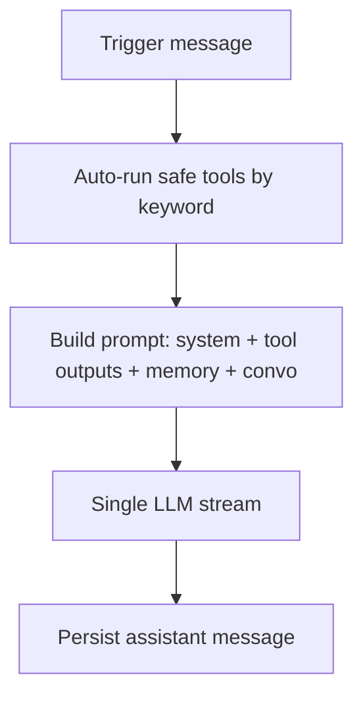

# Evolving your agent runtime into an enterprise-grade self-modifying planner–executor–critic system

## Executive summary

Your current runtime already has the "platform skeleton" (persistent agent records; runs/tasks; tool auditing; role policies; bounded spawning; vector retrieval; an orchestrator) but it is structurally closer to a **single-shot assistant** than a **true agentic system** because each run is effectively "tool pre-pass → one LLM response", and tool invocation is *not* model-driven. To evolve it into an enterprise-grade, self-modifying planner–executor–critic system, the essential leap is to make **planning, tool use, evaluation, and self-improvement first-class state machines** rather than behaviours implied by prompts. This aligns with how production agent platforms describe an "agent loop" as a serialised run that interleaves model inference and tool execution with persistence and lifecycle events. citeturn9view1turn2search0turn2search1

Practically, the shortest path to a reliable "agent that can iteratively build and program itself" looks like:

- **Replace keyword-triggered tools with native tool-calling + an internal agent loop** (multi-step tool execution inside one run, with caps on iterations/time/cost). citeturn2search0turn9view4turn9view1  
- Introduce **explicit Plans** (goal → ordered steps) and map your existing spawn/task ledger into plan execution state; use plan-first prompting patterns (Plan-and-Solve) and *act* patterns (ReAct). citeturn6search0turn1search0  
- Add **Critic/Evaluation** and **Reflection** objects that drive retries, tool/code patch proposals, and knowledge consolidation; ground "self-correction" in methods like Reflexion and Self-Refine (linguistic feedback loops), but governed by policy gates. citeturn1search1turn1search2turn2search2  
- Make self-modification concrete through a **Tool Registry** (code + schema + tests + versions + approvals) and a **Skill Library** (reusable plans/playbooks + measured success), inspired by systems that accumulate executable skills over time. citeturn1search3turn9view0  
- Run all generated code inside **sandboxed execution** (microVM/OCI+gVisor/Wasm), with strict egress controls, resource limits, artefact capture, and rollback. citeturn3search4turn3search1turn3search2turn3search6  
- Meet enterprise requirements (SOC 2 / GDPR / internal controls) by enforcing RBAC, approvals, audit trails, secrets hygiene, rate limits, and telemetry at well-defined enforcement points (router → planner → executor → tool gateway → sandbox → VCS/CI). citeturn4search1turn4search0turn2search3turn2search2  

Where OpenClaw is useful as a benchmark: it explicitly separates **tools (typed functions), skills (markdown runbooks), and plugins**, runs an **agentic loop** that interleaves tool calls and streaming output, supports multi-agent routing with per-agent sandbox/tool policy, and treats persona/operations as team files injected into context. citeturn9view0turn9view1turn9view2turn8search28turn8search3

Unspecified items (you should choose among options in the designs below): preferred cloud/provider, required compliance scope beyond GDPR/SOC 2, the canonical "source of truth" for generated tool code (DB vs Git mono-repo vs artefact store), and whether your sandbox must support Windows/macOS host execution.

## Baseline diagnosis and gap map

### What you have (strong foundations)

From your implementation summary, you already have several enterprise-grade primitives:

- **Persistent agent configuration** (name, role, provider/model, systemPrompt, toolPolicy, parent/child hierarchy, project/org scope, status).  
- **Runs/Tasks lifecycle** with statuses, WebSocket events, and tool call auditing (start/end timestamps, success/failure, input/output previews).  
- **Role policy registry** (allowed tools, canSpawn/canMutateFiles, review requirements) plus bounded spawn constraints (depth/children/concurrency/timeout).  
- **Conversation + memory retrieval** (short history + vector retrieval) to assemble context per run.

Those are prerequisites for the more advanced architecture—especially the safety, governance, and telemetry layers.

### Gaps you identified (and why they matter)

You specifically called out these gaps, which are the right "red flags" for a self-modifying system:

- **No native tool-calling protocol**: tools are executed by your runtime based on heuristics/keywords, and results are injected as text. This prevents model-driven, typed tool orchestration, clean retries, parallelism decisions, and consistent auditing of *arguments* and *structured results*. In contrast, modern tool use is typically a multi-step loop where the model returns structured tool calls, the app executes them, then returns tool results back to the model. citeturn2search0turn2search1turn9view0  
- **No agentic loop within a run**: you do one pass of tools then one LLM stream. OpenClaw's "agent loop" description explicitly frames a run as intake → context assembly → model inference → tool execution → persistence, with lifecycle events as the agent calls tools and streams output. citeturn9view1turn7search28  
- **No self-correction**: without a critic/reflection state machine and retry logic, "correction" is just hopeful prompting. The literature emphasises explicit feedback→revision loops (Self-Refine) and episodic reflection memory (Reflexion) as mechanisms for iterative improvement without weight updates. citeturn1search2turn1search1  
- **Keyword-based routing**: deterministic heuristics are easy to ship but brittle; you want policy-aware routing based on intent, cost, tools, user trust boundary, and current workload. Tool calling + structured outputs can make router decisions predictable and auditable. citeturn2search16turn2search0  
- **No inter-agent messaging**: you have "spawn" but not a robust message bus (mailboxes, correlation IDs, delivery guarantees, permissions). OpenClaw treats message routing and session control as first-class gateway concerns, with multi-agent routing and a shared control plane protocol. citeturn7search5turn7search2turn7search25  

These gaps map cleanly to the missing architectural pillars below.

## Missing architectural pillars with enterprise-grade designs

This section defines each pillar and gives design patterns, data models, APIs, storage, and runtime behaviour. The patterns are anchored to primary sources where possible.

### Explicit planning

**Definition.** Planning is creating an explicit, inspectable structure linking a goal to sequenced steps with dependencies, owners, and acceptance criteria—separate from execution. "Plan-and-Solve" prompting formalises the idea of generating a plan first, then solving subtasks according to it. citeturn6search0  

**Design patterns.**
- **Plan-first decomposition:** produce `Plan` + `PlanStep[]` with typed step kinds and measurable completion signals. citeturn6search0  
- **ReAct-style interleaving (plan-guided):** even with a plan, allow local reasoning+acting interleaving, but record it as step state transitions. citeturn1search0  
- **Long-horizon search (optional):** for complex reasoning, Tree-of-Thoughts style branching can be implemented as "candidate plan variants" scored by a critic. citeturn6search1  

**Data model essentials.**
- `Plan(goal, status, owner, scope, budget)`
- `PlanStep(order, type, dependsOn, assignedAgentId, toolName?, acceptanceCriteria?, status, artefacts)`

**Storage.**
- Relational DB for authoritative plan state (auditable), plus optional vector index for retrieving past successful plan templates.

**APIs.**
- `POST /plans` (create)
- `PATCH /plans/:id` (status/budget)
- `POST /plans/:id/steps` (append/insert)
- `PATCH /steps/:id` (state transitions)

**Runtime behaviour.**
- Planner generates a plan as structured output.
- Executor loops step-by-step; the orchestrator spawns sub-agents per step when concurrency is beneficial.

### Self-modification (agent & tool creation)

**Definition.** Self-modification means the system can propose, validate, and apply changes to its own behaviour/configuration and capabilities (tools/skills), governed by policy and approvals.

OpenClaw's architecture illustrates a "soft" self-modification pattern: persona and operating procedures live in team files like `SOUL.md` and `AGENTS.md`, which are injected into context each session, and internal hooks can swap injected files (persona switching). citeturn8search3turn8search28turn9view3

**Design patterns.**
- **Behaviour-as-data:** store system prompt fragments, policies, and agent configuration as versioned artefacts; apply changes via controlled change requests.
- **Capability-as-data:** represent tools as `(schema + implementation + tests + version + approval)` in a Tool Registry.
- **"Propose → validate → approve → apply" pipeline:** *never* allow direct self-edit of high-privilege assets; treat agent edits like code changes.

**Data model essentials.**
- `AgentConfigVersion` (snapshot of systemPrompt/toolPolicy/model/provider + who/when/why)
- `ToolDefinition` + `ToolVersion` (code + schema + risk + tests + approvals)
- `ChangeRequest` (links reflected "proposed change" to review/approval workflow)

**APIs.**
- `POST /agents/:id/proposals` (propose self-edit)
- `POST /tools` and `POST /tools/:id/versions` (tool lifecycle)
- `POST /change-requests/:id/approve` (approval gate)
- `POST /deployments/tools/:versionId` (activate tool version)

**Runtime behaviour.**
- Self-modification occurs only through meta-tools that create change requests.
- Executor can use newly approved tools immediately; unapproved tools remain inaccessible.

### Evaluation and critic loop

**Definition.** An explicit evaluation stage scores outputs against acceptance criteria (tests, policy checks, human review) and produces structured feedback that can trigger retries or changes.

**Evidence base.**
- **Reflexion** stores linguistic reflections in episodic memory to improve later trials without weight updates. citeturn1search1  
- **Self-Refine** alternates feedback and refinement steps iteratively. citeturn1search2  

**Design patterns.**
- **Planner–Executor–Critic triad:** planner creates plan; executor acts; critic evaluates and either accepts or produces "repair directives".
- **Two-critic model:** (1) fast policy critic (deterministic), (2) semantic critic (LLM) to detect reasoning/requirements failures.
- **Test-first critic for code/tools:** run unit/integration tests as the primary signal (more reliable than language critique alone).

**Data model essentials.**
- `Evaluation(kind, passed, score, metrics, evidenceRefs, feedback, evaluator)`
- `Reflection(content, rootCause, proposedFix, applied, impactEstimate)`

**APIs.**
- `POST /evaluations`
- `POST /reflections`
- `POST /runs/:id/retry` (create a new run or continue within loop depending on design)

**Runtime behaviour.**
- After execution, run automated checks (tests, linters, policy).
- If failed, feed structured feedback to reflection and either (a) continue the loop within run, or (b) spawn a repair task with bounded budget.

### Persistent learned-skill library

**Definition.** A skill library is a curated set of reusable procedures (plans, tool chains, prompts, constraints) grounded in measured outcomes, not just documentation.

**Evidence base.**
- Voyager highlights an "ever-growing skill library of executable code" plus iterative improvement using feedback and errors. citeturn1search3turn1search7  

**Design patterns.**
- **Skill cards:** compact metadata injected by default; full skill loaded on demand (OpenClaw does this: inject skill list metadata; the model reads `SKILL.md` only when needed). citeturn9view3turn9view4turn9view0  
- **Success-weighted retrieval:** rank skills by domain tags + embeddings + historical success conditioned on environment/tool availability.
- **Promotion pipeline:** candidate skill → tested skill → approved skill → deprecated skill.

**Data model essentials.**
- `Skill(name, description, tags, requiredTools, planTemplate, tests, successStats, status)`
- `SkillRunStats` (success/failure, latency, cost, environments)

**Runtime behaviour.**
- When a run succeeds, a "knowledge consolidation job" extracts reusable steps into a candidate skill, generates tests, and submits a change request.

### Sandboxed code execution

**Definition.** All generated or third-party code runs in a sandbox that enforces isolation, resource limits, and network/filesystem restrictions.

**Technology options and primary sources.**
- **Firecracker microVMs** with defence-in-depth via a "jailer" component. citeturn3search4turn3search0turn3search12  
- **gVisor** as a sandboxed container runtime integrating with OCI tooling. citeturn3search1turn3search25  
- **WebAssembly** has a defined security model; Wasmtime frames its goal as executing untrusted code safely inside a sandbox. citeturn3search2turn3search6  
- **Caveat:** not all WASI runtimes provide a security boundary (e.g., Node.js explicitly warns its WASI implementation is not a secure sandbox). citeturn3search22  

**Design patterns.**
- **Default-deny sandboxing:** no network by default; allowlist egress endpoints per tool.
- **Hermetic builds:** tool compilation runs in a separate build sandbox; execution runs in a runtime sandbox.
- **Artefact capture + replay:** store stdout/stderr, files produced, and environment hashes for audit and debugging.

### Meta-tools, reflection loop, and knowledge consolidation

**Definition.**
- **Meta-tools** are tools that change the agent system (create tool, update policy, publish skill).
- **Reflection loop** is the disciplined, stored self-analysis step that turns failures into actionable change requests.
- **Knowledge consolidation** turns raw run traces into durable memories, tested skills, and better prompts.

OpenClaw's docs illustrate two relevant principles:
1) "Tools are typed functions… the agent sees tools as structured function definitions sent to the model API." citeturn9view0  
2) The system prompt is rebuilt each run and injects team files; skills are presented as a compact list and loaded on demand, keeping prompts small. citeturn9view4turn9view3  

These principles generalise well: meta-tools should be typed and auditable, and "knowledge consolidation" should be designed to minimise context bloat while keeping high-value knowledge retrievable.

## Concrete designs for your stack

This section provides implementable schema/type/contract changes aligned to your current Prisma + TypeScript + Zod stack and your worker-runner design.

### Target runtime flow

Your current run is effectively:



The enterprise agent loop should become:

```mermaid
flowchart TD
  A[Trigger message] --> B[Router: choose agent + mode + budget]
  B --> C[Planner: generate Plan + Steps (structured)]
  C --> D[Executor loop]
  D -->|tool call| E[Policy check + sandbox exec]
  E --> D
  D -->|done| F[Critic: tests + policy + LLM review]
  F -->|pass| G[Persist + consolidate knowledge + update skill stats]
  F -->|fail| H[Reflection: root cause + propose fix]
  H -->|retry within budget| D
  H -->|needs approval| I[Create ChangeRequest -> Approval Gate]
```

This is compatible with OpenAI/Claude-style tool calling, which is explicitly a multi-step flow (model request with tools → tool call → app executes tool → model request with tool output). citeturn2search0turn2search1turn9view1

### Prisma schema additions (diff-style examples)

Below are *additive* models designed to fit alongside your existing `Agent`, `Run`, `Task`, `Message`, `ToolCall`, `ApprovalRequest` tables.

#### Plan and evaluation

```prisma
// enums
enum PlanStatus {
  draft
  active
  blocked
  completed
  failed
  cancelled
}

enum PlanStepStatus {
  pending
  running
  done
  failed
  skipped
}

enum PlanStepType {
  tool_call
  spawn_task
  code_change
  message
  wait
  approval_required
  human_input
}

enum EvaluationKind {
  policy_check
  unit_test
  integration_test
  critic_llm
  human_review
}

model Plan {
  id              String     @id @default(uuid())
  organizationId  String?
  projectId       String?
  ownerAgentId    String?    // the orchestrator or creating agent
  threadId        String?    // align to your Thread/Run model
  goal            String
  status          PlanStatus @default(active)
  budgetJson      Json?      // tokens, £/€, wallclock, tool budgets
  currentStepId   String?

  steps           PlanStep[]
  evaluations     Evaluation[]

  createdAt       DateTime   @default(now())
  updatedAt       DateTime   @updatedAt

  @@index([organizationId, projectId, status])
  @@index([threadId])
}

model PlanStep {
  id              String        @id @default(uuid())
  planId          String
  order           Int
  type            PlanStepType
  description     String
  status          PlanStepStatus @default(pending)

  // assignment/execution linkage
  assignedAgentId String?
  runId           String?
  taskId          String?

  // tool linkage (if applicable)
  toolName        String?
  toolArgs        Json?
  toolResultRef   String?      // pointer to ToolCall or artefact

  // dependencies (simple form; optional normalisation)
  dependsOnStepIds Json?

  // evidence / artefacts
  inputJson       Json?
  outputJson      Json?
  acceptanceJson  Json?        // tests to run, expected files, etc.

  startedAt       DateTime?
  completedAt     DateTime?

  plan            Plan          @relation(fields: [planId], references: [id], onDelete: Cascade)

  @@unique([planId, order])
  @@index([assignedAgentId, status])
}

model Evaluation {
  id              String         @id @default(uuid())
  kind            EvaluationKind
  passed          Boolean
  score           Float?
  feedback        String
  metricsJson     Json?

  planId          String?
  stepId          String?
  runId           String?
  taskId          String?

  evaluatorAgentId String?

  createdAt       DateTime @default(now())

  @@index([planId, kind, createdAt])
  @@index([runId, kind, createdAt])
}
```

**Migration notes.** In Prisma you'd typically:
- add the models/enums,
- run `prisma migrate dev --name add_plans_evaluations`,
- backfill `threadId` links as needed (if your existing schema uses `threadId` on `Message`/`Run`).  
Because your storage engine is unspecified (Postgres/MySQL/SQLite), keep constraints conservative (avoid exotic types; store complex structures as `Json`).  

#### Tool Registry with versions, tests, and approvals

Your system currently has a small fixed set of "safe tools" and tool policies on the agent record. Enterprise self-modification requires a registry where tools are versioned and gated.

```prisma
enum ToolRisk {
  low
  medium
  high
  critical
}

enum ToolExecutorKind {
  builtin         // coded in your worker
  webhook         // remote HTTP connector
  sandbox         // run user/agent-generated code in sandbox
  mcp             // remote MCP server tool
  plugin          // installed extension package
}

enum ToolVersionStatus {
  draft
  pending_review
  approved
  rejected
  deprecated
}

model ToolDefinition {
  id             String @id @default(uuid())
  name           String @unique
  description    String
  inputSchema    Json     // JSON Schema for args
  outputSchema   Json?
  executorKind   ToolExecutorKind
  risk           ToolRisk @default(low)

  ownerTeamId    String?
  createdByAgentId String?
  createdAt      DateTime @default(now())
  updatedAt      DateTime @updatedAt

  versions       ToolVersion[]
}

model ToolVersion {
  id             String @id @default(uuid())
  toolId         String
  version        Int

  // implementation metadata
  language       String?   // "ts" | "python" | "wasm" | ...
  entrypoint     String?
  sourceRef      String?   // e.g. git ref, artefact URI, or DB blob key
  checksum       String
  dependenciesJson Json?

  // quality gates
  testsJson      Json?     // unit/integration tests manifest
  staticAnalysisJson Json? // lint, SAST, policy scans
  status         ToolVersionStatus @default(draft)

  approvedByUserId String?
  approvedAt     DateTime?
  createdByAgentId String?
  createdAt      DateTime @default(now())

  tool           ToolDefinition @relation(fields: [toolId], references: [id], onDelete: Cascade)

  @@unique([toolId, version])
  @@index([status, createdAt])
}
```

**Where to store tool code (`sourceRef`).** Three viable options:

1) **Git as source of truth** (recommended for enterprises): tool code lives in a repo; `sourceRef` is a commit SHA; CI runs tests/scans; deployment promotes artefacts.  
2) **Artefact store** (S3/GCS/Azure Blob): `sourceRef` points to an immutable bundle; provenance via checksums + signed metadata.  
3) **Database blobs**: simplest operationally, but harder to integrate with standard code review workflows.

Given your explicit requirement for CI/CD integration and auditability, option 1 is usually the most SOC 2-friendly because it aligns with established change management and review controls. citeturn4search1turn4search5  

### TypeScript types and Zod API contracts

#### Plan contract

```ts
// types.ts
export type PlanStatus = 'draft' | 'active' | 'blocked' | 'completed' | 'failed' | 'cancelled'
export type PlanStepType =
  | 'tool_call'
  | 'spawn_task'
  | 'code_change'
  | 'message'
  | 'wait'
  | 'approval_required'
  | 'human_input'
export type PlanStepStatus = 'pending' | 'running' | 'done' | 'failed' | 'skipped'

export type PlanStep = {
  id: string
  planId: string
  order: number
  type: PlanStepType
  description: string
  status: PlanStepStatus
  assignedAgentId?: string
  runId?: string
  taskId?: string
  toolName?: string
  toolArgs?: unknown
  inputJson?: unknown
  outputJson?: unknown
  acceptanceJson?: unknown
  dependsOnStepIds?: string[]
  startedAt?: number
  completedAt?: number
}

export type Plan = {
  id: string
  goal: string
  status: PlanStatus
  budgetJson?: unknown
  currentStepId?: string
  steps: PlanStep[]
  createdAt: number
  updatedAt: number
}
```

```ts
// contracts.ts (Zod)
import { z } from 'zod'

export const PlanStepSchema = z.object({
  id: z.string().uuid(),
  planId: z.string().uuid(),
  order: z.number().int().nonnegative(),
  type: z.enum(['tool_call','spawn_task','code_change','message','wait','approval_required','human_input']),
  description: z.string().min(1),
  status: z.enum(['pending','running','done','failed','skipped']),
  assignedAgentId: z.string().uuid().optional(),
  runId: z.string().uuid().optional(),
  taskId: z.string().uuid().optional(),
  toolName: z.string().optional(),
  toolArgs: z.unknown().optional(),
  inputJson: z.unknown().optional(),
  outputJson: z.unknown().optional(),
  acceptanceJson: z.unknown().optional(),
  dependsOnStepIds: z.array(z.string().uuid()).optional(),
  startedAt: z.number().optional(),
  completedAt: z.number().optional(),
})

export const PlanSchema = z.object({
  id: z.string().uuid(),
  goal: z.string().min(1),
  status: z.enum(['draft','active','blocked','completed','failed','cancelled']),
  budgetJson: z.unknown().optional(),
  currentStepId: z.string().uuid().optional(),
  steps: z.array(PlanStepSchema),
  createdAt: z.number(),
  updatedAt: z.number(),
})

export const CreatePlanBodySchema = z.object({
  goal: z.string().min(1),
  threadId: z.string().optional(),
  ownerAgentId: z.string().uuid().optional(),
  budgetJson: z.unknown().optional(),
})
```

Structured outputs are valuable here: if your router/planner returns JSON conforming to schemas, you minimise downstream ambiguity and improve auditability. citeturn2search16turn2search0  

### Run-loop changes (from single-shot to agentic loop)

Your current system prompt construction explicitly tells the model that tools have already run and forbids tool-call markup—this hard-bakes "no agentic loop" into the system. To evolve:

1) **Include tool schemas in the model request** (native tool calling).
2) **Allow iterative tool execution** until done or bounded by budgets.
3) **Persist intermediate tool calls/results as first-class events.**

A minimal loop skeleton (pseudo-code):

```ts
const MAX_ITERS = 12
const MAX_WALLCLOCK_MS = 90_000

for (let i = 0; i < MAX_ITERS; i++) {
  const modelResp = await modelClient.chat({
    messages,
    tools: toolRegistry.getAllowedTools(agent, rolePolicy), // JSON schema defs
    temperature: 0.2,
  })

  if (modelResp.type === 'final') break

  if (modelResp.type === 'tool_call') {
    const { name, args } = modelResp.toolCall

    enforcePolicyOrThrow(agent, rolePolicy, name, args)

    const toolCallRow = await db.toolCall.create({ ... })
    const toolResult = await executeToolInSandboxOrNative(name, args, context)

    await db.toolCall.update({ ...toolResult })
    messages.push({ role: 'tool', name, content: JSON.stringify(toolResult.output) })
    continue
  }

  // Optional: handle "multi_tool_call" batches
}
// After loop: critic + evaluation + reflection
```

This matches the canonical "tool calling flow" described in OpenAI's function calling guide and Claude's tool use docs. citeturn2search0turn2search1  

### Spawn → Plan mapping and orchestrator changes

Today your spawn is keyword-driven ("spawn/delegate" in prompt). In an enterprise planner/executor, **spawns are plan steps**:

- Planner emits steps with `type: spawn_task` and specifies role/tools/budget.
- Orchestrator allocates steps to child agents/tasks based on concurrency limits and policy (your spawn constraints already exist—reuse them).
- Parent monitors child step completion via inter-agent messaging/events, then continues.

Spawn mapping design:

```mermaid
flowchart TD
  P[PlanStep: spawn_task] --> S[SpawnManager.spawn(role, toolScope, timeout)]
  S --> T[Create Task + Run for child]
  T --> M[Child executes agent loop]
  M --> R[Child sends ResultMessage + artefact refs]
  R --> U[Parent updates PlanStep output + status]
```

Key orchestrator upgrades:
- Replace `decideAction()` keyword logic with a **router model** that outputs typed decisions (reply/inject/subagent/plan) plus budgets and target agent IDs.
- Add **inter-agent mailbox** (see below) so routing/execution doesn't rely on "appendAssistantReply" in a single local state machine.

This parallels OpenClaw's gateway-centric routing model where inbound messages route to a session/agent via bindings and the agent loop runs serially per session. citeturn7search25turn8search20turn7search2turn9view1  

### Inter-agent messaging (missing component)

A minimal enterprise design is a DB-backed mailbox with delivery guarantees and correlation.

Prisma:

```prisma
enum MailboxMessageStatus {
  queued
  delivered
  processed
  failed
}

model AgentMailboxMessage {
  id            String @id @default(uuid())
  fromAgentId   String?
  toAgentId     String
  threadId      String?
  planId        String?
  stepId        String?
  correlationId String?

  kind          String // "result" | "request" | "event"
  content       String
  metadataJson  Json?

  status        MailboxMessageStatus @default(queued)
  createdAt     DateTime @default(now())
  deliveredAt   DateTime?
  processedAt   DateTime?

  @@index([toAgentId, status, createdAt])
  @@index([correlationId])
}
```

Runtime:
- A mailbox dispatcher publishes WebSocket events and/or enqueues child runs when messages arrive.
- Tool policy enforces who can message whom (scope by org/project/team).

OpenClaw's ecosystem demonstrates why this becomes necessary at scale: multi-agent routing, sessions, and a gateway protocol act as a control plane for coordination. citeturn7search5turn7search2turn9view1  

## Sandboxing and execution strategy

### Threat model and why sandboxing is non-negotiable

Once agents can generate code/tools or install third-party skills, you are exposed to:
- prompt injection and tool abuse,
- insecure output handling leading to downstream command execution,
- supply chain vulnerabilities in skills/tools,
- model/resource DoS. citeturn2search2  

OpenClaw has experienced public discussion of skill supply-chain risks; security research has documented malicious skill bundles that trick users into executing harmful commands. Treat that as a cautionary case study for any "skills marketplace" or third-party tool ingestion. citeturn0search24turn2search2  

### Sandbox options and trade-offs

| Option | Isolation strength | Performance | Operational complexity | Best fit |
|---|---:|---:|---:|---|
| Firecracker microVM | High (VM boundary + jailer defence-in-depth) | Medium–High | High | Untrusted code, enterprise hardening citeturn3search4turn3search12turn3search0 |
| OCI containers + gVisor | Medium–High (userspace kernel sandbox) | High | Medium | Many short jobs, good "secure containers" posture citeturn3search1turn3search25 |
| WebAssembly (Wasmtime) | Medium–High (capability-style imports; sandboxed by design) | High | Medium | Deterministic tools, plugin ecosystem, multi-language with WASI citeturn3search2turn3search6 |
| "Language sandbox" only (e.g. restricted Python) | Low–Medium | High | Low | Only acceptable for trusted code; not a security boundary |

Important caveat: "WASI in Node.js" is explicitly not a secure sandbox in Node's threat model; don't rely on it for isolation of untrusted code. citeturn3search22  

### Recommended implementation (pragmatic and monitorable)

Because your provider/cloud is unspecified, here is a vendor-neutral approach:

**Default:** OCI containers executed under gVisor (fast, integrates with Kubernetes/containerd; reasonable security posture). citeturn3search1turn3search9  
**High-risk tools:** Firecracker microVM pool for "critical/high risk" ToolVersions (stronger isolation). citeturn3search4turn3search12  
**Deterministic plugin-style tools:** Wasmtime/Wasm sandbox for small utilities, parsers, transformations. citeturn3search6turn3search2  

**Resource controls (enforce at sandbox runner):**
- CPU quota, memory hard limit, wallclock timeout, output size caps.
- Network: default none; allowlist egress domains/IPs; block private ranges (continue your SSRF protections).
- Filesystem: mount a per-run team snapshot; write results to an artefact directory; no host mounts.

**Artefact storage and rollback**
- Store: stdout/stderr, test reports, changed files/patches, tool bundles, provenance (hashes), and evaluation results.
- Rollback: never "hot swap" ToolVersions; activate via version pointer with instant rollback to the last approved version.

**Monitoring**
- Emit structured events per tool execution and per plan step transition.
- Track sandbox escape attempts, denied syscalls, network denies, and unusual runtime patterns.

OpenClaw's documentation emphasises per-agent sandbox/tool policy configuration and warns that a shared tool-enabled agent is not a supported security boundary for mutually untrusted users—this mirrors enterprise best practice: split trust boundaries by credentials, sandbox, and identity. citeturn9view2turn7search20  

## Safety, governance, and enterprise requirements

### Controls to meet SOC 2 / GDPR-style expectations

**SOC 2.** SOC 2 reports evaluate controls relevant to security, availability, processing integrity, confidentiality, and privacy. Your system needs traceable controls around change management, access control, logging, incident response, and data handling. citeturn4search1turn4search5  

**GDPR.** GDPR establishes principles and obligations for personal data processing (lawfulness, fairness, transparency; data minimisation; integrity/confidentiality, etc.). Agent systems often ingest personal data via messages, documents, and tool outputs, so you must design for minimisation, retention limits, and access controls. citeturn4search0turn2search3  

### Enforcement points (where to put the "hard gates")

A reliable enterprise design uses multiple deterministic enforcement points, not just prompt instructions:

1) **Router enforcement**
   - Decide: is this request allowed for this user/channel? Which agent? What tool/profile? What budget?
   - Output must be structured + logged.
   - Replace keyword routing with schema-validated routing.

2) **Policy engine before tool execution**
   - Check role policy + agent toolPolicy allow/deny + risk level + environment.
   - Reject high-risk tools unless a change request is approved.

3) **Sandbox boundary**
   - Enforce least privilege at execution time (network/filesystem/resource).
   - Treat tool output as untrusted input to later tools (OWASP "insecure output handling"). citeturn2search2  

4) **Change request + approval gates**
   - Tool creation, tool edits, agent self-edit, policy edits, and skill promotion should create `ChangeRequest` objects tied to `ApprovalRequest` workflows.
   - Require dual control for critical-risk changes.

5) **CI/CD integration**
   - Generated tools must pass: formatting/lint, SAST, dependency scanning, unit tests, integration tests in sandbox.
   - Only then promote to `ToolVersionStatus=approved`.

6) **Secrets handling**
   - No secrets in prompts or tool code. Fetch secrets at runtime from a secrets manager with per-tool/role scoping.
   - Add pre-commit and CI secret scanning. GitHub's secret scanning conceptually scans repositories for accidentally committed credentials; similar scanning should exist in your pipeline. citeturn4search3turn4search27  

7) **Audit trails and telemetry**
   - Persist: model inputs (redacted), tool args/results (redacted), plan/eval/reflection records, approvals, and artefacts.
   - Expose dashboards: tool failure rates, denial events, sandbox metrics, cost per goal.

### Recommended policy templates (for tool creation and agent self-edit)

**Tool creation policy (template snippet)**

```text
You may propose creating or modifying a tool only by producing a ChangeRequest.
Never directly execute unreviewed code.

Every tool proposal must include:
- Name, description, and JSON Schemas (input/output).
- Risk classification (low/medium/high/critical) with justification.
- A minimal test plan: unit tests + integration tests (sandboxed).
- Secrets model: what credentials are needed and how they are obtained (never inline secrets).
- Network policy: default no network; explicit allowlist if required.
- Rollback plan: previous version remains active until approved deployment.
```

**Agent self-edit policy (template snippet)**

```text
You may propose updates to your own systemPrompt/toolPolicy only via ChangeRequest.
All changes must be:
- Minimal and reversible.
- Linked to a concrete failure or evaluation outcome.
- Accompanied by an automated check (tests/policy assertions) that would have caught the issue.
High-risk changes require human approval.
```

These templates operationalise the same principle OpenClaw documents for separating "tools as typed functions" and "skills as guidance", keeping the system prompt manageable and auditable. citeturn9view0turn9view4  

## Comparison to OpenClaw and how to adopt or diverge

### Where OpenClaw is ahead (relative to your gaps)

OpenClaw provides several concepts that directly address your stated gaps:

- **Native tool calling:** OpenClaw defines tools as "typed functions" and notes that the agent sees tool definitions as structured function definitions sent to the model API, which implies a tool-calling protocol rather than keyword-triggered pre-execution. citeturn9view0turn9view4  
- **Agentic loop within a run:** OpenClaw formalises an agent loop that interleaves model inference and tool execution with persistence and lifecycle events. citeturn9view1turn7search28  
- **Behaviour-as-markdown (with controlled injection):** persona and operations are driven by injected team files (`SOUL.md`, `AGENTS.md`, etc.) and skills are `SKILL.md` runbooks; skills are listed compactly and loaded on demand to control context growth. citeturn8search28turn8search3turn0search2turn0search9turn9view4turn9view3  
- **Multi-agent routing + per-agent sandbox/tool policy:** OpenClaw supports multi-agent routing with per-agent teams and per-agent sandbox/tool restrictions. citeturn8search20turn9view2turn7search5  
- **Clear security stance:** OpenClaw explicitly warns that using one tool-enabled agent across mutually untrusted users is not a supported security boundary; enterprises should enforce trust boundary separation. citeturn7search20  

### Where OpenClaw's model may not match enterprise needs (and where to diverge)

- **File-based "source of truth" vs enterprise change control.** File-based configuration is transparent and developer-friendly, but enterprise governance typically needs "who changed what, when, why" with approvals and automated checks. You can still keep a file-based approach by storing all generated tools/skills/prompts in Git and running CI gates, but avoid silent overwrites and require approvals for sensitive changes (OpenClaw itself has had user reports about team files being overwritten unexpectedly—exact behaviour varies by version and tooling). citeturn8search17turn8search1  
- **Supply chain exposure for skills.** Any ecosystem that installs third-party "skills" or plugins faces supply-chain risk; treat skills as code-adjacent artefacts that must be scanned, reviewed, and sandboxed. citeturn0search24turn2search2  
- **Mixed-trust multi-user environments.** OpenClaw's stance suggests running separate gateways/credentials per trust boundary. Enterprises often need multi-tenant controls; if you must support multiple trust domains, your design should enforce isolation at the identity, credential, and sandbox layers (not just routing). citeturn7search20turn9view2  

### Adoption guidance

Adopt OpenClaw's **separation of concerns**:
- Tools: typed, schematised, audited. citeturn9view0turn9view4  
- Skills: compact index + on-demand load (keeps prompts stable). citeturn9view4turn0search2  
- Agent loop: serialised per session with lifecycle events. citeturn9view1  

Diverge by adding the enterprise-only layers OpenClaw does not aim to fully solve:
- Change-request-driven self-modification;
- Tool Registry with tests and approvals;
- SOC2/GDPR-grade audit and policy enforcement.

## Roadmap, milestones, and prioritised checklist

Estimated effort assumes a small platform team shipping incrementally; adjust if you have dedicated infra/security teams. Cloud/provider and exact compliance scope are unspecified; options are included in acceptance criteria.

### Milestone table

| Horizon | Deliverable | Primary owner | Acceptance criteria | Est. engineering weeks | Risk |
|---|---|---|---|---:|---|
| Short term | Native tool calling + internal agentic loop | Platform | Model requests include tool schemas; multi-iteration loop; tool args/results stored; hard caps (iters/time/cost); backward-compatible "safe tools" still work | 6–10 | Medium |
| Short term | Plan model + spawn→plan mapping | Platform | `Plan/PlanStep` persisted; planner emits plan as structured output; orchestrator executes steps; spawns are created only from plan steps; step state visible in UI/logs | 4–8 | Medium |
| Short term | Router replaces keyword routing | Platform | Router outputs schema-validated routing decisions; logs include decision, confidence, budget; fallbacks tested; reduced misroutes vs baseline | 3–6 | Low–Medium |
| Medium term | Critic + evaluation + reflection loop | Platform + QA | Automated tests/policy checks run after execution; evaluation objects persisted; failures trigger bounded retries; reflections create change requests | 8–14 | Medium |
| Medium term | Tool Registry + tool CI pipeline | Platform + Security | ToolDefinition/Version implemented; code stored in Git or artefact store; CI runs lint/SAST/tests; only approved versions deployable; rollback supported | 10–18 | High |
| Medium term | Sandboxed execution baseline | Infra + Security | Default sandbox enforced; egress allowlists; resource limits; artefact capture; monitoring/alerts; "high risk" tools run in stronger sandbox tier | 10–20 | High |
| Long term | Skill Library + knowledge consolidation pipeline | Platform + Applied AI | Skills promoted based on measured outcomes; retrieval by tags/embeddings; consolidation jobs summarise runs; success stats drive selection | 10–18 | Medium |
| Long term | Enterprise governance hardening (SOC2/GDPR) | Security + Legal + Platform | Documented controls; audit trails; retention policies; access reviews; incident response playbooks; evidence collection automated | 12–24 | High |

Engineering weeks are intentionally coarse; "risk" increases where external dependencies (sandbox infra, security sign-off, compliance evidence) dominate.

### Prioritised checklist (what to do first)

1) Implement **native tool calling + agentic loop** with strict budgets and full tool-call auditing (args + results + timings). citeturn2search0turn9view1  
2) Add **Plan/PlanStep** persistence and migrate "spawn" into plan execution. citeturn6search0  
3) Replace keyword routing with a **schema-validated router** (structured outputs) and introduce an **inter-agent mailbox** for reliable coordination. citeturn2search16turn7search2  
4) Add **Critic/Evaluation/Reflection** objects; integrate tests as the primary truth signal for code/tool changes. citeturn1search1turn6search2  
5) Introduce **Tool Registry + Approvals + CI gates**; only then enable "self-programming" beyond trivial prompt edits. citeturn4search1turn2search2  
6) Deploy **sandbox tiers** (gVisor baseline; Firecracker for high risk; Wasm for small deterministic tools) with egress/resource controls. citeturn3search1turn3search4turn3search6  

### Risk mitigations (top failure modes and controls)

- **Prompt injection / tool abuse:** enforce policy gates before every tool call; treat tool outputs as untrusted; implement content filtering and allowlists. citeturn2search2  
- **Supply-chain compromise of skills/tools:** require signed artefacts, dependency scanning, and sandboxing; disallow "run this curl | sh" patterns in skills; log provenance. citeturn2search2turn0search24  
- **Runaway costs / infinite loops:** hard caps on iterations, wallclock, tool calls, and spend per plan; per-user and per-agent rate limits; model DoS protections. citeturn2search2turn9view1  
- **Secrets exfiltration:** isolate credentials per agent/scope; never embed secrets in prompts; scanning in VCS; strict egress policies and redaction in logs. citeturn9view2turn4search3  
- **Unsafe self-modification:** all edits go via change requests + approvals; require tests/policy proofs; maintain rollback; keep last-known-good versions pinned. citeturn4search1turn2search3  
