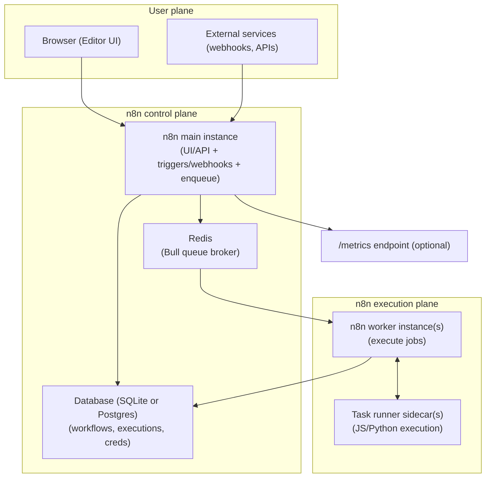
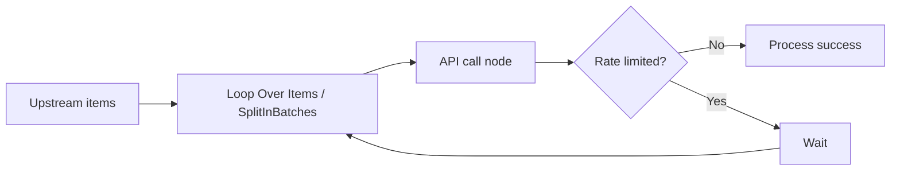

# Deep research report on n8n tools, nodes/connectors, and safe data passing for workflow replication

## Executive summary

n8n is a Node.js‑based workflow automation platform whose core abstraction is **“items flowing between nodes”**: every node receives an **array of items**, each item usually containing a `json` object (and optionally `binary` data), then emits a new item array to the next node(s). This single concept drives how integrations, transformations, branching, loops, merges, and error handling behave. citeturn16view1turn18search24

From an operational standpoint, n8n can run as a **single instance** (simple deployments) or in **queue mode** (recommended for scalability): a main instance handles triggers/timers/webhooks and enqueues executions in Redis, while worker instances pull execution IDs, load workflow state from the database, execute the workflow, write results back, and notify the main instance when finished. Queue mode in n8n uses the **Bull** queue library (Redis‑backed), and n8n’s own docs explicitly describe Redis as the broker that maintains the “queue of pending executions”. citeturn3view0turn5search0

Replicating workflows safely and reproducibly depends on four pillars:

1. **Stable execution semantics**: be explicit about **execution order in multi‑branch workflows**, because n8n v1+ defaults differ from legacy workflows (pre‑1.0). If you inherit older flows, branch behaviour around If/Merge can change materially. citeturn17search3turn9search4turn17search5  
2. **Controlled data surfaces**: aggressively reduce the data passed between nodes (e.g., with **Edit Fields (Set)** and “Keep Only Set Fields”), and avoid leaking secrets into execution logs. citeturn16view0turn7search3  
3. **Environment‑correct configuration**: production‑grade setups require a persistent **encryption key**, correct webhook base URL behind proxies, suitable database and binary‑data configuration (especially in queue mode), and disciplined use of environment variables and `_FILE`‑based secret injection. citeturn3view0turn8search3turn20view0turn11search4  
4. **Security isolation and governance**: use SSRF controls and node blocking, prefer external task runners for Code node isolation, restrict who can author workflows, and keep n8n patched—recent advisories show sandbox‑escape/RCE classes that specifically impact users who can create/modify workflows. citeturn7search9turn15search3turn15search2turn19search2turn19search9

## Architecture and runtime

### Core components and runtime model

At repository level, n8n is a TypeScript monorepo with a Node.js backend and a Vue.js frontend/editor, built as an extensible node‑based workflow engine. citeturn2search17 The system is operated via the web editor UI and CLI commands for administrative tasks (import/export, audit, worker processes, etc.). citeturn2search21turn11search10turn8search1

At runtime, the key persisted state is stored in a database:

- **SQLite is the default DB** for self‑hosted instances, but n8n also supports **PostgreSQL**; support for **MySQL/MariaDB was deprecated in v1.0**. citeturn20view0
- Queue mode is designed around a “main + workers” split and **recommends Postgres 13+**; running queue mode on SQLite is “not recommended”. citeturn3view0

### Queueing and execution scaling

**Queue mode architecture** (official semantics):

- Main instance: handles timers and webhook calls; creates execution records but does not run them.  
- Redis: acts as the broker, maintaining the queue and enabling workers to pick up executions.  
- Workers: pull an execution ID from Redis, load workflow info from the database, execute, persist results, then notify Redis/main on completion. citeturn3view0

n8n’s implementation uses the Bull queue library in its CLI package dependencies (`"bull": "4.16.4"`), aligning with docs and queue environment variables prefixed `QUEUE_BULL_*`. citeturn5search0turn3view3turn3view0

### Database, binary data, and storage constraints

n8n’s **binary data** handling is operationally important because large files can crash in-memory workflows:

- Default mode keeps binary data in memory (`N8N_DEFAULT_BINARY_DATA_MODE=default`). citeturn11search0turn11search4  
- Filesystem mode can offload to disk, but **queue mode cannot use filesystem binary storage**; docs advise `database` (or enterprise S3 external storage per licensing) for queue mode workloads. citeturn3view0turn11search4turn11search8

### Webhooks and ingress

The Webhook node exposes **test** and **production** URLs, supports multiple HTTP verbs, and can return responses immediately, after last node, or via a Respond to Webhook pattern. It also supports webhook auth (basic/header/JWT), IP allowlisting, CORS origins, and optional binary ingestion. citeturn18search4turn18search8

Behind reverse proxies, base URLs can be wrong unless you set `WEBHOOK_URL` explicitly. n8n docs describe generating webhook URLs from `N8N_PROTOCOL`, `N8N_HOST`, and `N8N_PORT`, and recommend `WEBHOOK_URL` when a reverse proxy changes the externally visible port/host. citeturn2search22turn17search1

### Architecture diagram

The following diagram synthesises official queue mode flow plus task runner isolation concepts. citeturn3view0turn7search9turn7search1turn13search0



## Node, connector, and execution model

### Node model: inputs, outputs, operations

In n8n, a workflow is assembled from **nodes** connected by **connections**; connections pass data from node outputs to node inputs. citeturn18search24turn18search12 Node operations are broadly split into **Triggers** (start workflows) and **Actions** (do work within running workflows). citeturn10search16

Custom node developers must implement a **node base file** (and often credential definitions). n8n docs describe base files as mandatory and highlight that programmatic nodes implement an `execute()` method, while declarative nodes use routing declarations. citeturn10search12turn10search32

### Execution modes inside Code/Function-style nodes

The modern **Code** node replaced the legacy **Function** and **Function Item** nodes starting in version 0.198.0 (legacy docs remain for older instances). citeturn10search3turn10search20

Code node run modes matter for determinism and performance:

- **Run Once for All Items**: code executes once for the entire incoming item array. citeturn10search3  
- **Run Once for Each Item**: code executes per item, and the “current item” APIs (`$json`, `$input.item`, etc.) become central. citeturn10search3turn6search34

Crucially, n8n’s data structure guide notes that n8n automatically wraps outputs with `json` and `[]` in Function/Code nodes when missing, but custom nodes must output the full structure correctly. citeturn16view1

### Credentials and OAuth behaviours

Credentials are first‑class objects in n8n and used by many nodes, including Webhook auth credentials (basic/header/JWT) and HTTP Request OAuth2 credentials. citeturn18search8turn14search1

For HTTP Request credentials, n8n documents OAuth2 grant types including **Authorization Code**, **Client Credentials**, and **PKCE**, along with required endpoints (token URL), client IDs/secrets, and optional scopes. citeturn14search1

Practical OAuth pitfall: community support threads highlight that refresh behaviour depends on actually receiving a `refresh_token` (often requiring an `offline_access` scope) and that missing/incorrect scopes can prevent auto‑refresh. citeturn14search0turn18search9

### Connector types and when to use them

n8n integration approaches cluster into:

- **Built‑in integrations**: purpose‑built nodes for common apps, providing pre‑modelled operations. citeturn10search31  
- **HTTP Request nodes**: generic protocol connector used for APIs without a dedicated node, beta endpoints, or non‑standard auth. citeturn10search31turn9search7  
- **Community nodes**: installable node packages (verified or unverified; self‑hosted only for npm installs), managed via Settings and controlled by environment variables. citeturn14search7turn14search3turn15search6  
- **Custom nodes**: loaded from `.n8n/custom` by default, or additional paths via `N8N_CUSTOM_EXTENSIONS`. citeturn15search1

### Comparison table: node categories and connector types

| Category | Typical node examples | Best used for | Replication notes | Security notes |
|---|---|---|---|---|
| Trigger nodes | Webhook, schedule/timers (varies) | Starting workflows from events | Webhook URLs have test vs production; proxying requires `WEBHOOK_URL` | Use webhook auth/IP allowlist/CORS controls; enforce payload limits | 
| Action/integration nodes | App‑specific nodes; HTTP Request | CRUD against SaaS/DB/API endpoints | Prefer purpose‑built nodes; use HTTP Request for missing endpoints | Apply SSRF safeguards to user‑controlled URLs; handle rate limits | 
| Data shaping nodes | Edit Fields (Set), Merge, Aggregate | Normalising schema between steps | Make schema choices explicit; reduce payloads early | “Keep Only Set Fields” prevents sensitive fields leaking downstream | 
| Logic/control nodes | If, Switch, Wait, Loop Over Items/Split in Batches | Branching, throttling, resumable waits | Execution order differences (v0 vs v1) can change branch outcomes | Wait resume URLs may need auth; avoid unbounded loops | 
| Code nodes | Code (JS/Python), legacy Function nodes | Non‑trivial transforms/algorithms | Item linking must be preserved when changing item counts | Use task runners external mode; restrict modules; patch promptly | 

Sources: node docs for Webhook, Edit Fields, If/Switch/Wait/Merge, Code; execution order docs; community nodes installation/config. citeturn18search4turn16view0turn9search4turn9search10turn9search13turn9search3turn10search3turn17search3turn14search7turn15search1

## Data model and data passing patterns

### Canonical data structure

n8n passes data **between nodes** as an **array of items**. Each item is typically:

- `{ "json": { ... } }` for structured data  
- `{ "binary": { "<prop>": { data: "...base64...", mimeType, fileName, ... } } }` for files/attachments citeturn16view1

This means mapping and filtering always operates over **item arrays**, even if you conceptually think you’re handling “a single object”. citeturn16view1

### Item linking and why it matters for replication

n8n tracks **which output item came from which input item** (“item linking”), enabling later nodes to reference “paired” upstream items in expressions. Official docs describe this as metadata linking output items back to their generating inputs, and warn it becomes complex for nodes that split/merge items. citeturn6search9turn6search1turn6search5

When you use the Code node in ways that **change item counts** (e.g., explode an array into many items), you must preserve item linking by setting `pairedItem`. Community guidance demonstrates returning objects like `{ json: ..., pairedItem: index }` to keep downstream expressions stable. citeturn6search30turn6search5

### Expressions, mapping, and reference styles

n8n expressions are JavaScript‑like snippets wrapped in `{{ ... }}` used directly in node parameters. Docs emphasise expressions are preferred when possible because they offer previews and are lighter than full Code nodes. citeturn6search0turn6search4

The expression reference documents common accessors:

- `$json` and `$binary` for the current item  
- `$("NodeName").first()`, `.all()`, `.item` for referencing previous nodes, including item‑linked accessors citeturn16view2turn6search1

### Context and persistent data scopes

n8n provides multiple “scope” concepts with different persistence guarantees:

- **Workflow static data**: persistent key/value storage across executions, with `global` and `node` scopes. citeturn6search2  
- **Custom variables** (`$vars`): admin‑managed, read‑only variables with environment/project scoping, available only on certain paid/enterprise plans. citeturn6search11turn14search14  
- **Environment variables** (`$env`/`env` in expressions): instance configuration variables, potentially blockable via security settings. citeturn6search22turn16view3turn15search21

Because plan/features differ, any workflow template intended for replication should state **which of these scopes it depends on** (unspecified by default unless you explicitly design for them). citeturn6search11turn7search2

### Comparison table: data passing methods

| Method | How you use it | Persistence | Best for | Common pitfalls |
|---|---|---|---|---|
| “Current item” fields | `$json.someField`, `$binary.file.data` | Per item, per node | Straight-through mapping | Misunderstanding arrays vs single objects; silently processing many items | 
| “Previous node” references | `$("Node").first().json...` / `$("Node").item...` | Execution-local | Lookups and joins across steps | Breaks if referenced node didn’t run; use `$("Node").isExecuted` checks where needed | 
| Edit Fields (Set) shaping | Explicitly map/rename fields; “Keep Only Set Fields” | Per item, per node | Schema normalisation and data minimisation | Forgetting to drop fields may leak sensitive data to logs/execution history | 
| Merge node | Append/combine data from branches | Execution-local | Joining datasets and waiting for multiple inputs | Execution order and merge modes differ across versions; legacy v0 branch behaviour differs | 
| Workflow static data | `$getWorkflowStaticData('global')` | Cross-execution | Checkpointing cursors, idempotency keys | Requires careful concurrency handling in queue mode; not ideal for high write rates | 
| Custom variables (`$vars`) | `$vars.MY_KEY` | Admin-managed | Environment switches without editing workflows | Not available on all plans; treat as configuration, not secrets | 

Sources: data structure and item linking docs, expression reference, static data cookbook, custom variables docs, Edit Fields docs, merge/execution order docs. citeturn16view1turn6search9turn16view2turn6search2turn6search11turn16view0turn9search3turn17search3

## Transformation, control flow, and workflow patterns

### Execution order in multi-branch workflows is version-dependent

n8n explicitly documents that node execution order depends on workflow vintage:

- **Pre‑1.0 workflows** (legacy): executes the first node of each branch, then second node of each branch, etc.  
- **v1+ workflows**: completes each branch in turn; branch ordering depends on canvas position (top-to-bottom, then left-to-right). citeturn17search3turn17search5

This difference is not cosmetic: n8n’s If node documentation warns that in legacy execution order, combining If and Merge can lead to both branches executing (a behaviour removed in v1 order). citeturn9search4turn17search17

Replication best practice: when exporting/importing templates across instances, ensure workflow settings explicitly specify execution order if you rely on legacy semantics. citeturn17search5turn17search33

### Core transformation and flow-control toolkit

**Edit Fields (Set)** is the “schema gateway” node: it can set/overwrite fields and optionally discard all other input fields using “Keep Only Set Fields”. It can also control whether binary data is carried forward. citeturn16view0

**If** and **Switch** implement conditional routing; Switch supports multiple outputs via Rules or Expression mode. citeturn9search4turn9search10

**Merge** implements multiple modes (Append, Combine/By Position, etc.) and, in Append mode, explicitly waits for all connected inputs. citeturn9search3turn9search19

**Wait** supports time-based waits and resumable waits via webhook callbacks; in webhook-resume modes it exposes `$execution.resumeUrl` and can require auth for resume requests. citeturn9search13

**Split in Batches / Loop Over Items** is the recommended tool for chunking work and throttling API calls when rate limits apply. n8n provides a dedicated “Handling API rate limits” guide describing two approaches: “Retry On Fail” and Loop Over Items + Wait. citeturn0search6turn9search2

### A standard throttled loop pattern

The official rate-limit pattern (Loop Over Items + Wait) can be expressed as follows. citeturn9search2turn9search13



### Practical configuration snippets (node-level)

**Retry On Fail** is configured in node settings; the HTTP Request node common issues page gives concrete steps and an example wait of `1000` ms. citeturn9search7turn9search2

Example (illustrative JSON fragment):

```json
{
  "name": "HTTP Request",
  "type": "n8n-nodes-base.httprequest",
  "typeVersion": 4,
  "parameters": {
    "url": "https://api.example.com/v1/things",
    "method": "GET",
    "responseFormat": "json"
  },
  "settings": {
    "retryOnFail": true,
    "maxTries": 3,
    "waitBetweenTries": 1000
  }
}
```

Pitfall: community and GitHub issue threads show edge cases where Retry/On Error interactions can be surprising; treat retries and “Continue (using error output)” as a tested pattern rather than assumed behaviour. citeturn7search12turn7search4

## Security, safety, and reliability engineering

### Credential storage, encryption keys, and secret injection

In queue mode, the **encryption key must be shared** between main and workers so workers can decrypt credentials stored in the database; docs show using `N8N_ENCRYPTION_KEY=<main_instance_encryption_key>`. citeturn3view0

For self-hosted configuration, n8n supports `_FILE` suffixes on environment variables so secrets can be loaded from Docker/Kubernetes secrets files rather than plain env vars. citeturn8search3turn3view3turn20view0

### External secrets and credential overwrites

n8n offers enterprise-tier **external secrets** integrations (providers include 1Password, AWS Secrets Manager, Azure Key Vault, GCP Secrets Manager, and HashiCorp Vault), and docs note multi-vault support begins at version 2.10.0. citeturn7search2

Credential overwrites let you prefill/lock credential fields globally so users can authenticate without seeing client secrets; however, the docs warn that using environment variables for overwrites is not recommended because environment variables “aren’t protected” and data can leak to users. citeturn11search2turn11search12turn11search5

### RBAC and data visibility controls

n8n provides role-based access control documentation and feature gating, and execution data redaction (enterprise) hides input/output data in execution history while preserving metadata like status and timing. citeturn7search3turn18search20turn20view1

For privacy obligations, n8n notes that self-hosters are responsible for deletion, and recommends pruning execution data via `EXECUTIONS_DATA_MAX_AGE` to reduce GDPR handling burden. citeturn7search15turn0search2

### Code execution isolation: task runners, module allowlists, and hardening

n8n’s Code node cannot directly perform HTTP requests or filesystem access; docs direct users to dedicated nodes instead. citeturn10search3  
For self-hosters, importing built-in/external npm modules in Code nodes is **blocked by default** and must be explicitly enabled via `NODE_FUNCTION_ALLOW_BUILTIN` and `NODE_FUNCTION_ALLOW_EXTERNAL`. citeturn15search0turn10search3

Task runners are the recommended isolation boundary for Code execution:

- Internal mode is “not recommended for production” due to security risk.  
- External mode runs task runners as separate containers/sidecars, increasing isolation; in queue mode, each worker needs its own runner sidecar. citeturn7search9turn10search2  
Hardening guidance explicitly recommends external mode “to increase the isolation between the core n8n process and code in the Code node.” citeturn7search1

Version note: the n8n v2.0 breaking changes list states that environment variable access in Code node becomes blocked by default and that task runners become enabled by default, specifically “to improve security and isolation.” citeturn15search21

### SSRF protection and node blocking

n8n provides SSRF protection controls, recommending network-level controls first, and application-level allowlists/blocklists as defence-in-depth. Docs specify precedence order for allowlists and give concrete patterns (`N8N_SSRF_ALLOWED_HOSTNAMES`, `N8N_SSRF_ALLOWED_IP_RANGES`). citeturn7search5turn15search3turn15search7

You can also block nodes via `NODES_EXCLUDE` so users can’t access risky nodes like Execute Command or filesystem nodes. citeturn15search2turn15search14

### Telemetry isolation and outbound connections

Self-hosted n8n instances may contact n8n servers for diagnostics, templates, and version notifications. Docs provide an “Isolate n8n” pattern to prevent outbound connections by disabling diagnostics, version notifications, and templates. citeturn18search10turn8search0

### Reliability patterns: retries, idempotency, error workflows

n8n supports error workflows via the **Error Trigger** node and **Stop And Error** for deliberate failures and custom messages. Error Trigger runs only on automatic execution failures, not manual tests. citeturn7search0turn9search1turn7search4

For idempotency, n8n doesn’t enforce semantics automatically; you typically implement it with stable external keys and upsert/unique constraints, or with workflow state checkpoints (static data) where appropriate. Static data exists, but should be treated as a lightweight state store rather than a high‑volume database. citeturn6search2turn6search9

### Security posture note (recent advisories)

Because workflow authors can execute expressions and code, **workflow creation/modification permissions are high impact**. Recent advisories and vulnerability records describe sandbox escape/RCE classes that apply to authenticated users with workflow modification rights, and recommend upgrading to patched versions. citeturn19search2turn19search9turn19search3  
This strengthens the case for: least-privilege RBAC, node blocking (especially high-risk nodes), external task runner isolation, SSRF controls, and continuous patching. citeturn7search9turn15search2turn15search3turn8search1

## Observability and operations

### Logging and execution history

n8n provides logging configuration via environment variables (log level, outputs, etc.), central to diagnosing production failures. citeturn2search15

Executions are first‑class objects; the executions list and execution log provide step-by-step node data for debugging. n8n also provides “Debug in editor / Copy to editor” flows for loading past execution data into the editor for troubleshooting. citeturn18search35turn2search38

Execution data storage is configurable; n8n documents environment variables like `EXECUTIONS_DATA_SAVE_ON_ERROR` and other save/prune controls to reduce DB and privacy burden. citeturn2search31turn7search15

### Monitoring endpoints and metrics

n8n documents three monitoring endpoints:

- `/healthz` (instance reachable)  
- `/healthz/readiness` (DB connected and migrated, ready to accept traffic)  
- `/metrics` (Prometheus-style metrics; not available on n8n Cloud) citeturn17search0turn13search1

Prometheus metrics are disabled by default; docs explain enabling them with `N8N_METRICS=true` and note both main and worker instances can expose metrics. citeturn13search0turn13search1

### Insights and telemetry

n8n “Insights” provides performance visibility over time and starts collecting only after upgrading to a supported version (docs mention collection begins from the first supported version, 1.89.0). citeturn13search4  
Telemetry can be opted out with `N8N_DIAGNOSTICS_ENABLED=false`, and version notifications can be disabled as well. citeturn8search0turn8search12

## Deployment, testing, reproducibility, and example workflows

### Deployment considerations and options

n8n deployment choices revolve around three axes: **execution scale**, **state persistence**, and **security isolation**.

Key official constraints to design around:

- Queue mode provides best scalability, uses Redis as broker, and recommends Postgres 13+. citeturn3view0turn20view0  
- Queue mode cannot use filesystem binary storage; use database mode or enterprise external storage (S3). citeturn3view0turn11search4turn11search8  
- For code execution safety, use external task runners in production. citeturn7search9turn7search1  
- Health readiness endpoints exist and can be customised through endpoint configuration. citeturn17search0turn17search1

#### Deployment options comparison table

| Option | Topology | When it fits | Scaling model | HA model | Operational pitfalls |
|---|---|---|---|---|---|
| Single instance (SQLite) | One n8n process + SQLite | Dev, small internal use | Vertical only | None | DB contention and state fragility; not ideal for many users/executions citeturn20view0 |
| Single instance (Postgres) | One n8n process + Postgres | Production baseline | Vertical; limited concurrency | LB/failover at infra layer | Must persist encryption key; configure pruning/log retention citeturn20view0turn7search15 |
| Queue mode | Main + Redis + worker(s) + Postgres | High volume and resilience | Horizontal workers | Multi-main is enterprise feature | Requires consistent encryption key across processes; binary data must not be filesystem mode citeturn3view0turn11search4turn3view3 |
| Multi-main queue mode | Multiple mains + Redis + workers + Postgres | Native HA | Horizontal | Enterprise-only “multi-main setup” | Requires leader designation and careful trigger ownership; feature-gated citeturn3view0turn13search18turn13search30 |

### Testing and reproducibility mechanisms

#### Workflow export/import and reproducible artefacts

n8n saves workflows as JSON and supports export/import via UI copy/paste, file export, and CLI. The CLI docs warn that exported workflows/credentials include IDs and can overwrite existing objects if IDs collide—meaning reproducibility pipelines should strip/rewrite IDs on import where needed. citeturn11search3turn11search10

For configuration reproducibility in self-hosting, prefer:

- Environment variables defined as code (compose/helm), with `_FILE` secrets for sensitive values. citeturn8search3turn20view0  
- Templates and custom template libraries in controlled environments, or disabling template fetching entirely in isolated networks. citeturn12search1turn18search10

#### Workflow versioning, publishing, and Git-based source control

In n8n 2.x, the **Save vs Publish** model introduces explicit workflow versions: edits create a new saved version; production executions run the published version. Naming versions is available on higher plans. citeturn12search0  
Workflow history exists with plan-based retention windows and explains the difference between workflow history (versions) and execution history (runs). citeturn12search24turn7search11

n8n provides **Git-based source control and environments**, where instances link to Git repositories and use branches as environments, with guidance not to push/pull to the same instance and the option to mark an instance “Protected” (useful to protect production). citeturn12search2turn12search6turn12search36  
For Git-centric teams, this can underpin “workflows as code” CI/CD pipelines, complemented by CLI import/export. citeturn12search2turn11search10

#### Unit testing and node development testing

For custom node builders, n8n’s own contributing docs describe layered testing: Jest unit tests for backend/nodes, Vitest for frontend, and Playwright E2E, including JSON-based workflow tests. citeturn12search3  
Node testing guidance documents test placement adjacent to node files and recommends Jest with HTTP mocking tools (e.g., nock). citeturn12search11

### Reproducible example workflows for common patterns

The examples below are designed to be **copyable patterns** rather than fully-importable exports (because node `typeVersion`, parameters, and credential IDs can vary by n8n version and instance). Where behaviour is version-sensitive, it is called out explicitly. citeturn17search5turn10search3turn11search3

#### Pattern: API chaining with throttling and merge

**Goal:** Call API A to get a list, then for each item call API B, combine results, and output a unified dataset.

**Why this works in n8n:** nodes process item arrays automatically, while Loop Over Items + Wait provides deterministic rate-limited iteration. citeturn16view1turn9search2turn9search13

**Step-by-step:**
1. HTTP Request “List” (GET /things) returns items. citeturn9search7  
2. Loop Over Items / SplitInBatches to iterate in controlled batches. citeturn0search6turn9search2  
3. HTTP Request “Details” uses expressions to call API B for the current item (e.g., `{{$json.id}}`). citeturn16view2turn6search0  
4. Optional: Wait node in loop to enforce pacing (or rely on Retry On Fail). citeturn9search2turn9search13  
5. Merge (Append) or Aggregate to produce a single combined stream; Append waits for all inputs in the merge configuration. citeturn9search3turn9search19  
6. Edit Fields (Set) at the end to output only the stable contract fields. citeturn16view0

**Key configuration snippets:**

HTTP Request “Details” with expression-based URL:

```json
{
  "name": "Details",
  "type": "n8n-nodes-base.httprequest",
  "typeVersion": 4,
  "parameters": {
    "method": "GET",
    "url": "={{ 'https://api.example.com/v1/things/' + $json.id }}",
    "responseFormat": "json"
  },
  "settings": {
    "retryOnFail": true,
    "maxTries": 3,
    "waitBetweenTries": 1000
  }
}
```

Edit Fields “contract output” (data minimisation):

```json
{
  "name": "Contract Output",
  "type": "n8n-nodes-base.set",
  "typeVersion": 3,
  "parameters": {
    "mode": "manual",
    "keepOnlySet": true,
    "values": {
      "string": [
        { "name": "id", "value": "={{ $json.id }}" },
        { "name": "status", "value": "={{ $json.status }}" }
      ]
    }
  }
}
```

**Pitfalls and best practices:**
- If you later join results from parallel branches, validate your execution order setting (v1 recommended) to prevent legacy If/Merge surprises. citeturn17search5turn9search4  
- Prefer Loop Over Items + Wait when rate limits are strict; Retry On Fail is useful but should be tested because retry/error-output combinations can behave unexpectedly. citeturn9search2turn7search12  
- Apply SSRF allowlists if upstream data can control URLs. citeturn15search3turn7search5

#### Pattern: Webhook → transform → validate → DB insert → respond

**Goal:** Provide a stable ingestion endpoint: accept JSON via webhook, validate and normalise schema, insert into DB, return a controlled response.

**Step-by-step:**
1. Webhook trigger configured for POST, with webhook auth and IP allowlist if feasible. citeturn18search4turn18search8  
2. Edit Fields (Set): enforce schema and drop all unneeded fields (“Keep Only Set Fields”). citeturn16view0  
3. If/Switch: validate required fields; route failures to Stop And Error with explicit JSON. citeturn9search4turn9search10turn9search1  
4. DB node (e.g., Postgres) insert; in replication, prefer idempotent inserts (unique keys + upsert) to handle retries safely. citeturn7search4turn9search7  
5. Webhook response strategy: either respond “When Last Node Finishes” or use Respond to Webhook for explicit control. citeturn2search14turn18search4

**Webhook example configuration (illustrative):**

```json
{
  "name": "Inbound Webhook",
  "type": "n8n-nodes-base.webhook",
  "typeVersion": 2,
  "parameters": {
    "httpMethod": "POST",
    "path": "ingest/orders",
    "responseMode": "responseNode"
  }
}
```

**Validation via If + Stop And Error:**

```json
{
  "name": "Validate",
  "type": "n8n-nodes-base.if",
  "typeVersion": 2,
  "parameters": {
    "conditions": {
      "string": [
        {
          "value1": "={{ $json.orderId }}",
          "operation": "isNotEmpty"
        }
      ]
    }
  }
}
```

```json
{
  "name": "Stop And Error",
  "type": "n8n-nodes-base.stopanderror",
  "typeVersion": 1,
  "parameters": {
    "operation": "errorMessage",
    "errorMessage": "Missing required field: orderId"
  }
}
```

**Security and replication notes:**
- Enforce webhook payload size limits; Webhook docs state a default max payload of 16MB and note self-hosters can change via `N8N_PAYLOAD_SIZE_MAX`. citeturn18search4turn17search1  
- Use execution data redaction or minimise fields early to avoid secrets/PII appearing in execution logs. citeturn7search3turn16view0  
- In queue mode, ensure encryption key, DB config, and binary mode are consistent (workers must decrypt creds). citeturn3view0turn11search4turn20view0

#### Pattern: File processing with filtering and safe binary handling

**Goal:** Process large files (CSV/PDF/images), filter items, and send results downstream without crashing memory or leaking data.

**Why it’s tricky:** n8n’s default binary handling is in-memory; large binaries can crash workflows, and queue mode imposes storage constraints. citeturn11search4turn3view0

**Step-by-step:**
1. Ingest binary (Webhook with Binary Property, or Read Binary File). citeturn18search4turn16view1  
2. Convert binary to structured items (e.g., Spreadsheet parsing node; not detailed here because it’s integration-specific and unspecified).  
3. Filter items using If/Switch (avoid Code where a built-in node suffices). citeturn9search4turn9search10turn6search0  
4. Use Edit Fields to drop unnecessary columns. citeturn16view0  
5. If producing or passing large binary outputs, set binary mode appropriately:
   - Single instance: consider `N8N_DEFAULT_BINARY_DATA_MODE=filesystem` to avoid memory pressure. citeturn11search4turn11search0  
   - Queue mode: use `database` (or enterprise S3 external storage) because filesystem mode is unsupported. citeturn11search4turn3view0turn11search8

**Configuration example (self-hosted single instance):**

```bash
export N8N_DEFAULT_BINARY_DATA_MODE=filesystem
export N8N_BINARY_DATA_STORAGE_PATH=/home/node/.n8n/binaryData
```

**Configuration example (queue mode):**

```bash
export EXECUTIONS_MODE=queue
export N8N_DEFAULT_BINARY_DATA_MODE=database
export QUEUE_BULL_REDIS_HOST=redis
export DB_TYPE=postgresdb
```

Binary mode and queue mode constraints are explicitly documented by n8n. citeturn11search4turn3view0turn3view3turn20view0

### Selected primary sources referenced

The following are the most “load-bearing” primary references used throughout this report (all are clickable via citations):

- Queue mode architecture and configuration (Redis broker, workers, shared encryption key, Postgres recommendation). citeturn3view0  
- Data structure and item/binary schema (item arrays with `json`/`binary`). citeturn16view1  
- Expression reference and data mapping semantics. citeturn16view2turn6search20  
- Code node semantics and legacy Function replacement. citeturn10search3turn10search20  
- Flow logic: multi-branch execution order and legacy pitfalls. citeturn17search3turn9search4turn17search5  
- Security controls: task runners + hardening, SSRF protection, blocking nodes, security audit, telemetry opt-out, data redaction. citeturn7search9turn7search1turn15search3turn15search2turn8search1turn8search0turn7search3  
- Monitoring endpoints and Prometheus metrics. citeturn17search0turn13search0turn13search1  
- Source control/environments and publishing/versioning models for reproducibility. citeturn12search2turn12search0turn12search24
